# Building The Network — conversation transcript

Snapshot captured at **2026-09-29 19:18:02 IST**. This chronological export contains **313 saved user-visible messages** (101 from Rahul and 212 from Codex) across **6 related Codex chats**, with **14 embedded user images**. Messages run from 2026-09-28 23:55:11 IST through 2026-09-29 19:17:29 IST. Later or unsaved messages are not included; active chats can continue after this snapshot.

The scope includes the earlier challenge and concept discussions, the main build, the subsequent graph animation and responsive layout work, and transcript preparation. Each message is labeled with its source chat. This is an export of local Codex conversations; separate ChatGPT conversations are not included.

Message wording is retained, including typos, revisions, abandoned ideas, and claims made at the time. System/developer instructions, private reasoning, tool calls/results, automatic browser/environment context, injected AGENTS.md instructions, and internal subagent/approval-review sessions are excluded. No messages were reconstructed from summaries. Local file links and attachment paths are replaced with readable references. Non-image attachments (including the original HEIC and storytelling Markdown) are not embedded. Saved image copies may have been resized by the chat application. Interactive visualizations are represented by placeholders.

The [recorded challenge brief](../../RESEARCH.md) asks for a drop, a public post, and a DM with the Git repository and agent conversation transcript: [Dhruv’s challenge](https://x.com/droovg/status/2103640223972557191) · [What a drop can be](https://x.com/droovg/status/2103669927140032706). This file supplies the conversation record; exporting it does not complete or verify the public-post or DM requirements.

## Included chats

| Chat | Title | Messages | Source ID |
| --- | --- | ---: | --- |
| 1 | Explain the drop in this post | 19 | `01a0e943-6c90-7522-a696-678c92fca427` |
| 2 | Explore hiring challenge | 76 | `01a0e96e-eb99-7493-b258-ef0023f39df2` |
| 3 | Explore hiring challenge (2) | 3 | `01a0e9ac-1e03-7883-a394-ef1c8e986302` |
| 4 | Understand the Cosign Drop challenge | 191 | `01a0ecc4-613c-7c63-b3ec-3a683d6fbb24` |
| 5 | Animate graph connections | 18 | `01a0ed56-a0ab-7b10-82c2-5df1821f9cfd` |
| 6 | Extract updated chat transcript | 6 | `01a0ed60-7416-78b0-8514-3dbfbaeeb20c` |

## Local file references

Historical links to files on Rahul's computer point here. Current project files can be found from the [README](../README.md). User-supplied image attachments available in the saved chats are reproduced inline below. Earlier deployment URLs and intermediate decisions remain as historical context; the README describes the current app.

---

## 1. Rahul — 2026-09-28 23:55:11 IST

**Chat 1: Explain the drop in this post**

what's a drop and can you explain this [https://x.com/droovg/status/2103640223972557191?s=46](https://x.com/droovg/status/2103640223972557191?s=46)

---

## 2. Codex — 2026-09-28 23:55:14 IST

**Chat 1: Explain the drop in this post**

I’ll check the post to see what “drop” means in this context.

---

## 3. Codex — 2026-09-28 23:55:53 IST

**Chat 1: Explain the drop in this post**

Here, **a “drop” is a small, polished interactive website that explores a topic**—think an article combined with a mini-app. You read the story, but can also manipulate diagrams, explore data, or try demos. The [MTS Drops site he links](https://drops.mts.now/) includes interactive explainers about chips, AI agents, and other topics.

**The post is essentially a hiring challenge for engineers at Cosign.** [Dhruv is asking you to](https://x.com/droovg/status/2103640223972557191):

1. Look at MTS Drops for inspiration.
2. Build your own drop, ideally about Cosign or social networks.
3. Post it publicly.
4. DM him the Git repository containing your code, plus the transcript of the AI-agent conversation you used to build it.

He says he values creativity, decisiveness, speed, and empathy. He promises at least a response, and says everyone who posts something will get access to Cosign.

For example, **“How a post goes viral”** could be a drop: a short explanation alongside an interactive network where you change sharing probability and watch a post spread—or die out.

My read: he wants to see **what you choose to build, how well you make it work for people, and how you collaborate with AI**. The finished website shows the result; the agent transcript shows your process.

---

## 4. Rahul — 2026-09-28 23:57:42 IST

**Chat 1: Explain the drop in this post**

i still can't wrap my head around drop and what it is

---

## 5. Codex — 2026-09-28 23:57:51 IST

**Chat 1: Explain the drop in this post**

Yeah—the name makes it sound like a specific technical thing. **Here, “drop” is just their name for a published interactive web experience.** Like calling a blog entry a “post.”

Imagine explaining **how a social network works**:

- **A blog post:** You read, “People connect to friends, forming a network.”
- **A video:** You watch dots representing people connect.
- **A “drop”:** You open a webpage full of dots. **You click to connect people**, and the page explains how your changes affect the network.

So you’re **reading an explanation and playing with it on the same webpage**.

It doesn’t need a particular framework, file format, or platform. In that tweet, “build a drop” roughly means:

> **“Make a small, interesting interactive website. Look at these examples for the kind of thing we mean.”**

My “article combined with a mini-app” description was describing the examples—not a strict definition or set of rules.

---

## 6. Rahul — 2026-09-28 23:59:29 IST

**Chat 1: Explain the drop in this post**

koay so I need to build a drop around cosign what should I build based on what you know about me and my angel etc

---

## 7. Codex — 2026-09-28 23:59:33 IST

**Chat 1: Explain the drop in this post**

I’ll look into Cosign so the idea fits the product. I’m reading “angel” as “angle”—your strengths and perspective as a builder.

---

## 8. Codex — 2026-09-29 00:00:10 IST

**Chat 1: Explain the drop in this post**

**I’d build “Who Gets Seen?”—an interactive story about a good builder getting overlooked, and what changes when someone credible vouches for them.**

From the context I can see—Kofe Flow, your attention to app design and icons, and your interest in storytelling and AI video—my read is that your strongest angle is **making something useful feel thoughtfully designed, then telling its story.** This idea gives you room to show both.

It also fits Cosign’s starting premise: excellent people often have reputations that only their immediate teammates know about. Cosign wants that recognition to travel further. [Their launch announcement](https://a16zjobs.substack.com/p/introducing-cosign-a-new-space-to).

Here’s the actual website I’m imagining:

1. **“You have one opening. Who gets your attention?”**  
   Three fictional builder cards appear. You initially see job titles, companies, and follower counts. You choose someone to explore.

2. **“Now see what they’ve made.”**  
   Flip the cards to reveal working product demos, thoughtful design decisions, and evidence of solving real user problems. You can change your choice.

3. **“Now hear from someone who worked with them.”**  
   Reveal specific endorsements: “She noticed users losing their work and shipped a fix that afternoon.” Let the visitor compare that with a vague “Amazing engineer!”

4. **“What made you reconsider?”**  
   Replay the visitor’s choices, showing which information changed their judgment. End with the question: **How do we help good work reach the people who would value it?**

**That whole experience is the drop.** A short website where the visitor participates in the argument.

The personal connection is that you can draw on the kinds of decisions you make building Kofe Flow: small interactions, user feedback, and fixes that demonstrate care. Use fictional people and clearly labelled illustrative examples; the story can reflect your experience without turning into a résumé.

I’d keep the first version to **three people, three reveals, and a two-minute experience**. Put the effort into the cards, transitions, tiny demos, and writing.

The strongest part is the nuance: let people keep their original choice. The experience should explore **what makes an endorsement informative**, rather than force the conclusion that whoever has the most influential friends deserves the job. That gives you a thoughtful point of view on the very problem Cosign is tackling.

---

## 9. Rahul — 2026-09-29 00:04:32 IST

**Chat 1: Explain the drop in this post**

do you think bakd.work is a hop

---

## 10. Codex — 2026-09-29 00:04:36 IST

**Chat 1: Explain the drop in this post**

I’m assuming you mean “a drop.” I’ll look at bakd.work and compare it with the examples.

---

## 11. Rahul — 2026-09-29 00:04:41 IST

**Chat 1: Explain the drop in this post**

sorry drop

---

## 12. Codex — 2026-09-29 00:05:13 IST

**Chat 1: Explain the drop in this post**

**Yes—in the broad sense of “a small, useful web experience,” Bakd fits.** Having looked at the [homepage](https://bakd.work/) and [your profile](https://bakd.work/p/rahulmfg), I’d describe it more precisely as a **working product**, while the MTS drops are mostly interactive stories and explainers.

And I should correct my earlier framing: **I made “drop” sound more rigidly defined than it is.** Dhruv linked examples, but didn’t give a strict format requirement.

Bakd is very relevant to his challenge:

- It brings **your work and other people’s endorsements together**.
- It turns appreciation on X into something people can find on a lasting profile.
- Your own page demonstrates the idea through your projects and backing from Andreas Klinger and Ryan Hoover.

**I’d use Bakd for this opportunity rather than start a separate project.** Its connection to Cosign is clear, although only Dhruv can say whether it meets what he had in mind.

The story I’d tell is:

> “Some of the most meaningful things people have said about my work were buried on X. I built Bakd to give those words a home alongside the work itself.”

That’s personal, concrete, and demonstrated by a real product. It’s a stronger angle for you than the fictional hiring exercise I suggested.

---

## 13. Rahul — 2026-09-29 00:19:47 IST

**Chat 1: Explain the drop in this post**

here is what the founder said about drops

drops can be anything! a lot of my early drops were interactive explainers or visualizations of unstructured corpuses of data, important thing is just that they have some theme that is represented in a way that hasn’t been done before

---

## 14. Codex — 2026-09-29 00:19:57 IST

**Chat 1: Explain the drop in this post**

**Then yes—Bakd fits his definition of a drop.** My earlier distinction between “product” and “drop” was too restrictive.

His criterion is **a theme expressed in a fresh way**. For Bakd:

- **Theme:** Your reputation lives in what other people say about your work.
- **Expression:** Bring those scattered words together with the actual things you’ve built, on one page you control.
- **Your angle:** You’re using your own experience as a builder to make professional recognition more tangible.

The part to sharpen is **what feels fresh**. Testimonials on portfolios already exist, so “a profile with endorsements” alone isn’t a strong novelty claim. Bakd’s more distinctive idea is **turning appreciation that already exists on X into a lasting, personal home for your work**.

I’d introduce it like this:

> I built Bakd around a simple idea: good words about your work shouldn’t disappear down a timeline. It brings appreciation from people who know your work together with the things you’ve built—on one page that stays yours.

**You don’t need to turn it into an interactive explainer.** Focus on making that idea clear and the experience compelling.

---

## 15. Rahul — 2026-09-29 00:38:35 IST

**Chat 1: Explain the drop in this post**

maybe my thessis for dro pcan be like

maybe I should say why cosign based hiring is great for startups? I feel like startups can't go trhough reghours cycle of rounds of test and anyway they need background checks or optinions so cosign acts exactly two in one. Also manye startup founderst tweet about there co-workers in X so we could already have data from there

---

## 16. Codex — 2026-09-29 00:38:50 IST

**Chat 1: Explain the drop in this post**

**Yes—this gives Bakd a clearer thesis: startups already share useful hiring signals in public, but those signals are scattered and hard to use.**

I’d sharpen your argument slightly. Startups still need to assess candidates; what they often lack is time to discover strong people and gather context about their work. Specific praise from a former teammate can help them decide **whom to speak to and what to ask**.

Your thesis could be:

> **Startup hiring doesn’t start from zero.**
> Founders and teammates already talk publicly about the people they trust—what they shipped, how they handled problems, and why they’d work with them again. But those recommendations disappear into the timeline.
>
> Bakd brings those words together with the work behind them, helping small teams discover people and start better-informed hiring conversations.

The “two-in-one” idea works best as **discovery + reference context**. I wouldn’t call it a background check: a public endorsement doesn’t verify someone’s history or replace a proper reference conversation.

**Your own story makes this concrete.** On your Bakd page, someone can see your Product Hunt experience alongside Andreas’s account of working with you. The work establishes what you did; his words add a colleague’s perspective.

That also gives you a strong opening for the drop:

> **“Your next hire might already have a great reference. It’s buried on X.”**

Then show a scattered tweet becoming a sourced endorsement next to the relevant work. Keep the original link and context visible, and distinguish praise from someone who worked with the person from a casual compliment.

The interesting claim is **“we can make existing evidence easier to find and evaluate.”** That’s more convincing than promising fewer interview rounds—and it’s exactly something Bakd can demonstrate.

---

## 17. Rahul — 2026-09-29 00:39:23 IST

**Chat 1: Explain the drop in this post**

wait foget bakd i think drop is an interactive stuff look at the link he sahred and tweet further

---

## 18. Codex — 2026-09-29 00:39:27 IST

**Chat 1: Explain the drop in this post**

I’ll reread the tweet and explore the linked drops themselves to see what kind of experience he’s pointing to.

---

## 19. Codex — 2026-09-29 00:40:23 IST

**Chat 1: Explain the drop in this post**

**Yes—you’re right to bring us back to the examples. I pushed the conversation toward fitting Bakd into the brief instead of developing your interactive idea.**

I reread [his tweet](https://x.com/droovg/status/2103640223972557191) and explored the linked drops:

- [Why Agents Need So Many CPUs](https://drops.mts.now/agent-computers/) takes you through an agent’s day, then lets you change its workload and see the infrastructure estimates update.
- [What 1,000 founders are talking about](https://drops.mts.now/trends/) turns company descriptions into visual patterns about changing startup vocabulary.
- [What startups are hiring for](https://drops.mts.now/jobs/) organizes job postings into an exploration of hiring patterns.

**The common thread is a topic made understandable through an experience or explorable evidence.** His “anything” clarification leaves the format open, but these are the useful references.

For your thesis, I’d build **“Who Would You Hire?”**

> **What can you learn about someone from the people who’ve worked with them—and what still needs an interview?**

The visitor becomes a founder hiring their first engineer:

1. **Start with three candidates.** Read their résumés and choose whom you’d interview.
2. **Reveal the public conversation.** Posts from former teammates appear around each candidate. Click to discover who said what, their relationship, and the work they’re describing.
3. **Explore different signals.** Toggle between general praise, specific examples of work, and willingness to work together again. See how much useful context each adds.
4. **Revisit your choice.** Pick again and identify what you still want to ask in an interview.

Your idea about founders praising coworkers on X could supply the **actual source material**. We’d first investigate whether there’s enough relevant public evidence; a fictional prototype would be clearly labelled.

I’d frame “cosign-based hiring is great for startups” as the question the experience investigates. **Let visitors discover where endorsements help, where they’re vague, and who gets overlooked because nobody has publicly vouched for them.** That makes the drop more interesting and credible than a predetermined sales pitch.

---

## 20. Rahul — 2026-09-29 00:43:24 IST

**Chat 2: Explore hiring challenge**

I want you to understand this hiring challenge first [https://x.com/droovg/status/2103640223972557191?s=46](https://x.com/droovg/status/2103640223972557191?s=46)

Explore fully, the links, comments etc use [@Chrome](plugin://browser@openai-bundled?browserFamily=chrome)

---

## 21. Codex — 2026-09-29 00:43:28 IST

**Chat 2: Explore hiring challenge**

I’ll open the post in Chrome, follow the challenge links, and read through the replies to understand the requirements and any clarifications.

---

## 22. Codex — 2026-09-29 00:44:16 IST

**Chat 2: Explore hiring challenge**

The key clarification is that a “drop” can be anything—not just a scrolling article. Dhruv wants a theme presented in a new way, and explicitly asks for both the code and the agent conversation. I’m checking the examples and Cosign’s launch context to understand the intended standard.

---

## 23. Codex — 2026-09-29 00:45:28 IST

**Chat 2: Explore hiring challenge**

The examples span data analysis, cinematic step-by-step explanations, simulated desktops, and searchable document collections. Cosign’s core themes are trust, career relationships, durable endorsements, and discovering people through other people. I also found a submission in the replies that turns scattered social posts into a themed gathering directory—useful evidence of how broadly applicants are interpreting “drop.”

---

## 24. Codex — 2026-09-29 00:46:00 IST

**Chat 2: Explore hiring challenge**

I explored it in Chrome: the hiring post, all 17 replies exposed by X—including the probable-spam section—the visible quote post, Cosign’s launch announcement and public lists, the Drops archive, five reference drops, and a submission linked in the replies.

**The challenge is to demonstrate your judgment as an AI-native product engineer through an original, finished web experience.**

The explicit submission requirements are:

1. **Build a “drop,”** ideally themed around Cosign or social networks.
2. **Post publicly about it.**
3. **DM Dhruv the Git repository and the transcript of the agent conversation used to build it.**

He explicitly values **creativity, decisiveness, speed, and empathy**. He promises at least a response, and says everyone who posts something will be admitted to Cosign. I found no stated deadline, required stack, deployment platform, or formal scoring rubric. [Hiring post](https://x.com/droovg/status/2103640223972557191)

**The most important clarification is in his reply:** “drops can be anything!” His early examples included interactive explainers and visualizations of unstructured data. The essential quality is a theme represented in a way that hasn’t been done before. A scrolling article is only one possible format. [Dhruv’s clarification](https://x.com/droovg/status/2103669927140032706)

The references establish a broad range:

| Reference I inspected | What it demonstrates |
|---|---|
| [What 1,000 founders are talking about](https://drops.mts.now/trends/) | Turning messy company descriptions into a clear story, with methodology and caveats |
| [Anatomy of a hack](https://drops.mts.now/hacking/) | Revealing a complex system through an eleven-beat visual sequence |
| [The Era of Personal Agents](https://drops.mts.now/personalagents) | Making the subject tangible through a simulated desktop, inbox, and agent |
| [MTS Evidence](https://evidence.mts.now/) | Making a document corpus navigable and searchable |
| [Starship Flight 14](https://drops.mts.now/starship/) | Explaining through a 3D timeline, cutaways, labels, and controllable viewpoints |

My interpretation: **the interaction should help someone discover or understand something interesting.** Visual polish supports that purpose; an original framing and meaningful interaction are stronger signals than a large feature count.

Cosign’s product context matters. Its launch describes a professional network built around:

- Who shaped your career and actually worked alongside you.
- Endorsements that remain attached to people and companies.
- Discovery through trusted people’s recommendations.
- Eventually, mutual private intent such as wanting to hire, invest in, or work with someone.

Those are stated ambitions, not all verified current features. The public lists already show curated companies and people, personal recommendations, and remixing. [Launch announcement](https://x.com/eriktorenberg/status/2103493671866060958) · [Public lists](https://cosign.co/lists)

David Booth’s quote adds useful hiring context: a small team shipped the initial product in three to four weeks, and they want AI-native builders with both passion for the space and a vision for its future. [His post](https://x.com/david__booth/status/2103641111344681344)

One visible applicant linked [Tech Shabbat Gossip Protocol](https://shabbatgossip.com/): a playful directory that organizes scattered social posts around gatherings, with endorsements and participation mechanics. It shows an applicant’s interpretation, **not a confirmed successful submission**.

For our eventual build, I’d use this working brief: **pick one human truth about trust, reputation, or opportunity; make it discoverable through a distinctive interaction; ship a coherent experience; and preserve the actual agent conversation so the decisions behind it are reviewable.**

---

## 25. Rahul — 2026-09-29 00:49:59 IST

**Chat 2: Explore hiring challenge**

do you think we should store this initial understand in agents.md

---

## 26. Codex — 2026-09-29 00:50:07 IST

**Chat 2: Explore hiring challenge**

Yes—save the research in **`docs/challenge-brief.md`**, then add a short pointer and working rules to **`AGENTS.md`**.

That keeps the sources, requirements, and our interpretations available without loading the full research into every coding task. `AGENTS.md` should emphasize:

- Build an original drop, preferably about Cosign or social networks.
- Prioritize creativity, decisiveness, speed, and empathy.
- Preserve the agent conversation for submission.
- Consult the challenge brief before making product decisions.
- Public posting and DM submission require your explicit instruction.

Keep confirmed requirements clearly separate from our interpretation of what makes a strong entry.

---

## 27. Rahul — 2026-09-29 00:51:47 IST

**Chat 2: Explore hiring challenge**

lets add challenge, examples and about cosign etc in brief md and have agents.md first to refer that. So that the context always exists in each and every step

---

## 28. Codex — 2026-09-29 00:51:54 IST

**Chat 2: Explore hiring challenge**

I’ll save the challenge requirements, examples, and Cosign context in a brief, then make reading it the first instruction in `AGENTS.md`.

---

## 29. Codex — 2026-09-29 00:53:42 IST

**Chat 2: Explore hiring challenge**

Added both files:

- [AGENTS.md](#local-file-references) — first instruction requires reading the brief before every task and after context loss.
- [Challenge brief](#local-file-references) — requirements, Cosign context, examples, reply findings, source links, and open decisions.

Confirmed facts and our interpretations are clearly separated.

---

## 30. Rahul — 2026-09-29 01:14:59 IST

**Chat 2: Explore hiring challenge**

okay now let's start working on the drop

First we need to decide our drop story or thesis. What I'm thinking is why traditional resumes & interview rounds are dead in AI era and especially for startups & why vouch & cosign signal matters

I feel like the multiple rounds which FANG companies have isn't the best way to find a talent. And this is very true for startups. Startups can't afford such heavy process. 

But they still need to find good talent. 

This is one case and the other is why vouch/cosign matters. Someone works on a startup as a early member or late as well and when startup dies the person worked would have worked on known heard company for X years and did those. Sounds nothing fancy right? But they might have did the real work and in fact a lot of foundder do tweet about people they work with which is such a valuble signal.

So considering both I think Cosign is the platform that could show true gems because one could show the vouches connected from x already and show how valuable it. 

In fact it's already happening in X or in other platforms to people often ping people in there network for job oppriunuties and the other person vouches for them and refer them. 

And thesis could go on like this and in the end I think we can scrap X with official api find people who have vouches maybe find 10-20 people or more and have a scatterd chat which when clicked can show vouches or tweets wdyt?

Is this a valid drop for the challenge or meh?

---

## 31. Codex — 2026-09-29 01:15:05 IST

**Chat 2: Explore hiring challenge**

I’ll read our brief, then assess the thesis and interaction. I’ll also check a few sources so we can separate a compelling argument from claims we’d need to qualify.

---

## 32. Codex — 2026-09-29 01:16:17 IST

**Chat 2: Explore hiring challenge**

**Yes—there’s a strong drop here. The most compelling part is your observation about people whose work disappears behind an unknown or failed startup.** That gives us a specific human story, a reason to care, and something an interactive experience can reveal.

I would sharpen the argument before building.

“Resumes and interviews are dead in the AI era” is too sweeping. Structured, job-relevant interviews have evidence behind them; that doesn’t mean six rounds are necessary or appropriate for a small startup. We should challenge the information those processes miss, rather than claim they have no value. [OPM’s research summary](https://www.opm.gov/policy-data-oversight/assessment-and-selection/other-assessment-methods/structured-interviews/)

Your stronger thesis is:

> **A company can disappear. The work someone did there shouldn’t. The people who worked alongside them can make that work visible again.**

That connects naturally to Cosign while standing on its own as an interesting story.

**The emotional center is the gap between a résumé line and a colleague’s memory.**

Imagine the opening showing this *illustrative, fictional* record:

> Software engineer · Unknown startup · 2022–2025

There’s little to distinguish it. Then the visitor reveals a former colleague’s account:

> When our infrastructure failed during launch, she rebuilt the deployment system and got the team shipping again.

Now there’s something concrete to investigate: ownership, circumstances, contribution, and someone who witnessed it. That reveal could be the defining interaction of the drop.

AI can provide supporting context: polished descriptions are easier to produce, so we can ask what makes a claim credible. But a vouch can also be AI-written. **Its value comes from the identifiable relationship and specific firsthand evidence—not simply being praise written by somebody else.**

I’d shape the experience into four short movements:

1. **The résumé compresses the story.** Start with one real, carefully sourced person and their basic work history.
2. **Someone remembers the work.** Reveal an original endorsement, who wrote it, how they worked together, and the contribution described.
3. **This is already happening in public.** Expand into your explorable field of 10–20 people and their documented vouches.
4. **Make the evidence last.** Show how attaching those accounts to people makes them discoverable beyond the life of a tweet or company. That earns the connection to Cosign.

Your scattered chart idea works as the exploration layer. I’d use a **constellation of people and witnesses**, with selectable connections. A scatterplot implies meaningful numerical axes; we don’t yet have those. Each selection should answer:

- Who vouched for this person?
- What did they actually witness?
- What work or behavior did they describe?
- When was it said, and where is the original?

I would avoid ranking people by endorsement count or followers. That would turn our story about overlooked talent into another popularity contest. Someone without public vouches may simply have worked with people who don’t post.

**What would make it feel “meh”:** a long argument about broken hiring followed by floating avatars and generic “amazing engineer” tweets.

**What would make it compelling:** the visitor sees the same person differently after uncovering specific evidence. The interaction demonstrates the thesis.

The official X API is a viable collection route in principle. Its documentation supports keyword searches and historical search; full-archive access is available through pay-per-use or Enterprise. We haven’t verified our account access or budget yet. [X search documentation](https://docs.x.com/x-api/posts/search/introduction)

My recommendation is to **validate three to five exceptional stories first**, before designing around twenty. We need firsthand, specific endorsements and verified context—not merely compliments. Those examples can illustrate overlooked contributions; they won’t prove that vouches predict success better than interviews.

Working title: **“The work outlives the company.”**

I’ve recorded your proposed direction and these recommendations in the [brief](#local-file-references), clearly marked as exploratory rather than finalized.

---

## 33. Rahul — 2026-09-29 01:25:12 IST

**Chat 2: Explore hiring challenge**

also this is another example&#x20;

1. **The hook:** a real founder tweet vouching for a hire, animated.
2. **The corporate funnel:** interactive, showing weeks of rounds and candidates dropping off.
3. **What startups actually do:** your curated vouch graph built from X examples.
4. **The two-in-one:** a vouch as both the screen and the reference check, shown side by side.
5. **Where it breaks:** cronyism, homogeneous networks, fake vouches. Including the counter-argument makes it a thesis instead of an ad.
6. **The ending:** what it looks like when vouches become a structured record, which is where Cosign fits, if it actually does this.

---

## 34. Codex — 2026-09-29 01:25:17 IST

**Chat 2: Explore hiring challenge**

This gives the story a clearer arc, especially the section on where vouches fail. I’ll add it to the brief as a proposed structure, with notes on which claims need evidence.

---

## 35. Codex — 2026-09-29 01:26:02 IST

**Chat 2: Explore hiring challenge**

**This is a stronger narrative structure.** It gives us tension, evidence, a useful mechanism, and a counterargument. I’d combine it with your earlier example of the person who did exceptional work at an unknown startup—that person gives the story an emotional thread.

I’d refine the six beats like this:

| Beat | How I’d approach it |
|---|---|
| **1. The hook** | Show a sparse résumé line, then reveal a real founder’s specific endorsement. Let the visitor experience how much information was missing. |
| **2. The funnel** | Ask: “What are these rounds trying to find out?” Let visitors inspect each stage’s purpose and time cost. Any durations or drop-off numbers need sources or an explicit simulation label. |
| **3. The existing network** | Reveal the curated X examples: people already sharing firsthand knowledge of colleagues. This demonstrates a real behavior without claiming all startups hire this way. |
| **4. The two-in-one** | Show how one specific endorsement can help someone get discovered **and** supply evidence about past work. It can inform screening and reference questions; it doesn’t automatically complete either. |
| **5. The blind spot** | Ask: “Who is missing from this graph?” Reveal how someone capable can remain invisible without connected, publicly vocal colleagues. Include vague praise, reciprocal favors, and unverifiable claims. |
| **6. The durable record** | Turn the scattered tweets into attributable records: person, witness, relationship, contribution, date, source. Connect this to Cosign’s stated vision, distinguishing that vision from verified functionality. |

**“Where it breaks” should be an interaction, not a disclaimer at the bottom.** For example, introduce an equally detailed work record from someone with no public endorsements. The visitor has to confront whether they were judging demonstrated work or network visibility. We could use a clearly labeled fictional scenario for that comparison.

The thesis that joins your two ideas is:

> **Hiring tries to discover how someone works. Often, their former teammates already know. That knowledge should travel with the person—even when the company disappears.**

Then the necessary qualification:

> **A vouch is useful when it carries evidence. Being well connected is not evidence of ability.**

That’s a more interesting position than “interviews are dead,” and it gives Cosign a meaningful role: making otherwise scattered knowledge persistent and discoverable.

I’d keep the corporate funnel relatively short and spend most of the experience on the people, their work, and what their colleagues actually witnessed. **The strongest moment is when the visitor changes their understanding of a person.**

I’ve added your six-part structure and these distinctions to the [brief](#local-file-references) as a proposed direction.

---

## 36. Rahul — 2026-09-29 01:27:52 IST

**Chat 2: Explore hiring challenge**

Wonder if I can be an example and maybe we could find couple of users from x? can you use [@Chrome](plugin://browser@openai-bundled?browserFamily=chrome) to get some sample data?

---

## 37. Codex — 2026-09-29 01:27:58 IST

**Chat 2: Explore hiring challenge**

I’ll look for public posts that specifically vouch for your work, then find a few comparable examples on X. I’ll separate firsthand accounts from generic praise so we can see whether the evidence supports the story.

---

## 38. Codex — 2026-09-29 01:28:54 IST

**Chat 2: Explore hiring challenge**

I found a promising example for you: Ryan Hoover has publicly explained why Product Hunt hired you, and Sarah Wright credited you on a shipped Product Hunt project. I’m reading the original posts and checking two other people’s examples so we can distinguish hiring stories, contribution evidence, and general recommendations.

---

## 39. Rahul — 2026-09-29 01:29:07 IST

**Chat 2: Explore hiring challenge**

<send_user_message_question_reply>
[{"questionItemId":"[\"request_user_input_async\",\"call_ieOueODThoGmMnHbQKwYHc0M\",0]","question":"Have colleagues vouched for you under an older X handle, or are there particular people/companies I should look for? I’m searching @rahulmfg meanwhile.","answer":"look for tweets from ryan hoover, andreas klinger and any other from product hunt like julie"}]
</send_user_message_question_reply>

---

## 40. Codex — 2026-09-29 01:30:13 IST

**Chat 2: Explore hiring challenge**

Julie’s posts add useful evidence: she both says she worked with you and credits you on a specific product release. Your strongest story so far is “work demonstrated before the hire, remembered by colleagues afterward.” I haven’t found evidence tying your case to a startup shutdown, so I wouldn’t force that framing.

---

## 41. Codex — 2026-09-29 01:31:37 IST

**Chat 2: Explore hiring challenge**

We have enough for a small prototype: five source records about you and three examples about other people. They cover different kinds of evidence—hiring rationale, colleague endorsement, shipped-project credit, direct referral, and recruiter testimony. I’m saving those distinctions with the source links and limitations.

---

## 42. Codex — 2026-09-29 01:32:49 IST

**Chat 2: Explore hiring challenge**

**Yes—you’re a viable example, and the sources tell a more specific story than generic praise.** I found eight useful records covering you and three other people.

For you, the strongest sources are:

- **[Ryan Hoover, 2025](https://x.com/rrhoover/status/1891140391421821327):** His attached email explains that you sent bug reports with possible solutions over several months. When an engineering position opened, the team immediately thought of you because they had already seen relevant ability and interest.
- **[Ryan Hoover, 2019](https://x.com/rrhoover/status/1105317699058429953):** Explicitly explains why they hired you: “He was helpful and respectfully persistent.”
- **[Julie Chabin, 2019](https://x.com/syswarren/status/1135887256508649473):** A direct colleague endorsement expressing how much she values working with you.
- **[Julie, 2022](https://x.com/syswarren/status/1588208382044938240)** and **[Sarah Wright, 2023](https://x.com/sarmariewright/status/1628041744922316800):** Credit you alongside teammates on actual Product Hunt releases.

I checked Andreas too. This pass surfaced conversations and encouragement, but no substantive work endorsement yet.

Three other sample people:

| Person | Public evidence | Important distinction |
|---|---|---|
| **[Harshita Jain](https://x.com/ashwinexe/status/1994528055600291868)** | Ashwin says he worked with her and recommends her across engineering, DevRel, and community. | Firsthand endorsement; specific project details come from her own quoted post. |
| **[Michael Song](https://x.com/barbinbrad/status/2095908194983756283)** | Brad recommends him directly in an engineering-leadership hiring thread. | Real referral behavior, but broad praise rather than a detailed contribution story. |
| **[Dhikshith Reddy](https://x.com/_svs_/status/1986731245003481517)** | A recruiter describes his first-week production deployment and continued performance. | Recruiter testimony with a disclosed commercial relationship—not equivalent to a teammate’s account. |

**Your opening could be: “Before there was an opening, there was already evidence.”**

Then reveal Ryan’s account, followed by colleagues’ later endorsements and release credits. That supports our thesis without claiming you skipped interviews or worked at a company that shut down. I’d present you transparently as the author’s own case, then widen to others.

Saved everything with attribution and limitations:

- [Research notes](#local-file-references)
- [Structured sample data](#local-file-references)

The non-Rahul examples are usable for exploration; we should find more specific contribution stories before choosing the final opening and cast.

---

## 43. Rahul — 2026-09-29 01:35:27 IST

**Chat 2: Explore hiring challenge**

# Files mentioned by the user:

## AGENTS_storytelling_x_instagram_generic.md

# Files pasted by the user:

## "# Codex Design Playbook Use these instructions when designing or substantially …"

## My request:
okay now lets work on the drop, remember what is primary for drop and take my idea of graph maybe too

I want you to use this design guideline I give you, fully with all steps. 

Let's follow this steps:

First let's decide what the exact drop structure and copy is gonna be, I've attached a story telling format md file too which we could maybe use for the drop to have nice copy. 

And then work on design directions, let's see multiple examples and I'll pick from it

So yeah let's go first step the the content, structure and interactions we want

---

## 44. Codex — 2026-09-29 01:35:34 IST

**Chat 2: Explore hiring challenge**

I’ll read both attachments and our project brief, then draft the drop’s content, structure, and interactions. I’ll keep the graph as a central possibility and leave visual directions for the next step.

---

## 45. Codex — 2026-09-29 01:36:07 IST

**Chat 2: Explore hiring challenge**

The storytelling guide suggests a useful sequence: show what Ryan saw in your work, let visitors explore similar evidence in the graph, then reveal what that graph cannot tell us. I’ll use the graph throughout the story rather than add it only at the end.

I’m drafting the six sections with exact copy and interaction states. The hiring timeline will be an explicitly adjustable example; we don’t yet have evidence for real-world dropout rates.

---

## 46. Rahul — 2026-09-29 01:36:11 IST

**Chat 2: Explore hiring challenge**

also add those md files to this project folder and have agent.md mention of those as the ref I gave to you

---

## 47. Codex — 2026-09-29 01:36:16 IST

**Chat 2: Explore hiring challenge**

I’ve copied both files into `docs/guidelines/`. I’ll add references in `AGENTS.md` and make the sequence explicit: content first, then three visual directions for you to choose from, then implementation and visual checks.

---

## 48. Codex — 2026-09-29 01:40:04 IST

**Chat 2: Explore hiring challenge**

Both references are now copied **verbatim** into the project and linked from [AGENTS.md](#local-file-references):

- [Design playbook](#local-file-references)
- [Storytelling guide](#local-file-references)

I’ve written the complete [content and interaction draft](#local-file-references). It’s a proposal for us to settle before visual exploration.

**My recommended title: “Someone has seen you work.”**

The core idea: **people hold evidence about each other’s work. We should make that evidence easier to discover and inspect, while recognizing who the network leaves out.**

The drop’s primary experience is your graph. The story introduces it, teaches visitors to read it, challenges its limits, and turns its scattered accounts into a useful record.

1. **Before the opening**

   **Headline:** “Before the job opening, there was already evidence.”

   Proposed copy:

   > Before Product Hunt hired me, I sent the team bug reports and possible fixes over several months.
   >
   > When an engineering role opened, Ryan Hoover says the team immediately thought of me. They had already seen work they needed.

   Show Ryan’s short endorsement with its source. Start with just **you → Ryan’s account**, making the relationship immediately explorable. Disclose that this is the maker’s own story.

   **Interaction:** Select the connection to inspect the evidence. “Follow the evidence” continues the story; “Explore the people” jumps to the wider graph.

2. **The cost of getting to know someone**

   **Headline:** “Every round is trying to answer something.”

   > Can you do the work? Can you make good decisions? What are you like when other people depend on you?
   >
   > A small team still needs answers. It also has a product to build.
   >
   > AI can help write the application. It can help write the recommendation too. We still have to ask what happened, and who actually saw it.

   **Interaction:** A compact, adjustable hiring loop. Four 45-minute rounds, two interviewers, and five candidates completing the loop produce **30 interviewer-hours**.

   Label this as an illustrative calculation. We won’t invent candidate drop-off or pretend it describes every company.

   Closing question:

   > Which answers could start with someone who has already worked with them?

3. **The evidence is already out there**

   **Headline:** “People already do this for each other.”

   > A teammate credits a release. A former colleague recommends someone for a role. A founder explains why they made a hire.
   >
   > These posts say different things. Open a connection to see what is actually there.

   **Interaction:** Expand into the graph: currently **four subjects, six authors, eight source posts**.

   Selecting a person reveals their accounts. Selecting a connection shows the author, working relationship, described contribution, date, original post, and unanswered questions.

   Keep separate groups disconnected where the evidence does. No invented links, talent scores, or popularity-sized nodes. Include a readable list alternative.

4. **Two questions, one account**

   **Headline:** “A useful vouch can answer more than ‘who do you know?’”

   > It can tell you why to speak to someone. And it can give you a better place to start the conversation.

   **Interaction:** Inspect the same source through two questions:

   | Why look closer? | What had they seen? |
   |---|---|
   | The team had seen Rahul take initiative on their product. | Bug reports with possible fixes, sent over several months. |

   Then expose what remains unknown: exact ownership, collaboration, and relevance to the next role.

   > The reference conversation can start earlier. There is still a conversation to have.

5. **Who is missing?**

   **Headline:** “A network can miss people too.”

   > A graph of public praise can only show the praise we found. It cannot show everyone who did good work.

   **Interaction:** “Show the blind spots” opens three clearly labeled illustrations: someone with no public witness, opportunities circulating within one circle, and praise with no verifiable context.

   These stay separate from the real people’s records.

   > Use a vouch to find questions worth asking. Keep a way in for people without one.

6. **Give the work somewhere to live**

   **Headline:** “The next person should be able to find the evidence.”

   > Put the account beside the person: who said it, how they know them, what work they describe, and where it came from.

   **Interaction:** The selected person’s scattered accounts reorganize into an inspectable record. Nothing new is invented; the existing information becomes easier to use.

   Then connect to **Cosign’s stated ambition** of making endorsements durable, without claiming unverified features.

   Final line:

   > Good work deserves to be remembered beyond the people who happened to see it.

I recommend this structure because it preserves your hiring argument while giving the visitor something concrete to discover. The graph carries the story; the copy gives each interaction a reason to exist.

---

## 49. Rahul — 2026-09-29 01:41:59 IST

**Chat 2: Explore hiring challenge**

okay now show me design directions you can think of make sure to use the design guideline I gave you with 2-3 options and interactions styles

---

## 50. Codex — 2026-09-29 01:42:08 IST

**Chat 2: Explore hiring challenge**

I’ll develop three directions that differ in layout, navigation, and interaction—not just colors. I’ll use your playbook to gather references and make comparable visual examples of the opening and graph for you to choose from.

---

## 51. Codex — 2026-09-29 01:44:06 IST

**Chat 2: Explore hiring challenge**

I’m using the design-director skill alongside your playbook. The key design goal is to make someone’s work visible through evidence—and make your graph part of that discovery, rather than a decorative network.

---

## 52. Codex — 2026-09-29 01:45:16 IST

**Chat 2: Explore hiring challenge**

Three useful approaches are emerging: a visual essay that gradually builds the graph, a map you can explore immediately, and a guided sequence where each action reveals another piece of evidence. The main choice is how much we guide the reader before giving them the full network.

---

## 53. Codex — 2026-09-29 01:46:03 IST

**Chat 2: Explore hiring challenge**

I’d lean toward the visual essay: Ryan’s account gives people a reason to care before the graph expands into other stories. The map-first option puts your graph idea front and center; the guided reveal gives us more control over pacing. I’m saving all three with their references, motion ideas, and mobile behavior so the choice stays in the project context.

---

## 54. Codex — 2026-09-29 01:48:02 IST

**Chat 2: Explore hiring challenge**

**I’d recommend A: a visual essay whose sources gradually become your graph.** It gives the reader a reason to care, then lets them explore.

Following your playbook, these differ in composition, navigation, and motion. The images are **existing website references**, with our proposed treatment described below.

**A — The living footnote**

Warm paper, dark ink, expressive serif typography, generous margins. Personal and thoughtful.

Our opening: **“Someone has seen you work.”** Your story and Ryan’s quote appear immediately, with a small Ryan → Rahul connection beneath them.

- **Interaction:** scroll through the story; selecting a source highlights its relationship. The initial connection gradually expands into the explorable graph.
- **Memorable moment:** a footnote becomes a connection between two people, revealing the account behind it.
- **Motion:** brief line reveals and smooth repositioning; the graph stays still while reading.
- **Mobile:** sources open inline, with a compact graph and readable list alternative.
- **Tradeoff:** could feel too much like an article unless the first evidence is interactive immediately.

Borrow the reading rhythm from [Walkachusetts](https://pudding.cool/2025/10/walk/) and relationship inspection from Kumu.

**B — The witness atlas**

A spacious, pale canvas, fine connections, clear names, and a compact evidence panel. **Your graph is the main interface from the beginning.**

Our opening: **“Who has seen you work?”** Ryan → Rahul starts selected, so visitors encounter a concrete story immediately.

- **Interaction:** select people and connections, filter account types, inspect original posts. An optional guided tour carries the thesis through the map.
- **Memorable moment:** clicking a line reveals exactly what someone witnessed—not merely that two people know each other.
- **Motion:** subtle selection and panel transitions; no constantly drifting nodes.
- **Mobile:** one relationship and its evidence at a time, with the full map available separately.
- **Tradeoff:** strongest exploration, but the argument is easier to miss. Our current four subjects should appear as an intimate collection.

Borrow the canvas/context relationship from [Kumu](https://kumu.io/UnLtdUSA/austin-social-entrepreneurship), with fewer controls and clearer emphasis.

**C — Anatomy of a vouch**

A dark stage, warm white typography, restrained gold highlights, one important idea per scene.

Our opening: Ryan’s real quote, followed by **“What did Ryan already know?”** The action: **“Reveal the work.”**

- **Interaction:** advance through six scenes. Reveal the observed work, adjust the illustrative hiring loop, then explore the graph before continuing.
- **Memorable moment:** the same quote becomes a relationship, then an organized evidence record.
- **Motion:** deliberate transitions connecting those states; no mandatory autoplay. Chapter navigation and “Read all” remain available.
- **Mobile:** vertically arranged scenes with normal scrolling for longer evidence.
- **Tradeoff:** strongest controlled reveal, but more choreography and a greater risk of forcing the reader’s pace.

Borrow the focused explanatory scenes from [MTS’s Anatomy of a hack](https://drops.mts.now/hacking/), while giving ours its own composition.

**My preference: A, with the expanding graph as its centerpiece.** B is closest to your original exploration idea; C makes the strongest staged demonstration.

I saved the [full directions and interaction notes](#local-file-references) and linked them from AGENTS.md.

**Which feels closest: A’s editorial story, B’s open exploration, or C’s guided reveal?**

---

## 55. Rahul — 2026-09-29 01:49:13 IST

**Chat 2: Explore hiring challenge**

let's go with A, with the expanding graph as its centerpiece

---

## 56. Codex — 2026-09-29 01:49:19 IST

**Chat 2: Explore hiring challenge**

I’ll record A as the chosen direction, then build the opening and expanding graph as a first working slice. That will let us judge the typography, pacing, and evidence interactions before extending it through the full story.

---

## 57. Codex — 2026-09-29 01:50:32 IST

**Chat 2: Explore hiring challenge**

The first slice will move from your account to Ryan’s source, then out to the other collected stories. I’m keeping each relationship separate and showing the source context alongside it, so readers can see what each post actually supports.

---

## 58. Rahul — 2026-09-29 01:50:32 IST

**Chat 3: Explore hiring challenge (2)**

in this chat we are trying to create an interactive story but it doesn't sound like a engineering drop which Dhruv referred to? I'm a bit concerned about that because his drops are so cool with eng data representation. 

Do you think that's an issue?

---

## 59. Codex — 2026-09-29 01:50:42 IST

**Chat 3: Explore hiring challenge (2)**

I’ll check the challenge brief and selected direction against that concern. The key question is whether the interaction helps the reader discover something, or mainly presents an argument we’ve already written.

---

## 60. Codex — 2026-09-29 01:51:14 IST

**Chat 3: Explore hiring challenge (2)**

**Yes—there’s a real risk in our current plan.** The subject fits the challenge, but a polished essay with an expanding graph could still feel like an article with animation. I leaned too far toward the editorial presentation before making the graph’s purpose strong enough.

Dhruv explicitly included interactive explainers and visualizations of unstructured data in his [clarification](https://x.com/droovg/status/2103669927140032706). So storytelling fits. What makes the stronger examples compelling is that **the interface lets you understand or discover something you couldn’t get as easily from the text alone.**

A useful test for ours: **if we replaced the graph with screenshots of tweets, how much would we lose?** Currently, probably not enough.

We should keep A’s visual direction and strengthen what sits underneath it.

**The stronger concept: “What a résumé leaves out.”**

Start with your real story, then let the reader reconstruct evidence of work from scattered public accounts. The graph becomes the instrument for doing that.

Three interactions would earn their place:

| Interaction | What the reader discovers |
|---|---|
| **Expand a person into witnesses and work** | Who described their contribution, what they actually described, and which original post supports that connection. |
| **Switch between all praise and specific work accounts** | How different “great person” is from an account of something someone did. Categories remain explainable and inspectable, without an invented trust score. |
| **Follow a contribution across sources** | Whether several accounts describe the same project, different contributions, or simply repeat a claim. Only connect these where the sources support it. |

That third interaction is especially interesting. A person-to-person graph mostly tells us **who knows whom**. Adding the **work being discussed** can reveal why the relationship matters.

For your example, the reader could move through:

**Rahul → Ryan’s hiring account → bug reports and proposed fixes → original source**

Then explore Julie’s and Sarah’s release credits, while seeing that shared credit does not establish your exact ownership. The distinction becomes part of the experience.

The engineering would support that discovery: collecting posts, resolving people across mentions, extracting attributable claims, preserving source passages, reviewing ambiguous relationships, and building linked graph/list/source views. Those are meaningful problems. We don’t need to add infrastructure purely to make the project sound technical.

**The biggest constraint is currently the evidence.** Four subjects and eight posts are enough to prove an interaction, but may not contain enough connected work to sustain a rich exploration. We should research for those relationships before committing to the larger graph. Twenty disconnected recommendations would still be twenty testimonials.

My recommendation is to:

- Keep the warm editorial design and your opening story.
- Make the evidence explorer most of the experience.
- Shrink the interview-funnel argument; it’s currently a detour.
- Let the limitations emerge from inspecting the sources.
- End with the Cosign connection briefly.

**I still think this can be a strong engineering drop. But the next thing to prove is the discovery interaction—not the scrolling animation.** The reader should leave having uncovered something, rather than simply having watched us explain why vouches matter.

---

## 61. Codex — 2026-09-29 01:55:59 IST

**Chat 2: Explore hiring challenge**

The first render has the paper-and-ink treatment in place. I’m checking the graph now, especially how it expands and how the evidence panel reads on a phone. The other story sections will follow once this slice is visually verified.

---

## 62. Codex — 2026-09-29 01:57:48 IST

**Chat 2: Explore hiring challenge**

All eight posts are reachable, and each opens the correct original source. The filters and list view also work. I found and fixed a graph alignment issue; next I’m checking mobile spacing, keyboard access, and the error state.

---

## 63. Codex — 2026-09-29 02:07:28 IST

**Chat 2: Explore hiring challenge**

A is recorded as the chosen direction. The first working slice includes the editorial opening, expanding graph, filters, and all eight source posts.

[Open the local preview](http://127.0.0.1:4173/)

Desktop and mobile were inspected; tablet and remaining accessibility checks are unfinished. The full story hasn’t been built yet.

---

## 64. Rahul — 2026-09-29 02:08:09 IST

**Chat 2: Explore hiring challenge**

you know what maybe it should be an interaction like this [https://drops.mts.now/worldcup/](https://drops.mts.now/worldcup/)
We collect series of vouches from x we need to first identify the pattern in which people usually vouch for others maybe we could use grok to get this and then once we have that data we could have a globle and reply the vouches? when someone get's a vouch we high light a aperp flight flying from person sending vouch location to the reciever and clicking on it could should you that?

clicking on that exapnds and shows vouch either like that or similar cool way the current one is so boring and it just a article with minmal interaction and hard to see what's happening

Also look at codex://threads/01a0e9ac-1e03-7883-a394-ef1c8e986302

---

## 65. Codex — 2026-09-29 02:08:15 IST

**Chat 2: Explore hiring challenge**

I’ll inspect the World Cup drop and the linked chat, then rethink the experience around vouches arriving and travelling between people. I’ll also check what our sources actually tell us about location, so the animation doesn’t imply a journey we can’t support.

---

## 66. Rahul — 2026-09-29 02:09:55 IST

**Chat 2: Explore hiring challenge**

for location I'll just use x user location

---

## 67. Codex — 2026-09-29 02:10:01 IST

**Chat 2: Explore hiring challenge**

That works—we’ll use the location people list on their X profiles. I’ll label it as profile location, keep ambiguous or blank locations off the globe, and use post dates to replay the vouches. That gives us a clear distinction between where someone lists themselves and where they were when they posted.

---

## 68. Codex — 2026-09-29 02:11:06 IST

**Chat 2: Explore hiring challenge**

I read **“Explore hiring challenge (2)”**. The concern there is right: the current page explains the argument, but doesn’t give the reader enough to discover.

The World Cup reference makes the activity itself the main view. For ours, I’d make a vouch launch a paper plane between two people, leave a selectable route behind, and pause the replay when you open the post. A synchronized feed would make each event easy to follow without having to catch a moving plane.

---

## 69. Rahul — 2026-09-29 02:13:54 IST

**Chat 2: Explore hiring challenge**

I still like this approach or structure

1. **Before the opening**

   **Headline:** “Before the job opening, there was already evidence.”

   Proposed copy:
   > Before Product Hunt hired me, I sent the team bug reports and possible fixes over several months.
   >
   > When an engineering role opened, Ryan Hoover says the team immediately thought of me. They had already seen work they needed.
   Show Ryan’s short endorsement with its source. Start with just **you → Ryan’s account**, making the relationship immediately explorable. Disclose that this is the maker’s own story.

   **Interaction:** Select the connection to inspect the evidence. “Follow the evidence” continues the story; “Explore the people” jumps to the wider graph.
2. **The cost of getting to know someone**

   **Headline:** “Every round is trying to answer something.”
   > Can you do the work? Can you make good decisions? What are you like when other people depend on you?
   >
   > A small team still needs answers. It also has a product to build.
   >
   > AI can help write the application. It can help write the recommendation too. We still have to ask what happened, and who actually saw it.
   **Interaction:** A compact, adjustable hiring loop. Four 45-minute rounds, two interviewers, and five candidates completing the loop produce **30 interviewer-hours**.

   Label this as an illustrative calculation. We won’t invent candidate drop-off or pretend it describes every company.

   Closing question:
   > Which answers could start with someone who has already worked with them?
3. **The evidence is already out there**

   **Headline:** “People already do this for each other.”
   > A teammate credits a release. A former colleague recommends someone for a role. A founder explains why they made a hire.
   >
   > These posts say different things. Open a connection to see what is actually there.
   **Interaction:** Expand into the graph: currently **four subjects, six authors, eight source posts**.

   Selecting a person reveals their accounts. Selecting a connection shows the author, working relationship, described contribution, date, original post, and unanswered questions.

   Keep separate groups disconnected where the evidence does. No invented links, talent scores, or popularity-sized nodes. Include a readable list alternative.
4. **Two questions, one account**

   **Headline:** “A useful vouch can answer more than ‘who do you know?’”
   > It can tell you why to speak to someone. And it can give you a better place to start the conversation.
   **Interaction:** Inspect the same source through two questions:

Esp the cost of knowing etc

But I think those section just needs better interactions like example look at [https://drops.mts.now/agent-computers/](https://drops.mts.now/agent-computers/)

It sections has beautiful things happening as one scroll so I think we could take that + the idea I gave wdyt?

---

## 70. Codex — 2026-09-29 02:14:01 IST

**Chat 2: Explore hiring challenge**

Yes—keep those story beats, especially the cost of getting to know someone. Your change is about how readers experience them: each section should make something happen, with the globe as the main exploration section. I’ll inspect the agent-computers example and map its scroll-driven approach onto that structure.

---

## 71. Codex — 2026-09-29 02:14:58 IST

**Chat 2: Explore hiring challenge**

The agent-computers example is a much closer fit. I watched its toolkit become a cloud workspace, then followed a persistent hardware diagram through the changing steps. The visual explains each section while the text gives it meaning.

For the hiring-cost section, we can do that with **five candidate rows × four interview rounds**. Each session shows 45 minutes and two interviewers; the blocks accumulate into 30 interviewer-hours. Changing a control reshapes the schedule. Then the globe answers the next question: who already has useful evidence?

---

## 72. Rahul — 2026-09-29 02:16:46 IST

**Chat 2: Explore hiring challenge**

also in those x grok data you can include the vouches I got

---

## 73. Rahul — 2026-09-29 02:16:46 IST

**Chat 2: Explore hiring challenge**

I think it can still have para like the cpu/gpu article with interactions because we have story but we could end with vouches already happening and that interaction could be what I said

---

## 74. Codex — 2026-09-29 02:17:05 IST

**Chat 2: Explore hiring challenge**

Yes—the paragraphs should stay and carry the story, with the visuals doing explanatory work alongside them. The globe can be the final payoff: **“People already do this for each other.”** Readers arrive there understanding why the vouches matter, then replay and explore them.

I’ll also include your five verified posts—from Ryan, Julie, and Sarah—in the research dataset and give those sources to Grok directly.

---

## 75. Rahul — 2026-09-29 02:19:44 IST

**Chat 2: Explore hiring challenge**

but lets have a diff design and layout I like plain black & white design and I don't want text all over the place minimal & focus should be on one thing at a time so that user knows what to focus on

---

## 76. Codex — 2026-09-29 02:19:49 IST

**Chat 2: Explore hiring challenge**

I’ll shift it to a plain black-and-white layout with one focal point per scene: a short passage, then an interaction that explains it. We’ll keep the hiring-cost story and end with the globe, giving each moment room instead of showing competing text, controls, and visuals together.

---

## 77. Codex — 2026-09-29 02:21:40 IST

**Chat 2: Explore hiring challenge**

Yes. **One idea, one visual, one action at a time.** Keep short paragraphs, with generous space and a single centered stage.

The sequence would be:

1. **Your story:** a brief introduction, then one connection between Ryan and you. Click to read the source.
2. **The cost of knowing someone:** interview blocks accumulate into **30 interviewer-hours**. Adjust the assumptions and watch the scene change.
3. **What a vouch reveals:** one post fills the stage. Scroll highlights the working relationship, then the contribution—each separately.
4. **What it leaves out:** a brief pause about missing context and people outside the network.
5. **“People already do this for each other.”** The globe becomes the final exploration: one paper-plane flight at a time; selecting its route pauses playback and opens the vouch.

Visually: white background, black typography, thin lines, restrained motion. Controls appear where needed; source details open on selection. The globe follows the same monochrome style.

I’ve saved this in the [active storyboard](#local-file-references) and updated AGENTS.md. Your five posts are also included in the [combined research dataset](#local-file-references). The existing prototype hasn’t been redesigned yet.

---

## 78. Rahul — 2026-09-29 02:22:03 IST

**Chat 2: Explore hiring challenge**

why do you wanna begin with my story I want this to be a general thesis isn't that how we started

---

## 79. Codex — 2026-09-29 02:22:08 IST

**Chat 2: Explore hiring challenge**

You’re right—we started with a general thesis. I gave your example too much weight when shaping the opening. I’ll restore the hiring question as the lead and keep your vouches in the wider collection.

---

## 80. Codex — 2026-09-29 02:22:42 IST

**Chat 2: Explore hiring challenge**

Yes—that’s how we started. I over-weighted your suggestion that you *could be an example* and turned it into the framing.

The general thesis is: **Hiring tries to learn how someone works. People who have worked alongside them may already hold valuable evidence.**

The flow should be:

1. **How do you know someone can do the work?** Résumés, interviews, and the question of credible evidence in the AI era.
2. **The cost of finding out.** The interactive hiring loop, especially relevant to small teams.
3. **Someone has already seen them work.** What specific vouches reveal, and what they leave unanswered.
4. **This is already happening.** End with the globe and real vouches—including yours among the other examples.

The black-and-white, one-focus-at-a-time direction stays. I’ve corrected the storyboard and project instructions.

---

## 81. Rahul — 2026-09-29 02:23:47 IST

**Chat 2: Explore hiring challenge**

okay this sounds interesting 

Now explore design direction for the site give 2-3 actual design direction with this copy etc and use my design guideline fully

---

## 82. Codex — 2026-09-29 02:23:51 IST

**Chat 2: Explore hiring challenge**

I’ll make three visual directions using the same thesis and copy, so you can compare the layouts and interaction styles. I’ll follow your playbook through reference research, distinct concepts, and rendered previews before asking you to choose.

---

## 83. Codex — 2026-09-29 02:24:04 IST

**Chat 2: Explore hiring challenge**

I’m using the Design Director skill alongside your playbook. The three options will share the black-and-white palette but differ in structure: a scroll-led stage, a chapter-based sequence, and a continuous visual diagram. Each will show the hiring-cost interaction and how it leads into the final vouch globe.

---

## 84. Codex — 2026-09-29 02:25:38 IST

**Chat 2: Explore hiring challenge**

The concepts are defined. The main difference is how they direct attention: A uses scrolling and a centered stage; B gives each idea its own chapter; C puts the diagram first, with short captions beneath it.

I’m building representative scenes with a working cost calculator and source card. The globe previews will demonstrate the motion and layout; I’ll label their route geometry as illustrative until the profile locations are mapped.

---

## 85. Rahul — 2026-09-29 02:29:53 IST

**Chat 2: Explore hiring challenge**

you could also research some data and attach those sources in the end like cost of knowing and other things

---

## 86. Codex — 2026-09-29 02:30:01 IST

**Chat 2: Explore hiring challenge**

Yes—I’ll add a sources section at the end and research support for the hiring-cost and evidence claims. The adjustable 30-hour example will stay labeled as a calculation; published findings will have their source, date, and scope attached so we don’t imply they describe every startup.

---

## 87. Codex — 2026-09-29 02:32:57 IST

**Chat 2: Explore hiring challenge**

The first previews are ready. A gives the prose most emphasis, B gives the reader explicit control over each chapter, and C makes the diagram the first thing they see.

I also found a relevant startup benchmark: Ashby reports roughly 21 interviewer-hours per technical hire at firms below 25 employees, rising to roughly 29 at firms with 100–300 employees in its sample. I’ve added it to Sources & method, alongside research on referrals and a counterpoint on why structured interviews remain useful.

---

## 88. Codex — 2026-09-29 02:34:53 IST

**Chat 2: Explore hiring challenge**

The visual review favored A’s reading order. It also caught two useful fixes: the small labels need more contrast and size, and the opening diagram needs a clear interaction. I’m applying those, then checking mobile layouts, keyboard controls, and the globe preview.

---

## 89. Codex — 2026-09-29 02:37:21 IST

**Chat 2: Explore hiring challenge**

All three previews now work on desktop, tablet, and mobile. The calculator recalculates correctly, the source card opens and closes with the keyboard, and static mode turns off the flight animation. I’ve also added Sources & method after the final scene.

My recommendation is A for the clearest story flow. B offers more deliberate pacing; C gives the diagrams more prominence. I’m putting them together on one comparison page so you can try each before choosing.

---

## 90. Codex — 2026-09-29 02:39:18 IST

**Chat 2: Explore hiring challenge**

Built **three working design studies** with the same copy, cost calculator, source card, and globe preview.

[Open the comparison page](http://127.0.0.1:4173/explorations/monochrome/)

**A — The quiet stage · Recommended**

Short paragraphs above one centered visual. Scroll to move through the argument; interact when you want to investigate. Best balance of storytelling and focus.

**B — The chapter book**

Serif typography and explicit previous/next controls. Each idea gets its own page. Strongest control over attention, though it feels more like a presentation.

**C — Follow the line**

The diagram leads, with short captions below. Bolder and more visual; the intended continuous line connects hiring questions, interview rounds, and the final vouch routes.

Followed your playbook through reference synthesis, specifications, an independent critique, and desktop/tablet/mobile checks. The calculator and source interactions work; the globe’s route geometry is explicitly illustrative.

Added [Sources & method](http://127.0.0.1:4173/explorations/monochrome/sources.html), including [Ashby’s startup hiring research](https://www.ashbyhq.com/talent-trends-report/reports/startup-hiring), referral research, and counterarguments.

**Which feels closest: A, B, or C?**

---

## 91. Rahul — 2026-09-29 02:39:39 IST

**Chat 2: Explore hiring challenge**

## My request:
btw I don't want any sloppy boring animations it has to be smooth interactive and like how the interactions and animation are in mts drops site. Maybe something that can be done with three.js sort of that's the fun part not boring

A is good but every scroll could have some subtle deligtful effects and colorful animations and/or interactions

---

## 92. Codex — 2026-09-29 02:40:02 IST

**Chat 2: Explore hiring challenge**

A is the base. I’ll keep its white canvas and focused reading order, and make the visual stage much more expressive: smooth scroll-driven transformations, tactile interactions, and restrained bursts of color.

I’ll build a motion prototype with Three.js to test that feel—from interview blocks accumulating into hours to a paper-plane route on the globe. The transitions should explain the story and respond directly to you.

---

## 93. Rahul — 2026-09-29 02:42:47 IST

**Chat 2: Explore hiring challenge**

also we collected a lot of data from grok right it all good be happening like a live signal once we are in the globe section

---

## 94. Codex — 2026-09-29 02:43:01 IST

**Chat 2: Explore hiring challenge**

Yes—the globe can feel active as soon as you reach it: a vouch arrives, its route draws, a paper plane travels, and the next account follows. Selecting one will pause the stream so you can read it.

We have 11 source-checked posts, including your five, plus more Grok leads awaiting review. I’ll use the checked posts for a dated replay, with a small “Historical replay” label so the activity feels alive without implying the posts are happening now.

---

## 95. Rahul — 2026-09-29 02:46:07 IST

**Chat 2: Explore hiring challenge**

maybe it can be a different interaction too doesn't have to be globe maybe characters interaction or whatever might be cool

---

## 96. Codex — 2026-09-29 02:46:22 IST

**Chat 2: Explore hiring challenge**

That opens up a better possibility: a small cast of people. As each post arrives, its author and recipient come forward, a signal passes between them, and selecting it reveals what was said. That puts the relationship at the center.

I’ll try that as the default ending in the motion prototype, with the globe available for comparison. Both will use the same dated replay, so we can judge which interaction makes the vouches more interesting to explore.

---

## 97. Codex — 2026-09-29 02:49:34 IST

**Chat 2: Explore hiring challenge**

The people version is now running on the reviewed posts. Each signal brings its author and recipient forward; selecting a person or account pauses the replay and opens the evidence, including shared-credit limits and the disclosure on your examples.

The same prototype also has a Globe toggle. I’m checking the scene transitions and mobile spacing now, particularly that the motion stays behind the active source and controls.

---

## 98. Codex — 2026-09-29 02:53:36 IST

**Chat 2: Explore hiring challenge**

The people replay is the more promising ending so far: you can follow who is speaking about whom, then inspect the account. The globe remains available as a comparison.

The prototype now has scroll-driven scene changes, responsive tiles, paper-plane transfers, and a stream of all 11 reviewed posts. I’m finishing source-mapping and mobile checks; the globe’s route positions are still explicitly illustrative.

---

## 99. Rahul — 2026-09-29 16:15:35 IST

**Chat 4: Understand the Cosign Drop challenge**

I want you to understand this tweet [https://x.com/droovg/status/2103640223972557191](https://x.com/droovg/status/2103640223972557191) & the challenge. What a drop is go through all examples and Dhruv explains what a drop is as well [https://x.com/droovg/status/2103669927140032706](https://x.com/droovg/status/2103669927140032706)

And make sure to read all about cosign and it's working

You can use [@Chrome](plugin://browser@openai-bundled?browserFamily=chrome)

---

## 100. Codex — 2026-09-29 16:15:39 IST

**Chat 4: Understand the Cosign Drop challenge**

I’ll read both posts, follow the drop examples and challenge details, and research how Cosign works.

---

## 101. Codex — 2026-09-29 16:17:09 IST

**Chat 4: Understand the Cosign Drop challenge**

Dhruv’s key point is that a drop can take any form: it needs a theme presented in a way that feels new. The challenge asks for the drop, a public post, the Git repo, and the agent conversation transcript. I found 25 examples in the archive and am reviewing their formats alongside Cosign’s product details.

---

## 102. Codex — 2026-09-29 16:18:19 IST

**Chat 4: Understand the Cosign Drop challenge**

The examples span much more than scrolling essays: there are searchable evidence archives, simulations, calculators, maps, portfolio explorers, a 3D spacecraft, and desktop-style experiences. Cosign’s launch describes a network built around durable endorsements and shared work history. Your existing account is waitlisted, but its public lists are accessible, so I can inspect those directly.

---

## 103. Codex — 2026-09-29 16:20:46 IST

**Chat 4: Understand the Cosign Drop challenge**

I found a useful distinction in Cosign’s actual UI: a job’s “Signal” button privately tells the company you’re interested, and explicitly says it is not an application. The founders also describe broader mutual-interest matching for hiring and investing; I’m keeping those claims separate from the flows I can verify. Their launch discussion emphasizes three endorsements: who shaped your career, who you’d work with anywhere, and who deserves early attention.

---

## 104. Codex — 2026-09-29 16:21:52 IST

**Chat 4: Understand the Cosign Drop challenge**

The common pattern is becoming clear: each drop chooses an interaction that helps explain its subject—following a dollar, inspecting a document, changing an assumption, or moving through a system. For a Cosign-themed drop, the strongest territory is how belief becomes reputation and opportunity. I’m saving the challenge requirements, a catalogue of all 25 examples, and the verified product details in the workspace for our next step.

---

## 105. Codex — 2026-09-29 16:24:05 IST

**Chat 4: Understand the Cosign Drop challenge**

I’ve read both tweets, surveyed **all 25 examples currently in the drop archive**, and researched Cosign through its launch post, official essay, launch-discussion transcript, and accessible product pages. I saved the detailed catalogue and findings in [RESEARCH.md](#local-file-references).

**A drop is an idea expressed through a distinctive digital experience.** Dhruv explicitly allows any format; what matters is presenting a theme in a new way. Interactive explainers and data visualizations are examples, not mandatory formats. [His clarification](https://x.com/droovg/status/2103669927140032706)

The archive demonstrates that range:

- **Explorable systems:** Starship’s 3D cutaways and flight timeline.
- **Calculators:** AI water consumption and agent infrastructure costs.
- **Narratives:** following shares through SPVs or a dollar through data-center financing.
- **Archives:** searchable trial exhibits and mapped UFO records.
- **Playgrounds:** desktop-style personal agents and ElevenLabs audio tools.

My takeaway: **the interaction should reveal something about the subject.** The strongest examples give readers a way to investigate, experience, or understand the idea. The file includes every example and its useful lesson.

The challenge asks us to build a drop—ideally about Cosign/social networks—post about it, then DM Dhruv the **Git repo and agent conversation transcript**. He calls out creativity, decisiveness, speed, and empathy. No deadline or required stack appears in the post. [Challenge](https://x.com/droovg/status/2103640223972557191)

Cosign’s central idea is to make professional reputation **lasting, attributable, and discoverable**. Its main pieces are:

- Profiles connecting people, companies, and shared work.
- Endorsements such as who shaped your career, who you’d work with anywhere, and people to watch.
- Curated lists and community recommendations.
- Announcements whose endorsements remain attached to profiles.
- Jobs and private professional-interest signals. [Founder launch](https://x.com/eriktorenberg/status/2103493671866060958), [official discussion](https://www.youtube.com/watch?v=-ywZlfznTa4)

I directly inspected public lists and jobs. The job **Signal** control says it privately informs the company of interest and is separate from applying. Your existing account is waitlisted, so I couldn’t verify the full member experience or broader mutual-matching flows. [Cosign Jobs](https://cosign.co/jobs)

For our eventual drop, the most promising territory is **how someone’s belief in another person becomes reputation, recognition, and opportunity**. That connects directly to Cosign’s thesis and gives us room for an original experience.

---

## 106. Rahul — 2026-09-29 16:31:48 IST

**Chat 4: Understand the Cosign Drop challenge**

Nice, I'm gonna create a drop too and exploring ideas but I'm fascinated about one thing. I wanted to solve the same problem i.e. show vouch signals in a site that's why I made bakd.work. Now don't get too hang up on the project. 

What I'm thinking is maybe ask grok to give us 100's or whatever is the upper bound profiles. Like X tweeting or recommending Y and then if possible we could have the companies relation as well worked together and represent all those as a user vouch connection graph.

X -> Y and both connected to Z the company and then the connection goes on something like that. 

So for this we might need get proper data from grok. So I'll leave you to prompt accordingly. 

But before all my drop probably is have a list of people and help them answer can you hire X? Or just explore the graph of vouches wdyt?

My core belief is this vouch or cosign signal is powerful for startups. They can't go through multiple rounds of hiring, startups already hire through referrals and word of mouth so this is perfect and why cosign exists? or even bakd.work?

Those are my raw thoughts. Now wdyt about that as a drop? Do you think it's valid or any feedback?

---

## 107. Codex — 2026-09-29 16:32:28 IST

**Chat 4: Understand the Cosign Drop challenge**

Yes—this is a valid drop, and your belief gives it a useful purpose: **help a startup find credible, specific evidence about someone through people who know their work.**

The part I’d sharpen is the question the experience answers. **“Who can vouch for X, and what have they actually seen X do?”** gives us a stronger foundation than “Can you hire X?” Hiring also depends on role, availability, interests, and team fit—things a public endorsement rarely establishes.

Your graph could help someone decide **who deserves a conversation and whom to ask for a reference**.

The graph is the medium; the discovery is the drop.

I’d make the central experience something like:

> **Someone says this engineer is exceptional. Follow the evidence.**

You select a person and discover:

- Who endorsed them.
- What specifically they endorsed: engineering judgment, design taste, leadership, reliability.
- How they know them.
- What they built together.
- The original statement and when it was made.

Then you can follow those connections outward. That gives the graph a reason to exist beyond looking interesting.

**Your person → person → company structure works**, but the relationships need precise meanings. Suppose Alice praises Bob and both worked at Acme. Those facts alone don’t establish that Alice worked directly with Bob. We should distinguish:

| Relationship | What it establishes |
|---|---|
| Alice explicitly recommends Bob | An attributed endorsement |
| Alice says she managed Bob | Firsthand working context |
| Both held roles at Acme during overlapping dates | Possible shared context |
| Alice congratulates Bob’s launch | Public support; potentially weak hiring evidence |

That distinction could become the most interesting part of the drop: **letting people see how much context sits behind a vouch.** A recommendation after three years of working together tells a different story from a celebratory reply.

On your startup thesis: I agree with the mechanism. Referrals can reduce the effort needed to discover and understand someone. But a vouch becomes especially useful when it explains *why this person might be good for this particular work*. Also, public evidence is uneven: excellent people may have little visible praise. Missing edges must stay “unknown.”

For the first version, I’d favor **a smaller, densely connected, well-sourced group** over hundreds of loosely connected profiles. Enough people to encounter surprising paths, with enough evidence that clicking each edge rewards curiosity.

And for Grok, I’d ask for **endorsement events, not a list of impressive people**. Every record should contain the author, recipient, exact relevant excerpt, original post URL, date, endorsement category, and explicit relationship context. Company relationships should have their own sources. We would verify those records before presenting them.

My strongest framing for your idea is:

**“Who would work with them again?”**  
*Explore the people, shared work, and public recommendations behind a name.*

That has a human question, a useful exploration mechanic, and a clear connection to your original belief. **I’d pursue it—with evidence-rich connections as the defining feature.**

---

## 108. Rahul — 2026-09-29 16:39:16 IST

**Chat 4: Understand the Cosign Drop challenge**

# Files mentioned by the user:

## IMG_4458.heic

## My request:
okay here is what I'm thinking we have graph everything can be circle the nodes, and user has user image and company has company image.

Arrows points a vouch and no arrow connection is for companies? and when clicked on a node we show a card with info about the node like company and people worked, basic stuff

Same for user we show basic info and who vouched and work etc??

We could get some nodes and vouches and companies from X. I feel like best way is to ask grok w/ [@Chrome](plugin://browser@openai-bundled?browserFamily=chrome)&#x20;

Have decent dense of data for mvp wdyt? Could include my data as well (rahulmfg) and have an expanded network?

Let's first get this data?

---

## 109. Codex — 2026-09-29 16:39:20 IST

**Chat 4: Understand the Cosign Drop challenge**

I’ll inspect your sketch, then use Grok in Chrome to gather a connected set of people, vouches, and companies—including public connections around `rahulmfg`. I’ll ask for source links for each relationship so we can distinguish an explicit vouch from company affiliation.

---

## 110. Codex — 2026-09-29 16:41:09 IST

**Chat 4: Understand the Cosign Drop challenge**

Your graph structure makes sense: arrows for person-to-person vouches, and plain lines for company affiliations, with the role and dates in the card. I’ll aim for roughly 40–60 people in a few connected clusters, then see how much sourced data we can actually recover.

Grok’s standalone page is blank, so I’m trying its interface inside X.

---

## 111. Codex — 2026-09-29 16:42:11 IST

**Chat 4: Understand the Cosign Drop challenge**

I’ve seen the sketch—it matches the relationship model you described. Grok is now searching X. I’m also applying the data-quality skill to check attribution, duplicate events, and whether each cited post supports the connection we’d draw.

---

## 112. Codex — 2026-09-29 16:43:09 IST

**Chat 4: Understand the Cosign Drop challenge**

Grok has found candidate vouches around your Product Hunt connections and is expanding through that network. Your public profile also gives us a sourced starting point for HeroStuff and Product Hunt affiliations. I’m keeping acknowledgments like “they took a chance on me” separate from actual recommendations—the arrow direction matters here.

---

## 113. Codex — 2026-09-29 16:45:04 IST

**Chat 4: Understand the Cosign Drop challenge**

The first batch has 22 people and 18 proposed connections. I’ve independently confirmed vouches for you from Ryan Hoover, Andreas Klinger, and Radoslav Stankov, plus Sarah Wright’s praise for the Chrome-extension team.

Some of Grok’s other rows are career-support acknowledgments, so I’ve asked it to separate those and find more substantive work recommendations. That will give us a clearer graph.

---

## 114. Rahul — 2026-09-29 16:46:18 IST

**Chat 4: Understand the Cosign Drop challenge**

btw even for company just use the profile images

---

## 115. Rahul — 2026-09-29 16:46:18 IST

**Chat 4: Understand the Cosign Drop challenge**

maybe we also highlight various relations in graph like worked with praise and they can be color coded what's the usual way for this?

---

## 116. Codex — 2026-09-29 16:46:25 IST

**Chat 4: Understand the Cosign Drop challenge**

Yes—company nodes can use their X profile images too.

A common approach is **color for relationship type, arrows for direction, and labels for clarity**:

- **Vouched for / recommended:** purple arrow.
- **Praised specific work:** teal arrow.
- **Worked directly with:** blue line, only when a source explicitly supports it.
- **Company affiliation:** muted gray line, with role and dates on click.
- **Mentored / gave an opportunity:** amber arrow, labeled so its direction is clear.

I’d keep the default view to vouches, work praise, and company affiliations, with filters for the others. Selecting a node would highlight its connections and fade the rest. That gives you detail without making the whole graph hard to read.

I’m collecting company profile images alongside people’s avatars.

---

## 117. Codex — 2026-09-29 16:49:38 IST

**Chat 4: Understand the Cosign Drop challenge**

The second pass brings us to 32 people and 33 proposed person-to-person connections, including the separate career-support links. There are useful clusters around Product Hunt and a16z/On Deck, with your HeroStuff affiliation connecting your node to another company.

I’m checking the original posts now and collecting the company avatars. Grok is useful for discovery, but I’ve already corrected a few excerpts and relationship labels before putting them into the dataset.

---

## 118. Codex — 2026-09-29 16:53:40 IST

**Chat 4: Understand the Cosign Drop challenge**

The source checks support the main connections found so far. I’m saving each post once and linking relationships back to it, so a team shoutout can connect several people without being mistaken for several independent sources.

The data will also keep “worked with” separate from praise: one post can support both, but they describe different things.

---

## 119. Codex — 2026-09-29 16:55:42 IST

**Chat 4: Understand the Cosign Drop challenge**

We now have 50 nodes in the working dataset: 32 people and 18 companies. The 33 person-to-person relationships point to 27 original posts; I’ve checked those posts, and I’m finishing the affiliation and avatar pass.

One useful distinction: there are 23 vouches or work-praise events, 9 career-support/mentorship events, and 1 brief acknowledgment. Those should be filterable rather than counted as the same signal.

---

## 120. Codex — 2026-09-29 16:57:37 IST

**Chat 4: Understand the Cosign Drop challenge**

The graph has a 42-node main cluster and three smaller clusters. That’s a useful MVP shape: we can start around your node and let people explore outward.

The avatar checks also found stale data: Kevin Wang’s bio mentions `@swordhealth`, but that profile currently says it doesn’t exist. I’m leaving its image empty and recording the gap rather than guessing another account.

---

## 121. Codex — 2026-09-29 17:00:12 IST

**Chat 4: Understand the Cosign Drop challenge**

The dataset is saved and its structural checks pass: no duplicate relationship records, missing node references, or broken source references. It has X profile-image URLs for 48 of the 50 nodes.

I’m packaging a reviewed version for the MVP. One remaining candidate—Joshua Voydik’s exact role at HeroStuff—is kept separate because his X bio links the company but doesn’t state the role.

---

## 122. Codex — 2026-09-29 17:02:04 IST

**Chat 4: Understand the Cosign Drop challenge**

Yes—color-code **relationship types**, use arrows for direction, and show a label/source on selection. Company nodes will use their X profile images too.

I collected the first dataset through Grok and checked the original posts:

- **32 people + 18 companies**, including your network.
- **23 vouch/work-praise events**, plus 9 career-support links.
- **47 company affiliations**.
- **48 profile images** out of 50 nodes.
- A **42-node main cluster** to explore.

Suggested colors: **purple** for vouches, **teal** for work praise, **blue** for explicitly worked together, **gray** for company affiliations, and **amber** for mentorship/support. Filters and labels should accompany the colors.

The [data summary](#local-file-references) has the findings and gaps. The [reviewed graph JSON](#local-file-references) is ready for the MVP; it excludes one unverified affiliation. Two company images remain unresolved.

**This is enough to start around your node and expand outward into a meaningful network.**

[Interactive visualization referenced in the original chat; not embedded in this text export]

---

## 123. Rahul — 2026-09-29 17:12:01 IST

**Chat 4: Understand the Cosign Drop challenge**

# Files mentioned by the user:

## Screenshot 2026-09-29 at 5.11.26 PM.png

## My request:
let's create a simple interactive page like this first? with all nodes and interactions can be zoom in out etc and node can be clicked and opens beautiful card?

[Image attached below]

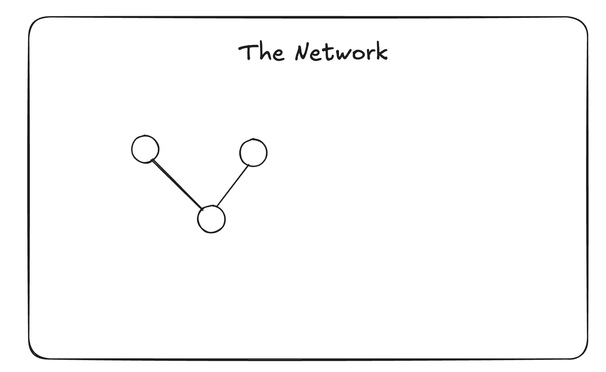

</image>

---

## 124. Codex — 2026-09-29 17:12:08 IST

**Chat 4: Understand the Cosign Drop challenge**

I’ll build a clean, full-page network canvas based on your sketch, with avatar nodes, pan and zoom, relationship filters, and a polished detail card when you click a person or company.

---

## 125. Codex — 2026-09-29 17:12:29 IST

**Chat 4: Understand the Cosign Drop challenge**

I’m using the Sites workflow for this first version. I’ll keep the canvas close to your reference: a quiet white surface, a centered “The Network” title, and the graph as the focus. The cards will show affiliations, incoming and outgoing relationships, and the original posts.

This should take about 5–10 minutes to build and check.

---

## 126. Rahul — 2026-09-29 17:15:28 IST

**Chat 4: Understand the Cosign Drop challenge**

use nextjs with tailwindcss and shadcn if needed

---

## 127. Codex — 2026-09-29 17:15:38 IST

**Chat 4: Understand the Cosign Drop challenge**

Got it—I’ll use Next.js and Tailwind CSS. The graph will be a client component, with the styling carried into Tailwind and reusable components where useful.

---

## 128. Codex — 2026-09-29 17:24:01 IST

**Chat 4: Understand the Cosign Drop challenge**

The Next.js version is built. I’m checking the graph interactions and card layouts now, including how the network fits on smaller screens.

---

## 129. Codex — 2026-09-29 17:25:47 IST

**Chat 4: Understand the Cosign Drop challenge**

The graph now includes 50 people and company nodes, with separate colors for vouches, praise, work history, and career support. Clicking a person highlights their connections and opens the original X receipts. I’m finishing the responsive checks and preparing the private preview link.

---

## 130. Codex — 2026-09-29 17:28:00 IST

**Chat 4: Understand the Cosign Drop challenge**

The production build and TypeScript checks passed. Search, node selection, company cards, zoom controls, and relationship filters are working; the mobile layout uses a bottom sheet for details. The private deployment is now publishing.

---

## 131. Rahul — 2026-09-29 17:28:10 IST

**Chat 4: Understand the Cosign Drop challenge**

## My request:
btw when a person is selcted i kinda feel it hard to hover on a line to see maybe it's too small wdyt?

---

## 132. Codex — 2026-09-29 17:28:15 IST

**Chat 4: Understand the Cosign Drop challenge**

Yes—the thin lines are hard to target. I’ll give each line a wider invisible hover area and show relationship labels around the selected person, so you can read the connections without precisely hovering.

---

## 133. Rahul — 2026-09-29 17:28:54 IST

**Chat 4: Understand the Cosign Drop challenge**

## My request:
because the node behind it is getting highligted

---

## 134. Codex — 2026-09-29 17:28:59 IST

**Chat 4: Understand the Cosign Drop challenge**

Ah, yes—the faded node behind the line is still catching the pointer. I’ll make unrelated faded nodes ignore hover and clicks while a person is selected, so the visible connection gets the interaction.

---

## 135. Codex — 2026-09-29 17:30:32 IST

**Chat 4: Understand the Cosign Drop challenge**

Fixed—faded, unrelated nodes no longer intercept hover or clicks. Lines now have a wider invisible hover area, and selected connections show relationship labels.

Built with Next.js and Tailwind; build and TypeScript checks pass.

[Open The Network — private preview](https://the-network-rahul.rahulmfg.chatgpt.site)

---

## 136. Rahul — 2026-09-29 17:32:30 IST

**Chat 4: Understand the Cosign Drop challenge**

# Files mentioned by the user:

## Screenshot 2026-09-29 at 5.31.39 PM.png

## My request:
this is little confusing the text is by me but when we have kevin it kinda confuses right. So we could fix this UI maybe alignment and rahul said or user said?

Think of better UI that component

[Image attached below]

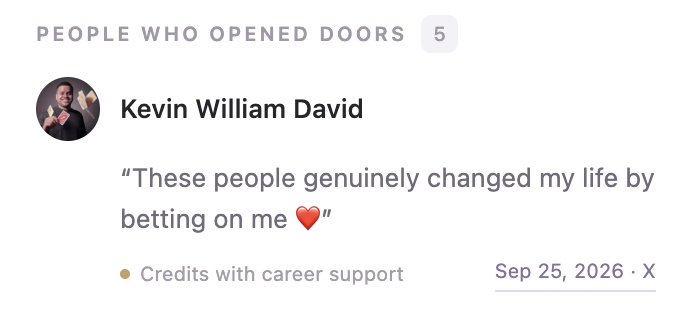

</image>

---

## 137. Codex — 2026-09-29 17:32:36 IST

**Chat 4: Understand the Cosign Drop challenge**

Yes—the avatar and name make it look like Kevin said the quote. I’ll make the direction explicit: **“Rahul credits Kevin William David”**, with **“Rahul said”** above the quote. I’ll apply the same author-first pattern to vouches and praise.

---

## 138. Rahul — 2026-09-29 17:33:36 IST

**Chat 4: Understand the Cosign Drop challenge**

also can we expand the data even further try to include some people from cosign and expand nodes further too I think it will be fun with more data. Like Erik from co-sign can be included. Goal is to get few more nodes maybe 20 or so

---

## 139. Codex — 2026-09-29 17:33:41 IST

**Chat 4: Understand the Cosign Drop challenge**

I’ll expand it by roughly 20 nodes, starting from Cosign’s network. Erik Torenberg is already included, so I’ll build outward from him and the other Cosign people, keeping the new connections tied to public posts or profiles. I’ll finish the quote-card update alongside that.

---

## 140. Rahul — 2026-09-29 17:34:07 IST

**Chat 4: Understand the Cosign Drop challenge**

# Files mentioned by the user:

## Screenshot 2026-09-29 at 5.33.46 PM.png

## My request:
when I picked Dane we could show who he supports or something like that the other way data?

[Image attached below]

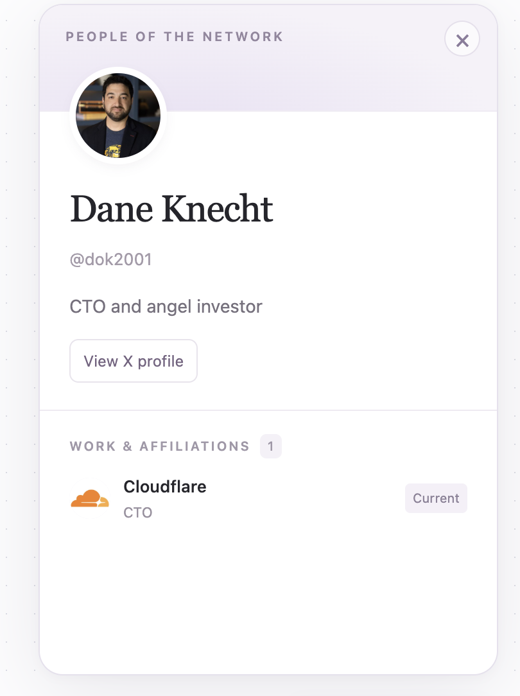

</image>

---

## 141. Codex — 2026-09-29 17:34:12 IST

**Chat 4: Understand the Cosign Drop challenge**

Yes—Dane’s card should also show **“People who credit Dane”**, including Dani Grant and her original quote. That makes the relationship explorable from both ends while keeping clear who actually said it. I’ll add that to every profile.

---

## 142. Rahul — 2026-09-29 17:34:37 IST

**Chat 4: Understand the Cosign Drop challenge**

esp the opened door is missing

---

## 143. Codex — 2026-09-29 17:34:40 IST

**Chat 4: Understand the Cosign Drop challenge**

Exactly—the **“opened doors” relationship was only shown from the author’s side**. I’ve added the reverse section: **“People who credit Dane”**, showing Dani’s quote with clear attribution. The same now applies to every person.

---

## 144. Rahul — 2026-09-29 17:35:08 IST

**Chat 4: Understand the Cosign Drop challenge**

okay what about my other request of getting more data nad other previously sent queries as well

---

## 145. Codex — 2026-09-29 17:35:16 IST

**Chat 4: Understand the Cosign Drop challenge**

I stopped too early. The data expansion is still unfinished, and the quote-attribution and reverse “opened doors” changes are in the local code but haven’t been published yet. I’ll complete the additional nodes, verify their sources, and publish all three changes together.

---

## 146. Codex — 2026-09-29 17:36:23 IST

**Chat 4: Understand the Cosign Drop challenge**

The reverse support section is now working: Dane’s card shows Dani’s post under “People who credit Dane,” with Dani clearly identified as the author. Grok has also found more connections around Erik and the Cosign team; I’m checking the original posts and removing people already in our dataset before adding them.

---

## 147. Rahul — 2026-09-29 17:37:00 IST

**Chat 4: Understand the Cosign Drop challenge**

also some of those people in the network are connected as well, make it data rich and fun to explore. So that it proves our drop

---

## 148. Codex — 2026-09-29 17:37:06 IST

**Chat 4: Understand the Cosign Drop challenge**

Agreed—the useful part is following connections across the network, not just seeing more people around Erik. I’ll also look for vouches and collaborations between the people we’re adding, plus links back to the existing network. Shared-company links will stay distinct from evidence that two people worked together.

---

## 149. Codex — 2026-09-29 17:40:17 IST

**Chat 4: Understand the Cosign Drop challenge**

I found several useful cross-links: Brooke explicitly names David and Dhruv as Cosign collaborators; Dhruv credits Brent for taking a chance on him; Brent and Henry praise each other; and Dani and Claire have posts about each other. These give the graph paths between the Cosign, MTS, OpenAI, and existing Product Hunt circles.

---

## 150. Codex — 2026-09-29 17:42:55 IST

**Chat 4: Understand the Cosign Drop challenge**

The expansion is assembled: **74 nodes and 147 reviewed connections**, up from 50 and 85. It adds 21 people and three organizations, including the cross-links between the new and existing circles. I’m checking the larger graph and the revised cards before publishing.

---

## 151. Codex — 2026-09-29 17:44:54 IST

**Chat 4: Understand the Cosign Drop challenge**

All three updates are now published. The cards identify the quote’s author, group repeated quotes from the same post, and show “opened doors” relationships from both ends. The expanded network also has source-linked collaborations visible by default, so you can follow the new cross-links.

---

## 152. Codex — 2026-09-29 17:45:03 IST

**Chat 4: Understand the Cosign Drop challenge**

All published in [The Network](https://the-network-rahul.rahulmfg.chatgpt.site):

- **24 new nodes and 62 connections**—now 74 nodes and 147 reviewed connections.
- Cross-links between Cosign, MTS, OpenAI, and existing people.
- Clear **“Rahul said”** attribution; repeated quotes grouped.
- Reverse **“People who credit Dane”** sections.

Try exploring **Dhruv → Brent → Henry**, or **Dani ↔ Claire**. Build and data checks passed.

---

## 153. Rahul — 2026-09-29 17:45:03 IST

**Chat 4: Understand the Cosign Drop challenge**

after you done with that let's focus on UX, I want the interaction to be smooth and enough space maybe? 

Right not the zoom in/out and interactions feels rigid.

---

## 154. Codex — 2026-09-29 17:45:11 IST

**Chat 4: Understand the Cosign Drop challenge**

I’ll soften the zoom and selection transitions, give connected people more room, and make panning feel more natural. I’ll also check how the detail card affects the space available for exploring the graph.

---

## 155. Codex — 2026-09-29 17:47:16 IST

**Chat 4: Understand the Cosign Drop challenge**

The abrupt camera jumps were a big part of the problem. Zoom and selection now ease into place, selecting someone frames their nearby connections beside the card, and “Back to network” restores your previous view. I’ve also spread out the nodes and reduced the header’s footprint.

---

## 156. Codex — 2026-09-29 17:48:09 IST

**Chat 4: Understand the Cosign Drop challenge**

The new framing keeps Rahul’s connected people clear of the card, and returning to the network restores the exact previous zoom and position. Repeated zoom clicks now build on each other smoothly. I’m checking the mobile layout and pinch-to-pan handoff next.

---

## 157. Codex — 2026-09-29 17:49:37 IST

**Chat 4: Understand the Cosign Drop challenge**

Updated [The Network](https://the-network-rahul.rahulmfg.chatgpt.site) with:

- Smooth zoom and selection transitions.
- More space between nodes.
- Camera framing that accounts for the detail card.
- “Back to network” restoring your previous view.
- More graph space on mobile.

Desktop/mobile checks and the production build passed.

---

## 158. Rahul — 2026-09-29 17:50:08 IST

**Chat 4: Understand the Cosign Drop challenge**

## My request:
I think zoom in/out become very sensitive

---

## 159. Codex — 2026-09-29 17:50:12 IST

**Chat 4: Understand the Cosign Drop challenge**

I’ll reduce the wheel and pinch sensitivity and make the zoom buttons take smaller steps.

---

## 160. Codex — 2026-09-29 17:51:47 IST

**Chat 4: Understand the Cosign Drop challenge**

I reduced wheel sensitivity by about 70% and trackpad-pinch sensitivity by 75%. I also limited queued zoom movement so quick gestures won’t overshoot as much, and reduced button steps from 25% to 12%.

---

## 161. Rahul — 2026-09-29 17:52:11 IST

**Chat 4: Understand the Cosign Drop challenge**

## My request:
oh I used pan in/out sort of way to zoom is that why?

---

## 162. Codex — 2026-09-29 17:52:18 IST

**Chat 4: Understand the Cosign Drop challenge**

Yes—two-finger scrolling currently controls zoom, so a gesture you intended as panning changes the scale.

A more natural setup would be **two-finger scroll to pan, pinch to zoom**, with dragging and +/− buttons still available. The sensitivity reduction is live, but that gesture mapping is the bigger issue.

---

## 163. Rahul — 2026-09-29 17:52:18 IST

**Chat 4: Understand the Cosign Drop challenge**

# Files mentioned by the user:

## Screenshot 2026-09-29 at 5.50.37 PM.png

## My request:
in this card I think we should have the one who received it photo & name? since we are in Erik card it make sense he gave it with the title as given?

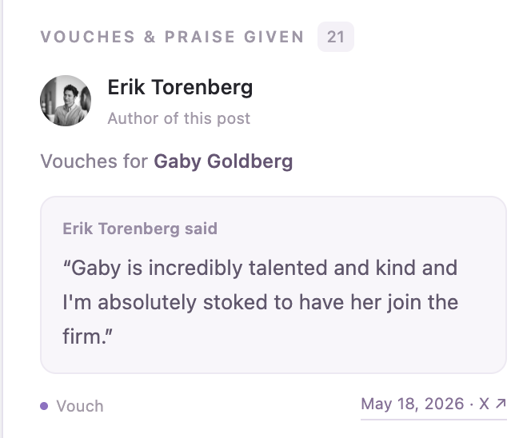

---

## 164. Codex — 2026-09-29 17:52:23 IST

**Chat 4: Understand the Cosign Drop challenge**

Yes—the recipient should lead in the “Given” section. I’ll show Gaby’s photo and name there, while keeping **“Erik Torenberg said”** above the quote so attribution stays clear.

---

## 165. Codex — 2026-09-29 17:54:17 IST

**Chat 4: Understand the Cosign Drop challenge**

Updated and live. “Given” cards now lead with **the recipient’s photo and name**, followed by “Vouched for by Erik Torenberg.” The quote still says **“Erik Torenberg said”**.

“Received” cards continue to lead with the giver.

---

## 166. Rahul — 2026-09-29 17:54:17 IST

**Chat 4: Understand the Cosign Drop challenge**

## My request:
instead of "PEOPLE WHO CREDIT Erik Torenberg
" maybe opened doors for or something? wdyt? as title

---

## 167. Codex — 2026-09-29 17:54:22 IST

**Chat 4: Understand the Cosign Drop challenge**

**“OPENED DOORS FOR”** fits well—it pairs naturally with **“PEOPLE WHO OPENED DOORS”** and keeps the focus on the people Erik helped. The quote attribution makes clear that they’re the ones crediting him.

---

## 168. Rahul — 2026-09-29 17:54:23 IST

**Chat 4: Understand the Cosign Drop challenge**

## My request:
the zoom in/out interaction is really confusing see how other sites with such interaction handles it and fix it plz. Esp with trackpad it's very confusing and does nothing

---

## 169. Codex — 2026-09-29 17:54:28 IST

**Chat 4: Understand the Cosign Drop challenge**

I’ll compare how established graph and canvas tools handle trackpads, then fix the gesture mapping—not just the sensitivity. I’ll also apply the “Opened doors for” heading.

---

## 170. Codex — 2026-09-29 17:55:19 IST

**Chat 4: Understand the Cosign Drop challenge**

React Flow’s design-tool controls use **scroll to pan and pinch to zoom**. Our implementation was still turning ordinary trackpad scrolling into zoom, then repeatedly easing tiny updates—which explains the confusing response. I’m switching gestures to direct movement and adding WebKit pinch support for Safari-style browsers. [Reference](https://reactflow.dev/learn/concepts/the-viewport)

---

## 171. Codex — 2026-09-29 17:59:13 IST

**Chat 4: Understand the Cosign Drop challenge**

The browser check now confirms that two-finger scrolling moves the graph horizontally and vertically without changing zoom. Zoom buttons work separately, and live gestures no longer have the delayed easing that made them feel unresponsive. I’m building and publishing this update now.

---

## 172. Codex — 2026-09-29 18:00:05 IST

**Chat 4: Understand the Cosign Drop challenge**

Fixed and [published](https://the-network-rahul.rahulmfg.chatgpt.site). Refresh your tab.

Following [React Flow’s design-tool controls](https://reactflow.dev/learn/concepts/the-viewport):

- **Two-finger scroll → pan**
- **Pinch → zoom around your cursor**
- **⌘/Ctrl + scroll → zoom**
- **+/− buttons → gradual zoom**

Removed delayed easing from live gestures and added Safari/WebKit pinch handling. Browser pan/button checks, gesture math tests, and build passed; physical trackpad pinch still needs your hands-on check.

Also changed the heading to **“Opened doors for.”**

---

## 173. Rahul — 2026-09-29 18:00:05 IST

**Chat 4: Understand the Cosign Drop challenge**

# Files mentioned by the user:

## Screenshot 2026-09-29 at 5.54.32 PM.png

## My request:
maybe close icon can be fixed so easy UX to closewdyt?

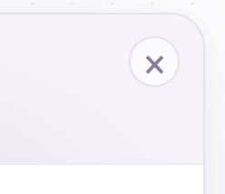

---

## 174. Codex — 2026-09-29 18:00:10 IST

**Chat 4: Understand the Cosign Drop challenge**

Yes—the close button should stay visible while you scroll the card. I’ll pin it in the top-right corner and keep a generous click target.

---

## 175. Codex — 2026-09-29 18:02:07 IST

**Chat 4: Understand the Cosign Drop challenge**

Done—[published](https://the-network-rahul.rahulmfg.chatgpt.site). The close button now stays pinned while the card scrolls, with a larger 44px click target and clearer icon. **Esc** also closes it.

Verified scrolling and dismissal. Refresh to try it.

---

## 176. Rahul — 2026-09-29 18:02:08 IST

**Chat 4: Understand the Cosign Drop challenge**

## My request:
okay update to opened doors

---

## 177. Codex — 2026-09-29 18:02:12 IST

**Chat 4: Understand the Cosign Drop challenge**

I’ll shorten “Opened doors for” to “Opened doors.”

---

## 178. Codex — 2026-09-29 18:03:25 IST

**Chat 4: Understand the Cosign Drop challenge**

Updated to **“Opened doors”** and [published](https://the-network-rahul.rahulmfg.chatgpt.site). Refresh to see it.

---

## 179. Rahul — 2026-09-29 18:03:25 IST

**Chat 4: Understand the Cosign Drop challenge**

## My request:
let's fix josuha profile he works at Hero and he also said about hiring me in one of his tweet find it and update data for him

---

## 180. Codex — 2026-09-29 18:03:29 IST

**Chat 4: Understand the Cosign Drop challenge**

I’ll find Joshua’s post about hiring you, verify his Hero affiliation, and update his profile and connections with the source links.

---

## 181. Codex — 2026-09-29 18:04:30 IST

**Chat 4: Understand the Cosign Drop challenge**

Found it: Joshua’s [May 7, 2024 post](https://x.com/joshuavoydik/status/1787900954907652459) welcomes you to Hero and says, “Rahul is a gem (and can ship).” His Hero affiliation was stored as unverified, so the graph hid it. I’m verifying that affiliation and adding the hiring praise and shared-work connection.

---

## 182. Codex — 2026-09-29 18:05:57 IST

**Chat 4: Understand the Cosign Drop challenge**

Joshua now has a visible Hero affiliation, and his praise appears on both his card and yours. The same post also supports a “worked together” connection. The data checks passed; I’m publishing the update.

---

## 183. Codex — 2026-09-29 18:06:26 IST

**Chat 4: Understand the Cosign Drop challenge**

Found [Joshua’s hiring post](https://x.com/joshuavoydik/status/1787900954907652459): “Rahul is a gem (and can ship).”

Updated and [published](https://the-network-rahul.rahulmfg.chatgpt.site):

- Joshua’s profile: **Cofounder and CEO at Hero**
- His hiring praise → you
- Joshua ↔ you: **Worked together**
- Verified Hero affiliation now visible

Refresh to explore his updated card.

---

## 184. Rahul — 2026-09-29 18:06:27 IST

**Chat 4: Understand the Cosign Drop challenge**

# Files mentioned by the user:

## AGENTS_storytelling_x_instagram_generic.md

## My request:
okay this is so much fun now coming back to drop and some explanation I'm gonna dump my raw thoughts. 

The social graph or network is such a power thing. It has so much signals which can be used for hiring, investment etc.. in the startup world.

Wanan hire someone say Rahul just click on his node and you will see his work, people who vouch for him, who he worked with etc.. And those are such a powerful signal for hiring. Or even for investment. 

And this data was not something that has been forced or asked for. It's how naturally people interact with each other in X. This was all exported from X using Grok. 

With this limited data we can see how cool the graph is and useful too. That's excaly what I think cosign is and bakd.work(pet project of mine).

These signals are so powerful than the resume and other things. Easy to find real talent faster. Or filter the applications. So many possibilites but I love this graph <3 

Those are my raw thoughts. Now we need to figure out a layout on how to present those and where to have it maybe graph is defualt and somewhere we have my photo it opens a chat bubble with these things wdyt? 

And you can use the story telling md file I gave you for structuring my thoughts as well.

---

## 185. Codex — 2026-09-29 18:06:31 IST

**Chat 4: Understand the Cosign Drop challenge**

I’ll read your storytelling notes and shape this into a short explanation that keeps the graph as the main experience. Your photo could work as a “Why I made this” entry point—personal and easy to discover.

---

## 186. Codex — 2026-09-29 18:06:56 IST

**Chat 4: Understand the Cosign Drop challenge**

**Keep the graph as the default. Your photo with “Why I made this” is a good way to add the story without taking people away from exploring.** Give it a visible label so it doesn’t look like another graph node.

I’d place it in the header, opposite “Start with Rahul.” Clicking opens a small note anchored beneath your photo; on mobile, a bottom sheet. Your photo, “A note from Rahul,” a close button, and a few short paragraphs. No typing animation or chat input—it should feel like a personal note.

Using your storytelling guide, the strongest sequence is **belief → concrete example → where the evidence came from → what it could make possible**. The graph itself supplies the proof.

Here’s the copy I’d use:

> **Good people leave signals everywhere.**
>
> Someone recommends a teammate. A founder celebrates a new hire. Someone thanks the person who opened a door for them.
>
> Those moments get buried in the feed. I wanted to see what happens when you connect them.
>
> Say you’re thinking about hiring me. Click my node. You can explore where I’ve worked, who I’ve worked with, and what people have actually said about my work. Every connection takes you back to its source.
>
> These posts already existed on X. I used Grok to help find them, then checked the sources and connected a small slice of the network.
>
> For startups, I think this context can say more than a résumé alone. It could help you discover someone, understand their work, or figure out whom to ask about them.
>
> It’s the belief behind my pet project, bakd.work, and what draws me to Cosign.
>
> There’s so much more to explore here. For now, I just love seeing the connections ❤️

End with **“Explore my connections →”**, which closes the note and selects your node. That makes the explanation lead straight into a demonstration.

I’d keep hiring as the main example; investment can come later. And I’d soften “better than résumés” to **“more context than a résumé alone”**—the convincing part is the specific evidence, rather than how publicly connected someone is. Likewise, “these posts already existed” is stronger factually than saying none were ever requested; we can’t know that for every post.

---

## 187. Rahul — 2026-09-29 18:07:38 IST

**Chat 4: Understand the Cosign Drop challenge**

# Files mentioned by the user:

## Screenshot 2026-09-29 at 6.07.12 PM.png

## My request:
let's make this beautiful it's too tight could be center modal

[Image attached below]

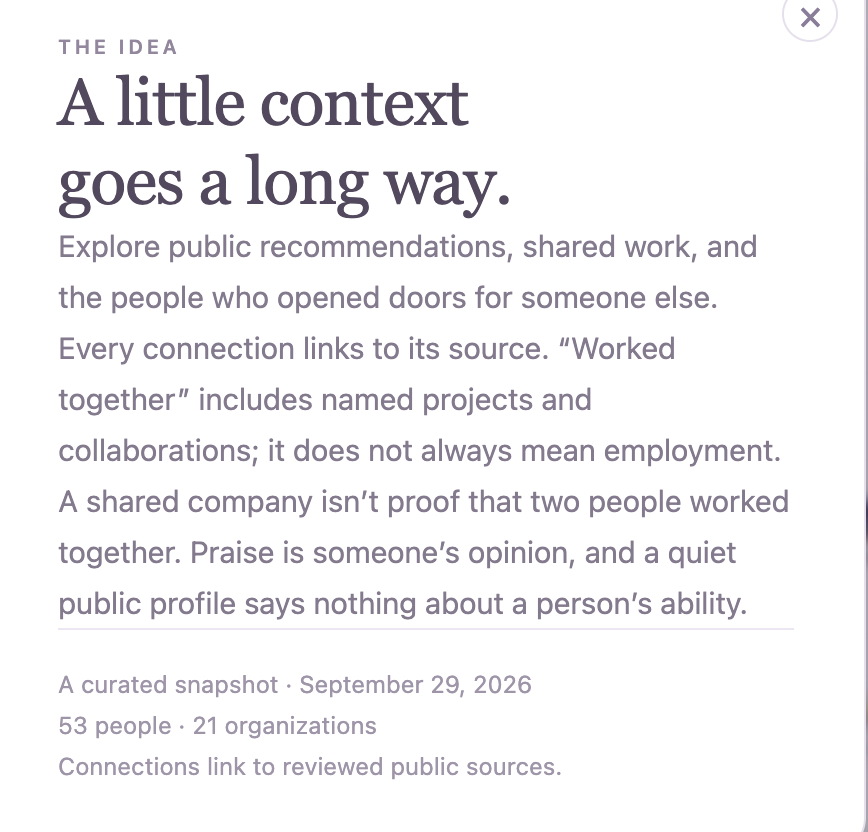

</image>

---

## 188. Codex — 2026-09-29 18:07:42 IST

**Chat 4: Understand the Cosign Drop challenge**

I’ll turn this into a spacious centered modal, with a clearer reading hierarchy, your personal introduction, and a close button that stays easy to reach.

---

## 189. Codex — 2026-09-29 18:09:23 IST

**Chat 4: Understand the Cosign Drop challenge**

The new modal has wider margins, a personal header with your photo, and a clear “Explore my connections” button. I’ve moved the data notes into an expandable section so the story has room to breathe.

---

## 190. Codex — 2026-09-29 18:10:20 IST

**Chat 4: Understand the Cosign Drop challenge**

[Published](https://the-network-rahul.rahulmfg.chatgpt.site)—refresh and open **“About this network.”**

It’s now a spacious centered modal with your photo, personal story, softer typography, and a blurred backdrop. Close and explore buttons stay visible; **“Explore my connections”** opens your node.

Build passed and the explore action is verified.

---

## 191. Rahul — 2026-09-29 18:10:21 IST

**Chat 4: Understand the Cosign Drop challenge**

## My request:
also yes do it the photo chat buble thing when clicked expands a chat bubble like intercom style and shows my thoughts

And any thoughts on the title and subtitle?

---

## 192. Codex — 2026-09-29 18:10:31 IST

**Chat 4: Understand the Cosign Drop challenge**

I’ll add your photo with a “Why I made this” label that opens an Intercom-style bubble. “About this network” will still open the larger centered version.

For the title, I’d keep **The Network.** and use **“See who people believe in.”** as the subtitle—it explains the graph’s purpose more clearly than “Good people know good people.”

---

## 193. Rahul — 2026-09-29 18:11:29 IST

**Chat 4: Understand the Cosign Drop challenge**

## My request:
btw the content misses some key things I explained like how I built it etc I would love those too don't skip important context I gave you

---

## 194. Codex — 2026-09-29 18:11:35 IST

**Chat 4: Understand the Cosign Drop challenge**

You’re right—I compressed it too far. I’ll bring back how you built it from X posts using Grok, why those existing interactions matter, the hiring and investment possibilities, and how this connects to Cosign and bakd.work. The bubble will scroll so the important context can stay.

---

## 195. Rahul — 2026-09-29 18:12:04 IST

**Chat 4: Understand the Cosign Drop challenge**

## My request:
actually the stroy telling kinda exluded lot of great things I said so ignore the storytelling md and use my raw thoughts again without leaving much things can you shape it

The social graph or network is such a power thing. It has so much signals which can be used for hiring, investment etc.. in the startup world.
Wanan hire someone say Rahul just click on his node and you will see his work, people who vouch for him, who he worked with etc.. And those are such a powerful signal for hiring. Or even for investment. 
And this data was not something that has been forced or asked for. It's how naturally people interact with each other in X. This was all exported from X using Grok. 
With this limited data we can see how cool the graph is and useful too. That's excaly what I think cosign is and bakd.work(pet project of mine).
These signals are so powerful than the resume and other things. Easy to find real talent faster. Or filter the applications. So many possibilites but I love this graph <3

---

## 196. Codex — 2026-09-29 18:12:16 IST

**Chat 4: Understand the Cosign Drop challenge**

I’ll set the storytelling framework aside and stay close to your words—lightly clean up the phrasing, keep all your points, and put that version in the photo bubble and centered modal.

---

## 197. Rahul — 2026-09-29 18:12:37 IST

**Chat 4: Understand the Cosign Drop challenge**

## My request:
with good title inside the bubble

---

## 198. Codex — 2026-09-29 18:12:46 IST

**Chat 4: Understand the Cosign Drop challenge**

**“The signals are already there.”** feels right for the bubble. It captures your main point: people are already sharing this context through their interactions on X, and the graph makes it easier to explore.

---

## 199. Codex — 2026-09-29 18:14:02 IST

**Chat 4: Understand the Cosign Drop challenge**

[Published](https://the-network-rahul.rahulmfg.chatgpt.site). Click your photo beside **“Why I made this”** to open the bubble.

Title: **“The signals are already there.”**

The copy now stays close to your raw thoughts, including Grok/X, natural interactions, hiring and investment, limited data, Cosign, bakd.work, and finding talent faster. Scrolling and dismissal verified.

For the main page, my recommendation remains **The Network.** with **“See who people believe in.”** as the subtitle.

---

## 200. Rahul — 2026-09-29 18:14:02 IST

**Chat 4: Understand the Cosign Drop challenge**

## My request:
also when someone is selected "the node" we highlight the connection. Can we zoom in a little bit so that's it's visible properly?

---

## 201. Codex — 2026-09-29 18:14:08 IST

**Chat 4: Understand the Cosign Drop challenge**

I’ll make selecting a node zoom in a bit more, while keeping its connections visible beside the profile card.

---

## 202. Codex — 2026-09-29 18:15:57 IST

**Chat 4: Understand the Cosign Drop challenge**

Done—[published](https://the-network-rahul.rahulmfg.chatgpt.site). Selecting a node now smoothly zooms closer and brings it toward the center beside its card, making nearby connections easier to read.

Closing the card restores your previous view. Refresh to try it.

---

## 203. Rahul — 2026-09-29 18:15:58 IST

**Chat 4: Understand the Cosign Drop challenge**

# Files mentioned by the user:

## Screenshot 2026-09-29 at 6.15.12 PM.png

## My request:
the why I made it look blunt and wrong position we should keep it somewhere it will grab attention too and I was hoping it could like a perfect chat bubble something like attached don't take the colors or direction

But first plcement and then chat bubble we could subtle animations and effects to make this whole page and this component delighfult

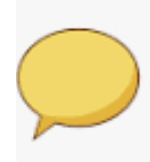

---

## 204. Codex — 2026-09-29 18:16:07 IST

**Chat 4: Understand the Cosign Drop challenge**

I’d move it to the top-left, beside your photo, so it’s part of the first thing people see. “A note from Rahul” can sit in a small speech bubble; clicking it opens a larger bubble with a tail pointing back to your photo.

I’ll keep the lavender palette and add a gentle entrance and hover effect, without constant bouncing that distracts from the graph.

---

## 205. Codex — 2026-09-29 18:17:36 IST

**Chat 4: Understand the Cosign Drop challenge**

The entry now sits beside your photo in the header, with a speech-bubble shape and a small “Why I made this” prompt. The expanded note opens directly beneath it. I’m checking the placement and scrolling before publishing.

---

## 206. Rahul — 2026-09-29 18:18:56 IST

**Chat 4: Understand the Cosign Drop challenge**

## My request:
let's add a proper .gitignore 

And then I don't want chatgpt sites discard those settings and code for that. No need to deploy this. 

And rename site to frontend

---

## 207. Codex — 2026-09-29 18:19:01 IST

**Chat 4: Understand the Cosign Drop challenge**

I’ll remove the ChatGPT Sites configuration, rename `site` to `frontend`, and add a `.gitignore` for the project. I’ll keep the Next.js app runnable locally and won’t deploy these changes.

---

## 208. Codex — 2026-09-29 18:20:23 IST

**Chat 4: Understand the Cosign Drop challenge**

The app is now in `frontend`, with its Git history preserved. I removed the Sites manifest and static-export settings, added ignore rules for dependencies, builds, local environment files, logs, and OS files, and updated the local run instructions. I’m checking the standard Next.js build now.

---

## 209. Codex — 2026-09-29 18:21:32 IST

**Chat 4: Understand the Cosign Drop challenge**

Done.

- Renamed `site` → [frontend](#local-file-references), preserving Git history.
- Added `.gitignore` files.
- Removed ChatGPT Sites configuration and static-export settings.
- Updated local run instructions and added `npm start`.
- Typecheck and production build passed.

Local app: [localhost:3000](http://127.0.0.1:3000). Nothing deployed; the existing hosted copy remains unchanged.

---

## 210. Rahul — 2026-09-29 18:21:33 IST

**Chat 4: Understand the Cosign Drop challenge**

## My request:
and finally let's refactor the codebase. We should use proper conventions. 

The code is not having proper split. Pure DOM elements or components needs to be in components. imo components has things that can be re-used across. 

And types can be in types folder

See how I structured my other projects in ~/hero/hero-web/frontend

---

## 211. Codex — 2026-09-29 18:21:40 IST

**Chat 4: Understand the Cosign Drop challenge**

I’ll inspect the conventions in `~/hero/hero-web/frontend`, then use them to split this app into focused components, hooks, types, and utilities. I’ll preserve the current behavior and keep the changes local.

---

## 212. Codex — 2026-09-29 18:22:14 IST

**Chat 4: Understand the Cosign Drop challenge**

Your Hero project uses `screens/` for page composition, named component folders for UI, hooks for behavior, and `types/` and `utils/` for shared definitions and helpers. I’ll follow that structure here. The main split will separate the graph interactions, profile cards and receipts, search and controls, and your story bubble.

---

## 213. Rahul — 2026-09-29 18:24:08 IST

**Chat 4: Understand the Cosign Drop challenge**

## My request:
also look at lint and ci checks. we don't have CI but we could at least run minimal checks before deploy locally

---

## 214. Codex — 2026-09-29 18:24:18 IST

**Chat 4: Understand the Cosign Drop challenge**

I’ll add a local `npm run ci` command for formatting, lint, type checks, and tests, plus `npm run check:deploy` to run those checks and a production build. That will give you a repeatable pre-deploy check without setting up hosted CI.

---

## 215. Rahul — 2026-09-29 18:26:50 IST

**Chat 4: Understand the Cosign Drop challenge**

# Files mentioned by the user:

## Screenshot 2026-09-29 at 6.24.43 PM.png

## Screenshot 2026-09-29 at 6.25.49 PM.png

## My request:
scroll bar is going outside the corners fix that clip it

And ust click on his node. maybe node text can be highlighted and clickable and on click loads my connection

Also when node is selcted we right now zoom in a bit make sure it's perfect and not too zommed in because right now when it zoomed some nodes where behind the bottom left element Would be great to have all elements visible

[Image attached below]

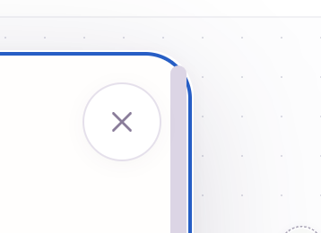

</image>

[Image attached below]

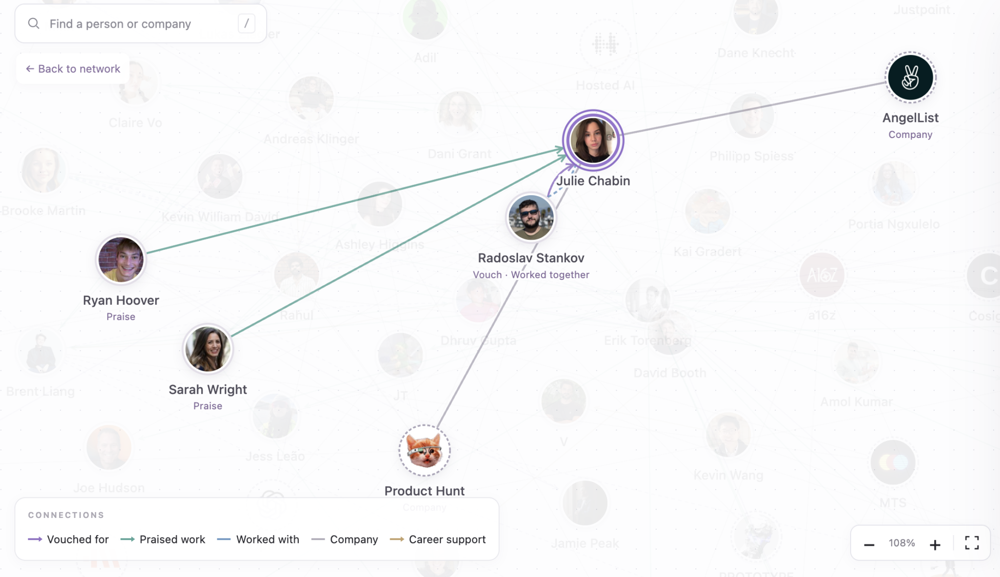

</image>

---

## 216. Codex — 2026-09-29 18:26:58 IST

**Chat 4: Understand the Cosign Drop challenge**

I’ll include those fixes in the refactor: clip scrolling inside the bubble’s rounded corners, make “node” a highlighted link to your connections, and fit selected connections within the space left by the card, search, and bottom controls. The current minimum zoom is forcing some nodes under those controls; I’ll remove that constraint.

---

## 217. Rahul — 2026-09-29 18:28:40 IST

**Chat 4: Understand the Cosign Drop challenge**

## My request:
and I wonder if note from rahul should be in right side? Any other better placement? you can think off if not just do that plz

---

## 218. Codex — 2026-09-29 18:28:48 IST

**Chat 4: Understand the Cosign Drop challenge**

The top-right is a better fit: it’s a familiar place for a personal note or chat entry, and it keeps the left side clear for search. I’ll move your photo and bubble there, with the tail pointing back to your photo. “Start with Rahul” will move to the left of the title.

---

## 219. Codex — 2026-09-29 18:30:08 IST

**Chat 4: Understand the Cosign Drop challenge**

The refactor and local checks are passing so far. Julie’s connections now fit above the legend and beside her card, and clicking “node” in your note opens your connections. The note is on the top-right, with a separate clipped inner surface to keep the scrollbar inside the rounded corners. I’m finishing mobile checks and the production build.

---

## 220. Codex — 2026-09-29 18:31:31 IST

**Chat 4: Understand the Cosign Drop challenge**

Done locally at [localhost:3000](http://127.0.0.1:3000).

- Refactored into `screens`, reusable `components`, `hooks`, `types`, `utils`, and `styles`, following Hero’s conventions.
- Moved your note to the top-right.
- Clipped scrollbars inside rounded corners.
- Made “node” clickable to open your connections.
- Adjusted selection zoom to fit connections clear of the card and controls.

Added:
- `npm run ci` — formatting, lint, types, tests.
- `npm run check:deploy` — all checks plus production build.

All checks and 10 tests passed. Desktop/mobile UI checked. Nothing committed or deployed.

---

## 221. Rahul — 2026-09-29 18:31:32 IST

**Chat 4: Understand the Cosign Drop challenge**

## My request:
also when clicking on a connection we right now close it maybe it should jsut scroll to that part in the right side bard?

---

## 222. Codex — 2026-09-29 18:31:39 IST

**Chat 4: Understand the Cosign Drop challenge**

Yes—clicking a connection should take you to its evidence in the right-hand card. I’ll make it scroll to the matching entry and briefly highlight it, instead of closing the card.

---

## 223. Codex — 2026-09-29 18:35:53 IST

**Chat 4: Understand the Cosign Drop challenge**

The connection now keeps the profile open and targets its matching evidence. I’m checking the scroll behavior for both quotes and company links, including posts that cover several people.

---

## 224. Codex — 2026-09-29 18:37:01 IST

**Chat 4: Understand the Cosign Drop challenge**

Done—clicking a connection now keeps the sidebar open, scrolls to the matching quote or company entry, and briefly highlights it.

Verified in-browser; lint, types, 10 tests, and production build pass. Updated locally only—nothing deployed.

---

## 225. Rahul — 2026-09-29 18:37:01 IST

**Chat 4: Understand the Cosign Drop challenge**

# Files mentioned by the user:

## Screenshot 2026-09-29 at 6.33.10 PM.png

## My request:
in this component first my image can appear and the chat bubble could come in it natural and most used animation? like new chat?

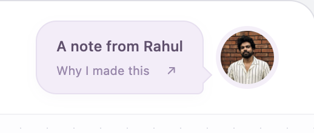

---

## 226. Codex — 2026-09-29 18:37:08 IST

**Chat 4: Understand the Cosign Drop challenge**

I’ll make your photo appear first, then bring in the bubble with a gentle fade and small spring motion—like a new message arriving. It’ll play once when the page opens and respect reduced-motion settings.

---

## 227. Rahul — 2026-09-29 18:37:15 IST

**Chat 4: Understand the Cosign Drop challenge**

## My request:
also I think we can include this text somewhere in my copy of why I built this drop

Even if someone what's to work at a company let's say OpenAI he can see if someone he knows work at OpenAI directly and makes it easy? 

Should we add this wdyt?

---

## 228. Codex — 2026-09-29 18:37:21 IST

**Chat 4: Understand the Cosign Drop challenge**

Yes—that adds the job seeker’s perspective: “Want to work at a company like OpenAI? Explore its connections to see whether someone you know works there, and who you could reach out to for an introduction.” I’ll add it alongside the hiring and investment examples.

---

## 229. Rahul — 2026-09-29 18:38:03 IST

**Chat 4: Understand the Cosign Drop challenge**

## My request:
also instead of why i build this copy maybe it could be something like title which make sesne for drop?

---

## 230. Codex — 2026-09-29 18:38:08 IST

**Chat 4: Understand the Cosign Drop challenge**

“The idea behind this drop” fits better—it introduces both the experiment and the bigger idea. I’ll use that for the bubble invitation and keep “The signals are already there” as the headline inside.

---

## 231. Codex — 2026-09-29 18:38:46 IST

**Chat 4: Understand the Cosign Drop challenge**

Updated to **“The idea behind this drop”**, with **“The signals are already there”** as the headline inside.

Also added the OpenAI introduction example and the photo-first, gently appearing chat bubble animation. Checks pass; changes are local only.

---

## 232. Rahul — 2026-09-29 18:38:46 IST

**Chat 4: Understand the Cosign Drop challenge**

## My request:
finally let's clean things and deploy this to cf worker? I think cf worker supports nextjs prod app? 

Make sure it's free version no need to go to paid tier yet

---

## 233. Codex — 2026-09-29 18:38:53 IST

**Chat 4: Understand the Cosign Drop challenge**

I’ll check the Cloudflare setup, clean up the deployment config, and deploy using the Workers Free plan. I’ll verify the Next.js support and free-tier limits before choosing the deployment approach.

---

## 234. Codex — 2026-09-29 18:39:03 IST

**Chat 4: Understand the Cosign Drop challenge**

I’m using the Cloudflare and Wrangler skills for this. This app currently renders entirely as static content, so Workers Static Assets looks like the simplest free deployment: the graph keeps all its interactions without needing a server on each request.

---

## 235. Rahul — 2026-09-29 18:39:36 IST

**Chat 4: Understand the Cosign Drop challenge**

# Files mentioned by the user:

## Screenshot 2026-09-29 at 6.39.19 PM.png

## My request:
clicking on cavas highlights that I don't want that can you fix it before deploy

[Image attached below]

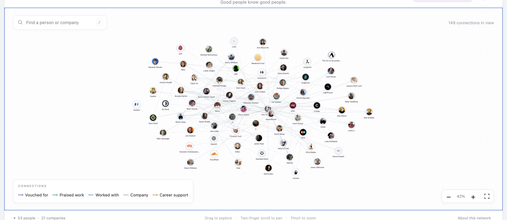

</image>

---

## 236. Codex — 2026-09-29 18:39:41 IST

**Chat 4: Understand the Cosign Drop challenge**

I’ll fix that before deploying. It’s the canvas focus outline; mouse clicks shouldn’t show that border. I’ll keep a subtle focus indicator for keyboard navigation.

---

## 237. Rahul — 2026-09-29 18:40:39 IST

**Chat 4: Understand the Cosign Drop challenge**

## My request:
also I don't think idea behind this drop is right too see other drops it's like title for a blog post or something like that right

---

## 238. Codex — 2026-09-29 18:40:44 IST

**Chat 4: Understand the Cosign Drop challenge**

Right—the invitation should hint at the idea itself, like a post title. **“Good people leave a trail”** feels more intriguing and connects to the recommendations, shared work, and introductions in the graph. I’ll check the drop examples before settling the wording, then include it in this deployment.

---

## 239. Codex — 2026-09-29 18:41:47 IST

**Chat 4: Understand the Cosign Drop challenge**

The [drop archive](https://drops.mts.now/) uses subject-led titles such as “What startups are hiring for” and “The World Inside a Chip.” For yours, I’m going with **“The people behind the résumé”**—it gives readers a concrete reason to explore. “A note from Rahul” can stay as the byline.

Cloudflare’s docs also confirm that static asset requests and storage are free, so this deployment won’t need a paid upgrade. [Pricing details](https://developers.cloudflare.com/workers/static-assets/billing-and-limitations/)

---

## 240. Codex — 2026-09-29 18:42:58 IST

**Chat 4: Understand the Cosign Drop challenge**

The production preview passes: clicking the canvas no longer draws a border, keyboard focus still works, and connection clicks open the right evidence. The new note title is included, the dependency audit is clean, and the Cloudflare dry run passed. I’m publishing the static build now.

---

## 241. Rahul — 2026-09-29 18:43:13 IST

**Chat 4: Understand the Cosign Drop challenge**

# Files mentioned by the user:

## Screenshot 2026-09-29 at 6.42.31 PM.png

## My request:
seems like this odd highlight is everywhere the blue one remove those where you have it's odd 

Think it's chrome or browser auto click highlight or osmething

[Image attached below]

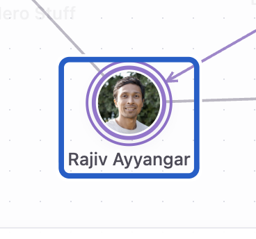

</image>

---

## 242. Codex — 2026-09-29 18:43:19 IST

**Chat 4: Understand the Cosign Drop challenge**

Yes, that’s the browser’s default focus ring on the SVG node. I’ll remove the blue click outlines throughout the app and use the existing purple styling for keyboard focus. I’ll include this fix in the Cloudflare release too.

---

## 243. Rahul — 2026-09-29 18:43:43 IST

**Chat 4: Understand the Cosign Drop challenge**

uh does people behind the resume really make sense with the content I gave

---

## 244. Codex — 2026-09-29 18:43:54 IST

**Chat 4: Understand the Cosign Drop challenge**

It’s too focused on hiring. Your idea is broader: **natural interactions reveal trust, shared work, and paths to opportunity**—for hiring, investing, or finding someone at a company.

**“What a network reveals”** fits that better. I’ll use it for the invitation and headline, while keeping your full explanation underneath.

---

## 245. Rahul — 2026-09-29 18:44:50 IST

**Chat 4: Understand the Cosign Drop challenge**

maybe we could pick among these

1. **The Résumé Is a Graph**
2. **Beyond the Résumé**
3. **The Social Graph Is the New Résumé**
4. **What If Your Network Was Your Résumé?**
5. **The People Behind the Résumé**
6. **A Résumé Made of People**
7. **Your Work. Your People. Your Graph.**
8. **The Trust Graph**
9. **Proof > Résumé**
10. **There’s More to You Than a Résumé**

For me **What If Your Network Was Your Résumé? feels like good since it's a question and could be a drop?**

---

## 246. Codex — 2026-09-29 18:45:00 IST

**Chat 4: Understand the Cosign Drop challenge**

Yes—**“What If Your Network Was Your Résumé?”** is the strongest option. The question invites people to explore the idea without claiming a graph should replace a résumé. It gives the drop a clear hook, while your copy can expand into investing, introductions, and opportunity.

I’ll use that title and let it wrap neatly in the invitation bubble.

---

## 247. Rahul — 2026-09-29 18:45:20 IST

**Chat 4: Understand the Cosign Drop challenge**

oh no that againt is just focused on hiring right

---

## 248. Rahul — 2026-09-29 18:45:20 IST

**Chat 4: Understand the Cosign Drop challenge**

maybe something liek that which could be generalised for all cases?

---

## 249. Codex — 2026-09-29 18:45:36 IST

**Chat 4: Understand the Cosign Drop challenge**

Yes—anything centered on a résumé still frames it around hiring. Your broader idea is that everyday interactions reveal trust and open paths to opportunity.

My pick is **“What If Opportunity Was a Graph?”** It covers finding talent, meeting a founder, reaching a company, or discovering who could make an introduction.

Two other directions:

- **“What Can a Network Reveal?”** — clear and exploratory.
- **“How Good People Find Each Other”** — warmer and more human.

---

## 250. Rahul — 2026-09-29 18:45:57 IST

**Chat 4: Understand the Cosign Drop challenge**

maybe The Signals in the Social Graph

---

## 251. Codex — 2026-09-29 18:46:03 IST

**Chat 4: Understand the Cosign Drop challenge**

**“The Signals in the Social Graph”** fits your full idea well. It names what people are exploring without narrowing it to hiring. I’ll use it for the note’s title and the invitation bubble.

---

## 252. Rahul — 2026-09-29 18:46:15 IST

**Chat 4: Understand the Cosign Drop challenge**

or What the Social Graph Knows

---

## 253. Codex — 2026-09-29 18:46:22 IST

**Chat 4: Understand the Cosign Drop challenge**

I’d pick **“What the Social Graph Knows.”** It’s shorter and more intriguing; your copy then explains the signals it reveals. “The Signals in the Social Graph” is clearer but feels more like a report title.

I’ll use **“What the Social Graph Knows”**.

---

## 254. Rahul — 2026-09-29 18:46:32 IST

**Chat 4: Understand the Cosign Drop challenge**

with ? mark

---

## 255. Codex — 2026-09-29 18:46:37 IST

**Chat 4: Understand the Cosign Drop challenge**

Yes—**“What the Social Graph Knows?”** I’ll add the question mark in both places.

---

## 256. Rahul — 2026-09-29 18:47:16 IST

**Chat 4: Understand the Cosign Drop challenge**

# Files mentioned by the user:

## Screenshot 2026-09-29 at 6.47.04 PM.png

## My request:
also I think we could remove that cta and keep search there?

[Image attached below]

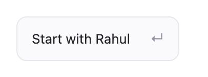

</image>

---

## 257. Codex — 2026-09-29 18:47:22 IST

**Chat 4: Understand the Cosign Drop challenge**

I’ll replace “Start with Rahul” with search in the header. That gives the graph more room, and your note will still have the link to explore your connections.

---

## 258. Rahul — 2026-09-29 18:48:02 IST

**Chat 4: Understand the Cosign Drop challenge**

uh and if we do that maybe my photo and chat goes to left and search goes right since that's the usual UX

---

## 259. Codex — 2026-09-29 18:48:09 IST

**Chat 4: Understand the Cosign Drop challenge**

I’ll put your photo and note on the left, keep the title centered, and move search to the right. On mobile, search will get its own full-width row so it stays easy to use.

---

## 260. Codex — 2026-09-29 18:49:44 IST

**Chat 4: Understand the Cosign Drop challenge**

The header now has your note on the left and working search on the right. I also adjusted the mobile layout so the title, note, and search don’t overlap. The final checks and Cloudflare update are running.

---

## 261. Codex — 2026-09-29 18:50:20 IST

**Chat 4: Understand the Cosign Drop challenge**

Live at [The Network](https://the-network.patch-dev.workers.dev).

- Photo and note on the left; search on the right.
- “Start with Rahul” removed.
- Title: **“What the Social Graph Knows?”**
- Blue click outlines fixed.
- Mobile layout and search verified; all checks pass.

Uses free Cloudflare Static Assets hosting—no paid upgrade.

---

## 262. Rahul — 2026-09-29 18:51:24 IST

**Chat 4: Understand the Cosign Drop challenge**

nice, let's update readme with my note first and then dev instructions

Also have all our convo as a transcript like asked in this challenge initially and put in the repo too and have link to that in readme

---

## 263. Codex — 2026-09-29 18:51:30 IST

**Chat 4: Understand the Cosign Drop challenge**

I’ll put your note at the top of the README, followed by the development instructions, and add a linked conversation transcript in the repo. I’ll check what conversation history I can export so the transcript is clearly labeled if any earlier messages are unavailable.

---

## 264. Codex — 2026-09-29 18:52:24 IST

**Chat 4: Understand the Cosign Drop challenge**

I found the saved conversation from the initial challenge research onward, including the earlier assistant replies. I can export the actual messages rather than reconstructing them. I’ll include the shared images where available and leave out internal instructions, tool logs, and automatic browser context.

---

## 265. Codex — 2026-09-29 18:54:36 IST

**Chat 4: Understand the Cosign Drop challenge**

Updated both READMEs with your full note first, followed by dev and deployment instructions.

Added a linked [conversation transcript](#local-file-references): **166 messages and 13 images**, with export scope documented.

[Open README](#local-file-references). Formatting and links verified.

---

## 266. Rahul — 2026-09-29 18:54:37 IST

**Chat 5: Animate graph connections**

for graph appear animation maybe we could have a cooler one like users and companies popping slowly and the nconnections are formed? Not too slow and not too fast wdyt?

And then once it's done we show my photo in top left and chat bubble appears

---

## 267. Codex — 2026-09-29 18:54:42 IST

**Chat 5: Animate graph connections**

I like that sequence—people and companies popping in, connections drawing between them, then your photo and chat bubble. I’ll check the current animation and tune it so it feels lively without delaying the page.

---

## 268. Codex — 2026-09-29 18:55:22 IST

**Chat 5: Animate graph connections**

I’ll aim for about three seconds total: a staggered pop-in for the nodes, lines drawing as their endpoints appear, then your photo followed by the speech bubble. The sequence will run once, and interacting with the page will skip straight to the finished view.

---

## 269. Codex — 2026-09-29 18:57:30 IST

**Chat 5: Animate graph connections**

Implemented a ~3-second sequence:

- People and companies pop in with a gentle stagger.
- Connections draw between them.
- Your photo appears top left, then the chat bubble.

Interacting skips the animation; reduced-motion preferences are respected. Formatting, lint, typecheck, and all 10 tests pass.

---

## 270. Rahul — 2026-09-29 18:57:57 IST

**Chat 5: Animate graph connections**

# Files mentioned by the user:

## Screenshot 2026-09-29 at 6.57.47 PM.png

## My request:
for ipad and such screen header is broken

[Image attached below]

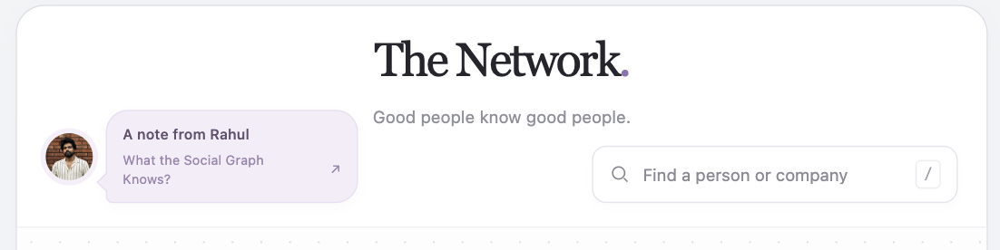

</image>

---

## 271. Codex — 2026-09-29 18:58:02 IST

**Chat 5: Animate graph connections**

I’ll fix the tablet header layout so the title, your note, and search sit in a balanced arrangement without the awkward gaps.

---

## 272. Codex — 2026-09-29 18:59:15 IST

**Chat 5: Animate graph connections**

The tablet layout was using an absolutely positioned title above bottom-aligned controls, which let the note crowd the subtitle. I’ve given the title its own row and aligned the note and search beneath it. I’m checking the tablet breakpoints now.

---

## 273. Rahul — 2026-09-29 18:59:18 IST

**Chat 5: Animate graph connections**

also for mobile we could have better exp too and left can just have my img with some better notification like beam effect or new notification 1 and then right side just search icon and click opens a search UI wdyt?

---

## 274. Codex — 2026-09-29 18:59:29 IST

**Chat 5: Animate graph connections**

That would work well on mobile: your photo with a subtle pulse and “1” badge on the left, a compact title in the middle, and a search icon on the right. I’ll make the search icon open a full-width search panel with autofocus and an easy close action.

---

## 275. Rahul — 2026-09-29 19:00:51 IST

**Chat 5: Animate graph connections**

also I think my image can be present fro mfirst just the chat bubble can come after the node load

---

## 276. Codex — 2026-09-29 19:01:00 IST

**Chat 5: Animate graph connections**

I’ll keep your photo visible from the start. The desktop/tablet chat bubble—and the mobile notification badge—will appear after the graph finishes loading.

---

## 277. Rahul — 2026-09-29 19:01:08 IST

**Chat 5: Animate graph connections**

for tablet maybe we could work on sizes and make sure it fits wdyt?

---

## 278. Codex — 2026-09-29 19:01:23 IST

**Chat 5: Animate graph connections**

Agreed. For iPad widths, I’ll shrink the title, note bubble, and search field enough to fit neatly in one row. Narrower tablet windows will switch to two rows before anything gets cramped.

---

## 279. Codex — 2026-09-29 19:02:37 IST

**Chat 5: Animate graph connections**

The compact header fits at 768px, and the mobile layout fits down to 320px. Search opens with the input focused, returns matching people, and closes correctly. Your photo now stays visible from the start; only the invitation appears after the graph. All checks pass.

---

## 280. Rahul — 2026-09-29 19:02:41 IST

**Chat 4: Understand the Cosign Drop challenge**

dont exclude docs from the git

---

## 281. Codex — 2026-09-29 19:02:49 IST

**Chat 4: Understand the Cosign Drop challenge**

I’ll check the ignore rules and make sure the transcript and its images are included in Git.

---

## 282. Codex — 2026-09-29 19:02:54 IST

**Chat 5: Animate graph connections**

Updated both layouts:

- **Tablet:** smaller elements fit neatly in one row.
- **Mobile:** photo with a pulsing “1” badge, centered title, and search icon opening a search panel.
- Your photo appears immediately; the bubble/badge follows the graph animation.

Verified at 320px, 390px, and 768px. All checks pass.

---

## 283. Codex — 2026-09-29 19:03:04 IST

**Chat 4: Understand the Cosign Drop challenge**

The docs aren’t ignored. I found the actual issue: the root repo has `frontend` staged as a submodule reference, so its files—including the docs—aren’t included. I’ll change it to a regular folder in Git.

---

## 284. Codex — 2026-09-29 19:03:27 IST

**Chat 4: Understand the Cosign Drop challenge**

Fixed—`frontend` is now staged as a regular folder, including the transcript and all 13 images.

The transcript is excluded only from **Prettier formatting**, not Git. No commit made.

---

## 285. Rahul — 2026-09-29 19:03:36 IST

**Chat 5: Animate graph connections**

for tablet reduuce the search width the space betwee network and other elements should be equal so that it doesn't look odd

---

## 286. Codex — 2026-09-29 19:03:40 IST

**Chat 5: Animate graph connections**

I’ll narrow the tablet search field and balance the gaps on either side of the title.

---

## 287. Rahul — 2026-09-29 19:04:12 IST

**Chat 4: Understand the Cosign Drop challenge**

also frontend has separate .git and i deleted it make sure things are okay and main .git in root is solid with proper gitignore

---

## 288. Codex — 2026-09-29 19:04:21 IST

**Chat 4: Understand the Cosign Drop challenge**

I’ll verify the root repository, check for leftover submodule entries, and confirm the ignore rules keep generated files and credentials out while including the source and docs.

---

## 289. Codex — 2026-09-29 19:04:27 IST

**Chat 5: Animate graph connections**

Done—tablet search is now 210px wide, with equal spacing on both sides of “The Network.” Verified at iPad width: both gaps are exactly 67px.

---

## 290. Codex — 2026-09-29 19:04:37 IST

**Chat 4: Understand the Cosign Drop challenge**

The root repo is intact: there’s no nested `.git` or leftover submodule entry, and the docs are staged normally. It’s a new repository on `main` with no commits or remote yet.

I’ll consolidate the duplicate ignore rules into the root `.gitignore` and correct the README’s outdated reference to separate frontend Git history. I also spotted an unstaged CSS change and will leave it untouched.

---

## 291. Codex — 2026-09-29 19:04:57 IST

**Chat 4: Understand the Cosign Drop challenge**

All good—one Git repository at the root, with `frontend` tracked normally.

- Consolidated rules into the root `.gitignore`.
- Build files, dependencies, caches, and credentials are ignored.
- Source, docs, transcript, and images are included.
- Your unstaged CSS change is untouched.

Everything is staged for the initial commit except that CSS change. No commit or remote exists yet.

---

## 292. Rahul — 2026-09-29 19:05:14 IST

**Chat 4: Understand the Cosign Drop challenge**

okay deploy the latest to cf

---

## 293. Codex — 2026-09-29 19:05:18 IST

**Chat 4: Understand the Cosign Drop challenge**

I’ll run the checks and deploy the latest working files to the existing Cloudflare Worker.

---

## 294. Rahul — 2026-09-29 19:05:47 IST

**Chat 6: Extract updated chat transcript**

after extracting the transcript I made further changes and chat can you extract new transcript with all thread and so that it follows the challenge rules

---

## 295. Codex — 2026-09-29 19:05:50 IST

**Chat 6: Extract updated chat transcript**

I’ll look for the previous transcript and the challenge rules, then update the transcript with the newer conversation.

---

## 296. Codex — 2026-09-29 19:06:18 IST

**Chat 4: Understand the Cosign Drop challenge**

Deployed the latest changes, including the tablet header adjustment, to [The Network](https://the-network.patch-dev.workers.dev).

All checks and 10 tests passed. Verified the latest version is live. No paid-tier changes.

---

## 297. Codex — 2026-09-29 19:06:30 IST

**Chat 6: Extract updated chat transcript**

The old export covered only the main build chat and stopped at 18:52. I found the newer animation and layout chat, plus earlier challenge discussions. I’m updating the exporter to include those related chats with clear thread labels and timestamps, while preserving the original wording and attachments.

---

## 298. Rahul — 2026-09-29 19:07:25 IST

**Chat 4: Understand the Cosign Drop challenge**

noticed something odd now, when I click on the node there is odd flickering which it zooms in and same when closing the card can you see what'sup and fix that. Seems like new thing

---

## 299. Codex — 2026-09-29 19:07:30 IST

**Chat 4: Understand the Cosign Drop challenge**

I’ll inspect the camera animation and card transitions to find what’s causing the flicker when selecting and closing a node.

---

## 300. Codex — 2026-09-29 19:08:23 IST

**Chat 4: Understand the Cosign Drop challenge**

The new opening animation leaves 149 SVG reveal masks attached after it finishes. Those masks are unnecessary during zooming and can cause extra repainting. I’ll remove them once the intro ends, then check selection and closing again.

---

## 301. Codex — 2026-09-29 19:09:09 IST

**Chat 4: Understand the Cosign Drop challenge**

The graph now stays visible through selection and the return to the overview in my browser checks. The opening animation is preserved, but its masks are removed before interaction. Checks pass; the fix is deploying now.

---

## 302. Codex — 2026-09-29 19:09:33 IST

**Chat 4: Understand the Cosign Drop challenge**

Fixed and [deployed](https://the-network.patch-dev.workers.dev). The opening animation was leaving SVG masks active during zooming; they’re now removed once the intro finishes.

Verified selecting nodes and closing cards. All checks and 10 tests pass.

---

## 303. Rahul — 2026-09-29 19:12:02 IST

**Chat 4: Understand the Cosign Drop challenge**

finally do full codebase review

---

## 304. Codex — 2026-09-29 19:12:07 IST

**Chat 4: Understand the Cosign Drop challenge**

I’ll review the code, data pipeline, deployment setup, and tests, then report any concrete issues with file references and severity.

---

## 305. Codex — 2026-09-29 19:12:40 IST

**Chat 4: Understand the Cosign Drop challenge**

The core code is reasonably split, and I’m checking behavior beyond lint: card framing on smaller screens, keyboard access, evidence attribution, and whether rebuilding the data reproduces what’s deployed.

---

## 306. Codex — 2026-09-29 19:14:32 IST

**Chat 4: Understand the Cosign Drop challenge**

I reproduced two layout bugs: selecting a node around a 620px window width collapses the graph to nearly 0% zoom, and on short phone screens the profile card covers the zoom controls. The existing checks all pass, and the data rebuild matches the checked-in files exactly.

---

## 307. Codex — 2026-09-29 19:15:15 IST

**Chat 4: Understand the Cosign Drop challenge**

Found **3 reproducible issues**:

1. **[P1] Selection can shrink the graph to 0% zoom.** At a 620px window width, the canvas is 594px wide. JavaScript treats that as mobile, while CSS displays the desktop sidebar. This produces an invalid framing area and makes the graph almost disappear. Use the same breakpoint in both. [useNetworkGraph.ts:123](#local-file-references)

2. **[P2] Profile cards cover zoom controls on short phones.** At 390×568, the card’s `260px` minimum height exceeds its intended 50% height, but the controls remain positioned against 50%. They end up underneath the card. Position controls using the card’s actual height. [network.css:1117](#local-file-references)

3. **[P2] Closing a card after resizing restores an outdated camera position.** Select someone at desktop width, resize to mobile, then close the card: only **7 of 74 nodes** remain within the canvas. Refit the overview when viewport dimensions have changed. [useNetworkGraph.ts:204](#local-file-references)

Formatting, lint, TypeScript, all **10 tests**, and the production build pass. Rebuilding the dataset reproduces the checked-in files exactly. The tests currently cover utilities, so they miss these browser layout regressions.

No code changes or deployment made during this review.

---

## 308. Rahul — 2026-09-29 19:15:34 IST

**Chat 4: Understand the Cosign Drop challenge**

okay fix whatever truly make sense without causing any regression

---

## 309. Codex — 2026-09-29 19:15:37 IST

**Chat 4: Understand the Cosign Drop challenge**

I’ll fix the three reproduced layout issues and add targeted checks, while preserving the current selection and zoom behavior.

---

## 310. Rahul — 2026-09-29 19:15:38 IST

**Chat 6: Extract updated chat transcript**

did more chat so do it again plz

---

## 311. Codex — 2026-09-29 19:15:43 IST

**Chat 6: Extract updated chat transcript**

I’ll refresh it again from the latest saved messages across the related chats.

---

## 312. Codex — 2026-09-29 19:17:20 IST

**Chat 4: Understand the Cosign Drop challenge**

The fixes are working in the browser: selection stays visible at 620px, zoom controls remain above the card on a short phone screen, and closing after a desktop-to-mobile resize brings all 74 nodes back into view. I’m checking ordinary close behavior and the production build before publishing.

---

## 313. Codex — 2026-09-29 19:17:29 IST

**Chat 6: Extract updated chat transcript**

The refreshed export now contains 312 messages across six related Codex chats, including the latest build discussion. I’m checking that the earlier messages remain intact and all 14 saved images are linked correctly.
