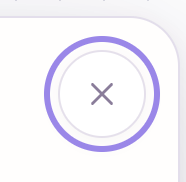
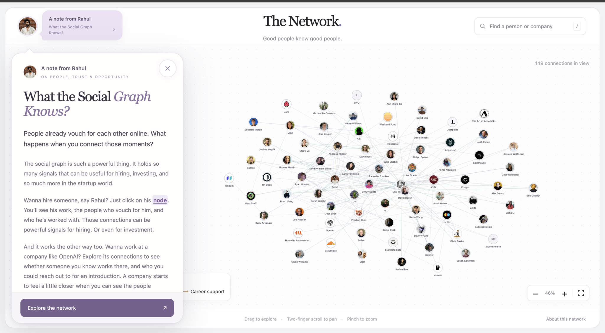
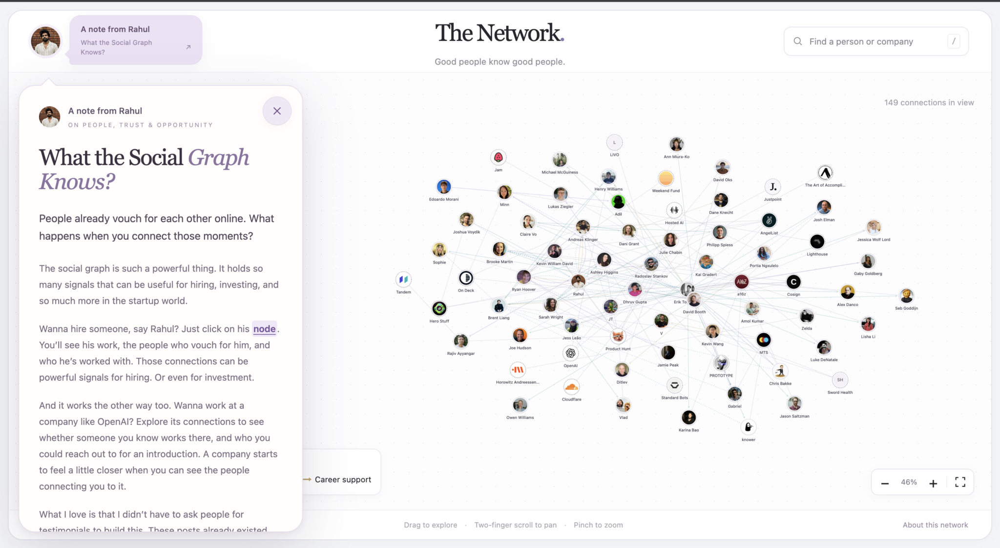
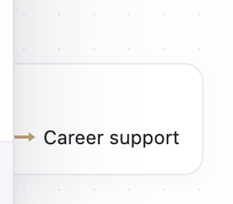
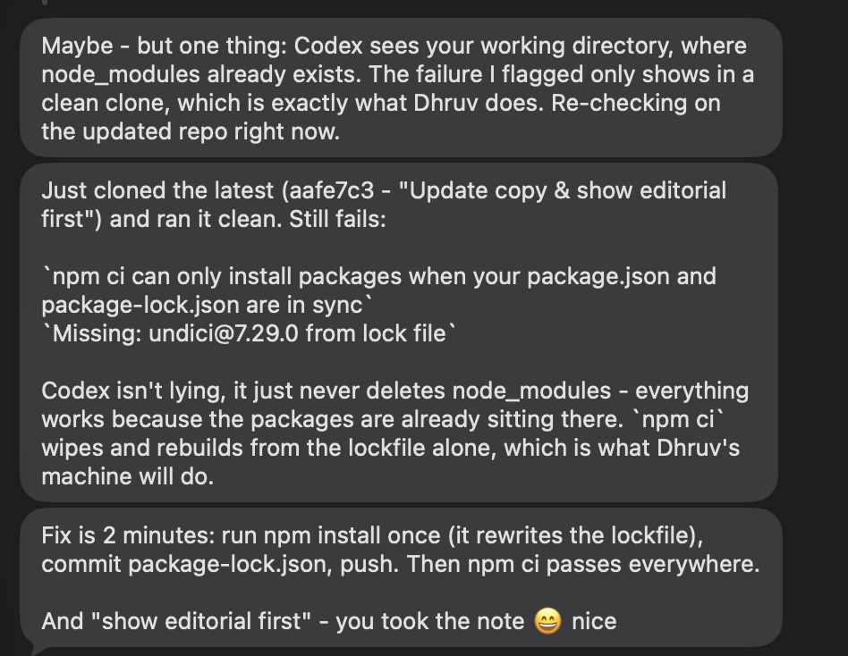

# Building The Network — conversation transcript

Snapshot captured at **2026-09-29 22:00:24 IST**. This chronological export contains **347 saved user-visible messages** (111 from Rahul and 236 from Codex) across **7 project Codex chats**, with **19 embedded user images**. Messages run from 2026-09-29 16:15:35 IST through 2026-09-29 22:00:03 IST. Later or unsaved messages are not included; active chats can continue after this snapshot.

The scope is restricted to chats whose working directory matches this cosign-drop repository. Chats from other project folders, including the separate CosignDrop project, are excluded. Each message is labeled with its source chat. This is an export of local Codex conversations; separate ChatGPT conversations are not included.

Message wording is retained, including typos, revisions, abandoned ideas, and claims made at the time. System/developer instructions, private reasoning, tool calls/results, automatic browser/environment context, injected AGENTS.md instructions, and internal subagent/approval-review sessions are excluded. No messages were reconstructed from summaries. Local file links and attachment paths are replaced with readable references. Non-image attachments (including the original HEIC and storytelling Markdown) are not embedded. Saved image copies may have been resized by the chat application. Interactive visualizations are represented by placeholders.

The [recorded challenge brief](../../RESEARCH.md) asks for a drop, a public post, and a DM with the Git repository and agent conversation transcript: [Dhruv’s challenge](https://x.com/droovg/status/2103640223972557191) · [What a drop can be](https://x.com/droovg/status/2103669927140032706). This file supplies the conversation record; exporting it does not complete or verify the public-post or DM requirements.

## Included chats

| Chat | Title | Messages | Source ID |
| --- | --- | ---: | --- |
| 1 | Understand the Cosign Drop challenge | 192 | `01a0ecc4-613c-7c63-b3ec-3a683d6fbb24` |
| 2 | Animate graph connections | 58 | `01a0ed56-a0ab-7b10-82c2-5df1821f9cfd` |
| 3 | Extract updated chat transcript | 7 | `01a0ed60-7416-78b0-8514-3dbfbaeeb20c` |
| 4 | Assess the Cosign Drop challenge | 49 | `01a0edb6-59f1-7be0-af8d-b3d7b0e56bb0` |
| 5 | Update modal social graph copy | 11 | `01a0edcc-291d-7500-931b-52e33f6eeca6` |
| 6 | Verify the claim | 26 | `01a0eddb-8724-74d1-8fd2-7dc5a886c363` |
| 7 | wait seems like you added conversation from other project I wanted only this project | 4 | `01a0edff-c9e5-7320-8709-c89343a8de02` |

## Local file references

Historical links to files on Rahul's computer point here. Current project files can be found from the [README](../README.md). User-supplied image attachments available in the saved chats are reproduced inline below. Earlier deployment URLs and intermediate decisions remain as historical context; the README describes the current app.

---

## 1. Rahul — 2026-09-29 16:15:35 IST

**Chat 1: Understand the Cosign Drop challenge**

I want you to understand this tweet [https://x.com/droovg/status/2103640223972557191](https://x.com/droovg/status/2103640223972557191) & the challenge. What a drop is go through all examples and Dhruv explains what a drop is as well [https://x.com/droovg/status/2103669927140032706](https://x.com/droovg/status/2103669927140032706)

And make sure to read all about cosign and it's working

You can use [@Chrome](plugin://browser@openai-bundled?browserFamily=chrome)

---

## 2. Codex — 2026-09-29 16:15:39 IST

**Chat 1: Understand the Cosign Drop challenge**

I’ll read both posts, follow the drop examples and challenge details, and research how Cosign works.

---

## 3. Codex — 2026-09-29 16:17:09 IST

**Chat 1: Understand the Cosign Drop challenge**

Dhruv’s key point is that a drop can take any form: it needs a theme presented in a way that feels new. The challenge asks for the drop, a public post, the Git repo, and the agent conversation transcript. I found 25 examples in the archive and am reviewing their formats alongside Cosign’s product details.

---

## 4. Codex — 2026-09-29 16:18:19 IST

**Chat 1: Understand the Cosign Drop challenge**

The examples span much more than scrolling essays: there are searchable evidence archives, simulations, calculators, maps, portfolio explorers, a 3D spacecraft, and desktop-style experiences. Cosign’s launch describes a network built around durable endorsements and shared work history. Your existing account is waitlisted, but its public lists are accessible, so I can inspect those directly.

---

## 5. Codex — 2026-09-29 16:20:46 IST

**Chat 1: Understand the Cosign Drop challenge**

I found a useful distinction in Cosign’s actual UI: a job’s “Signal” button privately tells the company you’re interested, and explicitly says it is not an application. The founders also describe broader mutual-interest matching for hiring and investing; I’m keeping those claims separate from the flows I can verify. Their launch discussion emphasizes three endorsements: who shaped your career, who you’d work with anywhere, and who deserves early attention.

---

## 6. Codex — 2026-09-29 16:21:52 IST

**Chat 1: Understand the Cosign Drop challenge**

The common pattern is becoming clear: each drop chooses an interaction that helps explain its subject—following a dollar, inspecting a document, changing an assumption, or moving through a system. For a Cosign-themed drop, the strongest territory is how belief becomes reputation and opportunity. I’m saving the challenge requirements, a catalogue of all 25 examples, and the verified product details in the workspace for our next step.

---

## 7. Codex — 2026-09-29 16:24:05 IST

**Chat 1: Understand the Cosign Drop challenge**

I’ve read both tweets, surveyed **all 25 examples currently in the drop archive**, and researched Cosign through its launch post, official essay, launch-discussion transcript, and accessible product pages. I saved the detailed catalogue and findings in [RESEARCH.md](#local-file-references).

**A drop is an idea expressed through a distinctive digital experience.** Dhruv explicitly allows any format; what matters is presenting a theme in a new way. Interactive explainers and data visualizations are examples, not mandatory formats. [His clarification](https://x.com/droovg/status/2103669927140032706)

The archive demonstrates that range:

- **Explorable systems:** Starship’s 3D cutaways and flight timeline.
- **Calculators:** AI water consumption and agent infrastructure costs.
- **Narratives:** following shares through SPVs or a dollar through data-center financing.
- **Archives:** searchable trial exhibits and mapped UFO records.
- **Playgrounds:** desktop-style personal agents and ElevenLabs audio tools.

My takeaway: **the interaction should reveal something about the subject.** The strongest examples give readers a way to investigate, experience, or understand the idea. The file includes every example and its useful lesson.

The challenge asks us to build a drop—ideally about Cosign/social networks—post about it, then DM Dhruv the **Git repo and agent conversation transcript**. He calls out creativity, decisiveness, speed, and empathy. No deadline or required stack appears in the post. [Challenge](https://x.com/droovg/status/2103640223972557191)

Cosign’s central idea is to make professional reputation **lasting, attributable, and discoverable**. Its main pieces are:

- Profiles connecting people, companies, and shared work.
- Endorsements such as who shaped your career, who you’d work with anywhere, and people to watch.
- Curated lists and community recommendations.
- Announcements whose endorsements remain attached to profiles.
- Jobs and private professional-interest signals. [Founder launch](https://x.com/eriktorenberg/status/2103493671866060958), [official discussion](https://www.youtube.com/watch?v=-ywZlfznTa4)

I directly inspected public lists and jobs. The job **Signal** control says it privately informs the company of interest and is separate from applying. Your existing account is waitlisted, so I couldn’t verify the full member experience or broader mutual-matching flows. [Cosign Jobs](https://cosign.co/jobs)

For our eventual drop, the most promising territory is **how someone’s belief in another person becomes reputation, recognition, and opportunity**. That connects directly to Cosign’s thesis and gives us room for an original experience.

---

## 8. Rahul — 2026-09-29 16:31:48 IST

**Chat 1: Understand the Cosign Drop challenge**

Nice, I'm gonna create a drop too and exploring ideas but I'm fascinated about one thing. I wanted to solve the same problem i.e. show vouch signals in a site that's why I made bakd.work. Now don't get too hang up on the project. 

What I'm thinking is maybe ask grok to give us 100's or whatever is the upper bound profiles. Like X tweeting or recommending Y and then if possible we could have the companies relation as well worked together and represent all those as a user vouch connection graph.

X -> Y and both connected to Z the company and then the connection goes on something like that. 

So for this we might need get proper data from grok. So I'll leave you to prompt accordingly. 

But before all my drop probably is have a list of people and help them answer can you hire X? Or just explore the graph of vouches wdyt?

My core belief is this vouch or cosign signal is powerful for startups. They can't go through multiple rounds of hiring, startups already hire through referrals and word of mouth so this is perfect and why cosign exists? or even bakd.work?

Those are my raw thoughts. Now wdyt about that as a drop? Do you think it's valid or any feedback?

---

## 9. Codex — 2026-09-29 16:32:28 IST

**Chat 1: Understand the Cosign Drop challenge**

Yes—this is a valid drop, and your belief gives it a useful purpose: **help a startup find credible, specific evidence about someone through people who know their work.**

The part I’d sharpen is the question the experience answers. **“Who can vouch for X, and what have they actually seen X do?”** gives us a stronger foundation than “Can you hire X?” Hiring also depends on role, availability, interests, and team fit—things a public endorsement rarely establishes.

Your graph could help someone decide **who deserves a conversation and whom to ask for a reference**.

The graph is the medium; the discovery is the drop.

I’d make the central experience something like:

> **Someone says this engineer is exceptional. Follow the evidence.**

You select a person and discover:

- Who endorsed them.
- What specifically they endorsed: engineering judgment, design taste, leadership, reliability.
- How they know them.
- What they built together.
- The original statement and when it was made.

Then you can follow those connections outward. That gives the graph a reason to exist beyond looking interesting.

**Your person → person → company structure works**, but the relationships need precise meanings. Suppose Alice praises Bob and both worked at Acme. Those facts alone don’t establish that Alice worked directly with Bob. We should distinguish:

| Relationship | What it establishes |
|---|---|
| Alice explicitly recommends Bob | An attributed endorsement |
| Alice says she managed Bob | Firsthand working context |
| Both held roles at Acme during overlapping dates | Possible shared context |
| Alice congratulates Bob’s launch | Public support; potentially weak hiring evidence |

That distinction could become the most interesting part of the drop: **letting people see how much context sits behind a vouch.** A recommendation after three years of working together tells a different story from a celebratory reply.

On your startup thesis: I agree with the mechanism. Referrals can reduce the effort needed to discover and understand someone. But a vouch becomes especially useful when it explains *why this person might be good for this particular work*. Also, public evidence is uneven: excellent people may have little visible praise. Missing edges must stay “unknown.”

For the first version, I’d favor **a smaller, densely connected, well-sourced group** over hundreds of loosely connected profiles. Enough people to encounter surprising paths, with enough evidence that clicking each edge rewards curiosity.

And for Grok, I’d ask for **endorsement events, not a list of impressive people**. Every record should contain the author, recipient, exact relevant excerpt, original post URL, date, endorsement category, and explicit relationship context. Company relationships should have their own sources. We would verify those records before presenting them.

My strongest framing for your idea is:

**“Who would work with them again?”**  
*Explore the people, shared work, and public recommendations behind a name.*

That has a human question, a useful exploration mechanic, and a clear connection to your original belief. **I’d pursue it—with evidence-rich connections as the defining feature.**

---

## 10. Rahul — 2026-09-29 16:39:16 IST

**Chat 1: Understand the Cosign Drop challenge**

# Files mentioned by the user:

## IMG_4458.heic

## My request:
okay here is what I'm thinking we have graph everything can be circle the nodes, and user has user image and company has company image.

Arrows points a vouch and no arrow connection is for companies? and when clicked on a node we show a card with info about the node like company and people worked, basic stuff

Same for user we show basic info and who vouched and work etc??

We could get some nodes and vouches and companies from X. I feel like best way is to ask grok w/ [@Chrome](plugin://browser@openai-bundled?browserFamily=chrome)&#x20;

Have decent dense of data for mvp wdyt? Could include my data as well (rahulmfg) and have an expanded network?

Let's first get this data?

---

## 11. Codex — 2026-09-29 16:39:20 IST

**Chat 1: Understand the Cosign Drop challenge**

I’ll inspect your sketch, then use Grok in Chrome to gather a connected set of people, vouches, and companies—including public connections around `rahulmfg`. I’ll ask for source links for each relationship so we can distinguish an explicit vouch from company affiliation.

---

## 12. Codex — 2026-09-29 16:41:09 IST

**Chat 1: Understand the Cosign Drop challenge**

Your graph structure makes sense: arrows for person-to-person vouches, and plain lines for company affiliations, with the role and dates in the card. I’ll aim for roughly 40–60 people in a few connected clusters, then see how much sourced data we can actually recover.

Grok’s standalone page is blank, so I’m trying its interface inside X.

---

## 13. Codex — 2026-09-29 16:42:11 IST

**Chat 1: Understand the Cosign Drop challenge**

I’ve seen the sketch—it matches the relationship model you described. Grok is now searching X. I’m also applying the data-quality skill to check attribution, duplicate events, and whether each cited post supports the connection we’d draw.

---

## 14. Codex — 2026-09-29 16:43:09 IST

**Chat 1: Understand the Cosign Drop challenge**

Grok has found candidate vouches around your Product Hunt connections and is expanding through that network. Your public profile also gives us a sourced starting point for HeroStuff and Product Hunt affiliations. I’m keeping acknowledgments like “they took a chance on me” separate from actual recommendations—the arrow direction matters here.

---

## 15. Codex — 2026-09-29 16:45:04 IST

**Chat 1: Understand the Cosign Drop challenge**

The first batch has 22 people and 18 proposed connections. I’ve independently confirmed vouches for you from Ryan Hoover, Andreas Klinger, and Radoslav Stankov, plus Sarah Wright’s praise for the Chrome-extension team.

Some of Grok’s other rows are career-support acknowledgments, so I’ve asked it to separate those and find more substantive work recommendations. That will give us a clearer graph.

---

## 16. Rahul — 2026-09-29 16:46:18 IST

**Chat 1: Understand the Cosign Drop challenge**

btw even for company just use the profile images

---

## 17. Rahul — 2026-09-29 16:46:18 IST

**Chat 1: Understand the Cosign Drop challenge**

maybe we also highlight various relations in graph like worked with praise and they can be color coded what's the usual way for this?

---

## 18. Codex — 2026-09-29 16:46:25 IST

**Chat 1: Understand the Cosign Drop challenge**

Yes—company nodes can use their X profile images too.

A common approach is **color for relationship type, arrows for direction, and labels for clarity**:

- **Vouched for / recommended:** purple arrow.
- **Praised specific work:** teal arrow.
- **Worked directly with:** blue line, only when a source explicitly supports it.
- **Company affiliation:** muted gray line, with role and dates on click.
- **Mentored / gave an opportunity:** amber arrow, labeled so its direction is clear.

I’d keep the default view to vouches, work praise, and company affiliations, with filters for the others. Selecting a node would highlight its connections and fade the rest. That gives you detail without making the whole graph hard to read.

I’m collecting company profile images alongside people’s avatars.

---

## 19. Codex — 2026-09-29 16:49:38 IST

**Chat 1: Understand the Cosign Drop challenge**

The second pass brings us to 32 people and 33 proposed person-to-person connections, including the separate career-support links. There are useful clusters around Product Hunt and a16z/On Deck, with your HeroStuff affiliation connecting your node to another company.

I’m checking the original posts now and collecting the company avatars. Grok is useful for discovery, but I’ve already corrected a few excerpts and relationship labels before putting them into the dataset.

---

## 20. Codex — 2026-09-29 16:53:40 IST

**Chat 1: Understand the Cosign Drop challenge**

The source checks support the main connections found so far. I’m saving each post once and linking relationships back to it, so a team shoutout can connect several people without being mistaken for several independent sources.

The data will also keep “worked with” separate from praise: one post can support both, but they describe different things.

---

## 21. Codex — 2026-09-29 16:55:42 IST

**Chat 1: Understand the Cosign Drop challenge**

We now have 50 nodes in the working dataset: 32 people and 18 companies. The 33 person-to-person relationships point to 27 original posts; I’ve checked those posts, and I’m finishing the affiliation and avatar pass.

One useful distinction: there are 23 vouches or work-praise events, 9 career-support/mentorship events, and 1 brief acknowledgment. Those should be filterable rather than counted as the same signal.

---

## 22. Codex — 2026-09-29 16:57:37 IST

**Chat 1: Understand the Cosign Drop challenge**

The graph has a 42-node main cluster and three smaller clusters. That’s a useful MVP shape: we can start around your node and let people explore outward.

The avatar checks also found stale data: Kevin Wang’s bio mentions `@swordhealth`, but that profile currently says it doesn’t exist. I’m leaving its image empty and recording the gap rather than guessing another account.

---

## 23. Codex — 2026-09-29 17:00:12 IST

**Chat 1: Understand the Cosign Drop challenge**

The dataset is saved and its structural checks pass: no duplicate relationship records, missing node references, or broken source references. It has X profile-image URLs for 48 of the 50 nodes.

I’m packaging a reviewed version for the MVP. One remaining candidate—Joshua Voydik’s exact role at HeroStuff—is kept separate because his X bio links the company but doesn’t state the role.

---

## 24. Codex — 2026-09-29 17:02:04 IST

**Chat 1: Understand the Cosign Drop challenge**

Yes—color-code **relationship types**, use arrows for direction, and show a label/source on selection. Company nodes will use their X profile images too.

I collected the first dataset through Grok and checked the original posts:

- **32 people + 18 companies**, including your network.
- **23 vouch/work-praise events**, plus 9 career-support links.
- **47 company affiliations**.
- **48 profile images** out of 50 nodes.
- A **42-node main cluster** to explore.

Suggested colors: **purple** for vouches, **teal** for work praise, **blue** for explicitly worked together, **gray** for company affiliations, and **amber** for mentorship/support. Filters and labels should accompany the colors.

The [data summary](#local-file-references) has the findings and gaps. The [reviewed graph JSON](#local-file-references) is ready for the MVP; it excludes one unverified affiliation. Two company images remain unresolved.

**This is enough to start around your node and expand outward into a meaningful network.**

[Interactive visualization referenced in the original chat; not embedded in this text export]

---

## 25. Rahul — 2026-09-29 17:12:01 IST

**Chat 1: Understand the Cosign Drop challenge**

# Files mentioned by the user:

## Screenshot 2026-09-29 at 5.11.26 PM.png

## My request:
let's create a simple interactive page like this first? with all nodes and interactions can be zoom in out etc and node can be clicked and opens beautiful card?

[Image attached below]

</image>

---

## 26. Codex — 2026-09-29 17:12:08 IST

**Chat 1: Understand the Cosign Drop challenge**

I’ll build a clean, full-page network canvas based on your sketch, with avatar nodes, pan and zoom, relationship filters, and a polished detail card when you click a person or company.

---

## 27. Codex — 2026-09-29 17:12:29 IST

**Chat 1: Understand the Cosign Drop challenge**

I’m using the Sites workflow for this first version. I’ll keep the canvas close to your reference: a quiet white surface, a centered “The Network” title, and the graph as the focus. The cards will show affiliations, incoming and outgoing relationships, and the original posts.

This should take about 5–10 minutes to build and check.

---

## 28. Rahul — 2026-09-29 17:15:28 IST

**Chat 1: Understand the Cosign Drop challenge**

use nextjs with tailwindcss and shadcn if needed

---

## 29. Codex — 2026-09-29 17:15:38 IST

**Chat 1: Understand the Cosign Drop challenge**

Got it—I’ll use Next.js and Tailwind CSS. The graph will be a client component, with the styling carried into Tailwind and reusable components where useful.

---

## 30. Codex — 2026-09-29 17:24:01 IST

**Chat 1: Understand the Cosign Drop challenge**

The Next.js version is built. I’m checking the graph interactions and card layouts now, including how the network fits on smaller screens.

---

## 31. Codex — 2026-09-29 17:25:47 IST

**Chat 1: Understand the Cosign Drop challenge**

The graph now includes 50 people and company nodes, with separate colors for vouches, praise, work history, and career support. Clicking a person highlights their connections and opens the original X receipts. I’m finishing the responsive checks and preparing the private preview link.

---

## 32. Codex — 2026-09-29 17:28:00 IST

**Chat 1: Understand the Cosign Drop challenge**

The production build and TypeScript checks passed. Search, node selection, company cards, zoom controls, and relationship filters are working; the mobile layout uses a bottom sheet for details. The private deployment is now publishing.

---

## 33. Rahul — 2026-09-29 17:28:10 IST

**Chat 1: Understand the Cosign Drop challenge**

## My request:
btw when a person is selcted i kinda feel it hard to hover on a line to see maybe it's too small wdyt?

---

## 34. Codex — 2026-09-29 17:28:15 IST

**Chat 1: Understand the Cosign Drop challenge**

Yes—the thin lines are hard to target. I’ll give each line a wider invisible hover area and show relationship labels around the selected person, so you can read the connections without precisely hovering.

---

## 35. Rahul — 2026-09-29 17:28:54 IST

**Chat 1: Understand the Cosign Drop challenge**

## My request:
because the node behind it is getting highligted

---

## 36. Codex — 2026-09-29 17:28:59 IST

**Chat 1: Understand the Cosign Drop challenge**

Ah, yes—the faded node behind the line is still catching the pointer. I’ll make unrelated faded nodes ignore hover and clicks while a person is selected, so the visible connection gets the interaction.

---

## 37. Codex — 2026-09-29 17:30:32 IST

**Chat 1: Understand the Cosign Drop challenge**

Fixed—faded, unrelated nodes no longer intercept hover or clicks. Lines now have a wider invisible hover area, and selected connections show relationship labels.

Built with Next.js and Tailwind; build and TypeScript checks pass.

[Open The Network — private preview](https://the-network-rahul.rahulmfg.chatgpt.site)

---

## 38. Rahul — 2026-09-29 17:32:30 IST

**Chat 1: Understand the Cosign Drop challenge**

# Files mentioned by the user:

## Screenshot 2026-09-29 at 5.31.39 PM.png

## My request:
this is little confusing the text is by me but when we have kevin it kinda confuses right. So we could fix this UI maybe alignment and rahul said or user said?

Think of better UI that component

[Image attached below]

</image>

---

## 39. Codex — 2026-09-29 17:32:36 IST

**Chat 1: Understand the Cosign Drop challenge**

Yes—the avatar and name make it look like Kevin said the quote. I’ll make the direction explicit: **“Rahul credits Kevin William David”**, with **“Rahul said”** above the quote. I’ll apply the same author-first pattern to vouches and praise.

---

## 40. Rahul — 2026-09-29 17:33:36 IST

**Chat 1: Understand the Cosign Drop challenge**

also can we expand the data even further try to include some people from cosign and expand nodes further too I think it will be fun with more data. Like Erik from co-sign can be included. Goal is to get few more nodes maybe 20 or so

---

## 41. Codex — 2026-09-29 17:33:41 IST

**Chat 1: Understand the Cosign Drop challenge**

I’ll expand it by roughly 20 nodes, starting from Cosign’s network. Erik Torenberg is already included, so I’ll build outward from him and the other Cosign people, keeping the new connections tied to public posts or profiles. I’ll finish the quote-card update alongside that.

---

## 42. Rahul — 2026-09-29 17:34:07 IST

**Chat 1: Understand the Cosign Drop challenge**

# Files mentioned by the user:

## Screenshot 2026-09-29 at 5.33.46 PM.png

## My request:
when I picked Dane we could show who he supports or something like that the other way data?

[Image attached below]

</image>

---

## 43. Codex — 2026-09-29 17:34:12 IST

**Chat 1: Understand the Cosign Drop challenge**

Yes—Dane’s card should also show **“People who credit Dane”**, including Dani Grant and her original quote. That makes the relationship explorable from both ends while keeping clear who actually said it. I’ll add that to every profile.

---

## 44. Rahul — 2026-09-29 17:34:37 IST

**Chat 1: Understand the Cosign Drop challenge**

esp the opened door is missing

---

## 45. Codex — 2026-09-29 17:34:40 IST

**Chat 1: Understand the Cosign Drop challenge**

Exactly—the **“opened doors” relationship was only shown from the author’s side**. I’ve added the reverse section: **“People who credit Dane”**, showing Dani’s quote with clear attribution. The same now applies to every person.

---

## 46. Rahul — 2026-09-29 17:35:08 IST

**Chat 1: Understand the Cosign Drop challenge**

okay what about my other request of getting more data nad other previously sent queries as well

---

## 47. Codex — 2026-09-29 17:35:16 IST

**Chat 1: Understand the Cosign Drop challenge**

I stopped too early. The data expansion is still unfinished, and the quote-attribution and reverse “opened doors” changes are in the local code but haven’t been published yet. I’ll complete the additional nodes, verify their sources, and publish all three changes together.

---

## 48. Codex — 2026-09-29 17:36:23 IST

**Chat 1: Understand the Cosign Drop challenge**

The reverse support section is now working: Dane’s card shows Dani’s post under “People who credit Dane,” with Dani clearly identified as the author. Grok has also found more connections around Erik and the Cosign team; I’m checking the original posts and removing people already in our dataset before adding them.

---

## 49. Rahul — 2026-09-29 17:37:00 IST

**Chat 1: Understand the Cosign Drop challenge**

also some of those people in the network are connected as well, make it data rich and fun to explore. So that it proves our drop

---

## 50. Codex — 2026-09-29 17:37:06 IST

**Chat 1: Understand the Cosign Drop challenge**

Agreed—the useful part is following connections across the network, not just seeing more people around Erik. I’ll also look for vouches and collaborations between the people we’re adding, plus links back to the existing network. Shared-company links will stay distinct from evidence that two people worked together.

---

## 51. Codex — 2026-09-29 17:40:17 IST

**Chat 1: Understand the Cosign Drop challenge**

I found several useful cross-links: Brooke explicitly names David and Dhruv as Cosign collaborators; Dhruv credits Brent for taking a chance on him; Brent and Henry praise each other; and Dani and Claire have posts about each other. These give the graph paths between the Cosign, MTS, OpenAI, and existing Product Hunt circles.

---

## 52. Codex — 2026-09-29 17:42:55 IST

**Chat 1: Understand the Cosign Drop challenge**

The expansion is assembled: **74 nodes and 147 reviewed connections**, up from 50 and 85. It adds 21 people and three organizations, including the cross-links between the new and existing circles. I’m checking the larger graph and the revised cards before publishing.

---

## 53. Codex — 2026-09-29 17:44:54 IST

**Chat 1: Understand the Cosign Drop challenge**

All three updates are now published. The cards identify the quote’s author, group repeated quotes from the same post, and show “opened doors” relationships from both ends. The expanded network also has source-linked collaborations visible by default, so you can follow the new cross-links.

---

## 54. Codex — 2026-09-29 17:45:03 IST

**Chat 1: Understand the Cosign Drop challenge**

All published in [The Network](https://the-network-rahul.rahulmfg.chatgpt.site):

- **24 new nodes and 62 connections**—now 74 nodes and 147 reviewed connections.
- Cross-links between Cosign, MTS, OpenAI, and existing people.
- Clear **“Rahul said”** attribution; repeated quotes grouped.
- Reverse **“People who credit Dane”** sections.

Try exploring **Dhruv → Brent → Henry**, or **Dani ↔ Claire**. Build and data checks passed.

---

## 55. Rahul — 2026-09-29 17:45:03 IST

**Chat 1: Understand the Cosign Drop challenge**

after you done with that let's focus on UX, I want the interaction to be smooth and enough space maybe? 

Right not the zoom in/out and interactions feels rigid.

---

## 56. Codex — 2026-09-29 17:45:11 IST

**Chat 1: Understand the Cosign Drop challenge**

I’ll soften the zoom and selection transitions, give connected people more room, and make panning feel more natural. I’ll also check how the detail card affects the space available for exploring the graph.

---

## 57. Codex — 2026-09-29 17:47:16 IST

**Chat 1: Understand the Cosign Drop challenge**

The abrupt camera jumps were a big part of the problem. Zoom and selection now ease into place, selecting someone frames their nearby connections beside the card, and “Back to network” restores your previous view. I’ve also spread out the nodes and reduced the header’s footprint.

---

## 58. Codex — 2026-09-29 17:48:09 IST

**Chat 1: Understand the Cosign Drop challenge**

The new framing keeps Rahul’s connected people clear of the card, and returning to the network restores the exact previous zoom and position. Repeated zoom clicks now build on each other smoothly. I’m checking the mobile layout and pinch-to-pan handoff next.

---

## 59. Codex — 2026-09-29 17:49:37 IST

**Chat 1: Understand the Cosign Drop challenge**

Updated [The Network](https://the-network-rahul.rahulmfg.chatgpt.site) with:

- Smooth zoom and selection transitions.
- More space between nodes.
- Camera framing that accounts for the detail card.
- “Back to network” restoring your previous view.
- More graph space on mobile.

Desktop/mobile checks and the production build passed.

---

## 60. Rahul — 2026-09-29 17:50:08 IST

**Chat 1: Understand the Cosign Drop challenge**

## My request:
I think zoom in/out become very sensitive

---

## 61. Codex — 2026-09-29 17:50:12 IST

**Chat 1: Understand the Cosign Drop challenge**

I’ll reduce the wheel and pinch sensitivity and make the zoom buttons take smaller steps.

---

## 62. Codex — 2026-09-29 17:51:47 IST

**Chat 1: Understand the Cosign Drop challenge**

I reduced wheel sensitivity by about 70% and trackpad-pinch sensitivity by 75%. I also limited queued zoom movement so quick gestures won’t overshoot as much, and reduced button steps from 25% to 12%.

---

## 63. Rahul — 2026-09-29 17:52:11 IST

**Chat 1: Understand the Cosign Drop challenge**

## My request:
oh I used pan in/out sort of way to zoom is that why?

---

## 64. Codex — 2026-09-29 17:52:18 IST

**Chat 1: Understand the Cosign Drop challenge**

Yes—two-finger scrolling currently controls zoom, so a gesture you intended as panning changes the scale.

A more natural setup would be **two-finger scroll to pan, pinch to zoom**, with dragging and +/− buttons still available. The sensitivity reduction is live, but that gesture mapping is the bigger issue.

---

## 65. Rahul — 2026-09-29 17:52:18 IST

**Chat 1: Understand the Cosign Drop challenge**

# Files mentioned by the user:

## Screenshot 2026-09-29 at 5.50.37 PM.png

## My request:
in this card I think we should have the one who received it photo & name? since we are in Erik card it make sense he gave it with the title as given?

---

## 66. Codex — 2026-09-29 17:52:23 IST

**Chat 1: Understand the Cosign Drop challenge**

Yes—the recipient should lead in the “Given” section. I’ll show Gaby’s photo and name there, while keeping **“Erik Torenberg said”** above the quote so attribution stays clear.

---

## 67. Codex — 2026-09-29 17:54:17 IST

**Chat 1: Understand the Cosign Drop challenge**

Updated and live. “Given” cards now lead with **the recipient’s photo and name**, followed by “Vouched for by Erik Torenberg.” The quote still says **“Erik Torenberg said”**.

“Received” cards continue to lead with the giver.

---

## 68. Rahul — 2026-09-29 17:54:17 IST

**Chat 1: Understand the Cosign Drop challenge**

## My request:
instead of "PEOPLE WHO CREDIT Erik Torenberg
" maybe opened doors for or something? wdyt? as title

---

## 69. Codex — 2026-09-29 17:54:22 IST

**Chat 1: Understand the Cosign Drop challenge**

**“OPENED DOORS FOR”** fits well—it pairs naturally with **“PEOPLE WHO OPENED DOORS”** and keeps the focus on the people Erik helped. The quote attribution makes clear that they’re the ones crediting him.

---

## 70. Rahul — 2026-09-29 17:54:23 IST

**Chat 1: Understand the Cosign Drop challenge**

## My request:
the zoom in/out interaction is really confusing see how other sites with such interaction handles it and fix it plz. Esp with trackpad it's very confusing and does nothing

---

## 71. Codex — 2026-09-29 17:54:28 IST

**Chat 1: Understand the Cosign Drop challenge**

I’ll compare how established graph and canvas tools handle trackpads, then fix the gesture mapping—not just the sensitivity. I’ll also apply the “Opened doors for” heading.

---

## 72. Codex — 2026-09-29 17:55:19 IST

**Chat 1: Understand the Cosign Drop challenge**

React Flow’s design-tool controls use **scroll to pan and pinch to zoom**. Our implementation was still turning ordinary trackpad scrolling into zoom, then repeatedly easing tiny updates—which explains the confusing response. I’m switching gestures to direct movement and adding WebKit pinch support for Safari-style browsers. [Reference](https://reactflow.dev/learn/concepts/the-viewport)

---

## 73. Codex — 2026-09-29 17:59:13 IST

**Chat 1: Understand the Cosign Drop challenge**

The browser check now confirms that two-finger scrolling moves the graph horizontally and vertically without changing zoom. Zoom buttons work separately, and live gestures no longer have the delayed easing that made them feel unresponsive. I’m building and publishing this update now.

---

## 74. Codex — 2026-09-29 18:00:05 IST

**Chat 1: Understand the Cosign Drop challenge**

Fixed and [published](https://the-network-rahul.rahulmfg.chatgpt.site). Refresh your tab.

Following [React Flow’s design-tool controls](https://reactflow.dev/learn/concepts/the-viewport):

- **Two-finger scroll → pan**
- **Pinch → zoom around your cursor**
- **⌘/Ctrl + scroll → zoom**
- **+/− buttons → gradual zoom**

Removed delayed easing from live gestures and added Safari/WebKit pinch handling. Browser pan/button checks, gesture math tests, and build passed; physical trackpad pinch still needs your hands-on check.

Also changed the heading to **“Opened doors for.”**

---

## 75. Rahul — 2026-09-29 18:00:05 IST

**Chat 1: Understand the Cosign Drop challenge**

# Files mentioned by the user:

## Screenshot 2026-09-29 at 5.54.32 PM.png

## My request:
maybe close icon can be fixed so easy UX to closewdyt?

---

## 76. Codex — 2026-09-29 18:00:10 IST

**Chat 1: Understand the Cosign Drop challenge**

Yes—the close button should stay visible while you scroll the card. I’ll pin it in the top-right corner and keep a generous click target.

---

## 77. Codex — 2026-09-29 18:02:07 IST

**Chat 1: Understand the Cosign Drop challenge**

Done—[published](https://the-network-rahul.rahulmfg.chatgpt.site). The close button now stays pinned while the card scrolls, with a larger 44px click target and clearer icon. **Esc** also closes it.

Verified scrolling and dismissal. Refresh to try it.

---

## 78. Rahul — 2026-09-29 18:02:08 IST

**Chat 1: Understand the Cosign Drop challenge**

## My request:
okay update to opened doors

---

## 79. Codex — 2026-09-29 18:02:12 IST

**Chat 1: Understand the Cosign Drop challenge**

I’ll shorten “Opened doors for” to “Opened doors.”

---

## 80. Codex — 2026-09-29 18:03:25 IST

**Chat 1: Understand the Cosign Drop challenge**

Updated to **“Opened doors”** and [published](https://the-network-rahul.rahulmfg.chatgpt.site). Refresh to see it.

---

## 81. Rahul — 2026-09-29 18:03:25 IST

**Chat 1: Understand the Cosign Drop challenge**

## My request:
let's fix josuha profile he works at Hero and he also said about hiring me in one of his tweet find it and update data for him

---

## 82. Codex — 2026-09-29 18:03:29 IST

**Chat 1: Understand the Cosign Drop challenge**

I’ll find Joshua’s post about hiring you, verify his Hero affiliation, and update his profile and connections with the source links.

---

## 83. Codex — 2026-09-29 18:04:30 IST

**Chat 1: Understand the Cosign Drop challenge**

Found it: Joshua’s [May 7, 2024 post](https://x.com/joshuavoydik/status/1787900954907652459) welcomes you to Hero and says, “Rahul is a gem (and can ship).” His Hero affiliation was stored as unverified, so the graph hid it. I’m verifying that affiliation and adding the hiring praise and shared-work connection.

---

## 84. Codex — 2026-09-29 18:05:57 IST

**Chat 1: Understand the Cosign Drop challenge**

Joshua now has a visible Hero affiliation, and his praise appears on both his card and yours. The same post also supports a “worked together” connection. The data checks passed; I’m publishing the update.

---

## 85. Codex — 2026-09-29 18:06:26 IST

**Chat 1: Understand the Cosign Drop challenge**

Found [Joshua’s hiring post](https://x.com/joshuavoydik/status/1787900954907652459): “Rahul is a gem (and can ship).”

Updated and [published](https://the-network-rahul.rahulmfg.chatgpt.site):

- Joshua’s profile: **Cofounder and CEO at Hero**
- His hiring praise → you
- Joshua ↔ you: **Worked together**
- Verified Hero affiliation now visible

Refresh to explore his updated card.

---

## 86. Rahul — 2026-09-29 18:06:27 IST

**Chat 1: Understand the Cosign Drop challenge**

# Files mentioned by the user:

## AGENTS_storytelling_x_instagram_generic.md

## My request:
okay this is so much fun now coming back to drop and some explanation I'm gonna dump my raw thoughts. 

The social graph or network is such a power thing. It has so much signals which can be used for hiring, investment etc.. in the startup world.

Wanan hire someone say Rahul just click on his node and you will see his work, people who vouch for him, who he worked with etc.. And those are such a powerful signal for hiring. Or even for investment. 

And this data was not something that has been forced or asked for. It's how naturally people interact with each other in X. This was all exported from X using Grok. 

With this limited data we can see how cool the graph is and useful too. That's excaly what I think cosign is and bakd.work(pet project of mine).

These signals are so powerful than the resume and other things. Easy to find real talent faster. Or filter the applications. So many possibilites but I love this graph <3 

Those are my raw thoughts. Now we need to figure out a layout on how to present those and where to have it maybe graph is defualt and somewhere we have my photo it opens a chat bubble with these things wdyt? 

And you can use the story telling md file I gave you for structuring my thoughts as well.

---

## 87. Codex — 2026-09-29 18:06:31 IST

**Chat 1: Understand the Cosign Drop challenge**

I’ll read your storytelling notes and shape this into a short explanation that keeps the graph as the main experience. Your photo could work as a “Why I made this” entry point—personal and easy to discover.

---

## 88. Codex — 2026-09-29 18:06:56 IST

**Chat 1: Understand the Cosign Drop challenge**

**Keep the graph as the default. Your photo with “Why I made this” is a good way to add the story without taking people away from exploring.** Give it a visible label so it doesn’t look like another graph node.

I’d place it in the header, opposite “Start with Rahul.” Clicking opens a small note anchored beneath your photo; on mobile, a bottom sheet. Your photo, “A note from Rahul,” a close button, and a few short paragraphs. No typing animation or chat input—it should feel like a personal note.

Using your storytelling guide, the strongest sequence is **belief → concrete example → where the evidence came from → what it could make possible**. The graph itself supplies the proof.

Here’s the copy I’d use:

> **Good people leave signals everywhere.**
>
> Someone recommends a teammate. A founder celebrates a new hire. Someone thanks the person who opened a door for them.
>
> Those moments get buried in the feed. I wanted to see what happens when you connect them.
>
> Say you’re thinking about hiring me. Click my node. You can explore where I’ve worked, who I’ve worked with, and what people have actually said about my work. Every connection takes you back to its source.
>
> These posts already existed on X. I used Grok to help find them, then checked the sources and connected a small slice of the network.
>
> For startups, I think this context can say more than a résumé alone. It could help you discover someone, understand their work, or figure out whom to ask about them.
>
> It’s the belief behind my pet project, bakd.work, and what draws me to Cosign.
>
> There’s so much more to explore here. For now, I just love seeing the connections ❤️

End with **“Explore my connections →”**, which closes the note and selects your node. That makes the explanation lead straight into a demonstration.

I’d keep hiring as the main example; investment can come later. And I’d soften “better than résumés” to **“more context than a résumé alone”**—the convincing part is the specific evidence, rather than how publicly connected someone is. Likewise, “these posts already existed” is stronger factually than saying none were ever requested; we can’t know that for every post.

---

## 89. Rahul — 2026-09-29 18:07:38 IST

**Chat 1: Understand the Cosign Drop challenge**

# Files mentioned by the user:

## Screenshot 2026-09-29 at 6.07.12 PM.png

## My request:
let's make this beautiful it's too tight could be center modal

[Image attached below]

</image>

---

## 90. Codex — 2026-09-29 18:07:42 IST

**Chat 1: Understand the Cosign Drop challenge**

I’ll turn this into a spacious centered modal, with a clearer reading hierarchy, your personal introduction, and a close button that stays easy to reach.

---

## 91. Codex — 2026-09-29 18:09:23 IST

**Chat 1: Understand the Cosign Drop challenge**

The new modal has wider margins, a personal header with your photo, and a clear “Explore my connections” button. I’ve moved the data notes into an expandable section so the story has room to breathe.

---

## 92. Codex — 2026-09-29 18:10:20 IST

**Chat 1: Understand the Cosign Drop challenge**

[Published](https://the-network-rahul.rahulmfg.chatgpt.site)—refresh and open **“About this network.”**

It’s now a spacious centered modal with your photo, personal story, softer typography, and a blurred backdrop. Close and explore buttons stay visible; **“Explore my connections”** opens your node.

Build passed and the explore action is verified.

---

## 93. Rahul — 2026-09-29 18:10:21 IST

**Chat 1: Understand the Cosign Drop challenge**

## My request:
also yes do it the photo chat buble thing when clicked expands a chat bubble like intercom style and shows my thoughts

And any thoughts on the title and subtitle?

---

## 94. Codex — 2026-09-29 18:10:31 IST

**Chat 1: Understand the Cosign Drop challenge**

I’ll add your photo with a “Why I made this” label that opens an Intercom-style bubble. “About this network” will still open the larger centered version.

For the title, I’d keep **The Network.** and use **“See who people believe in.”** as the subtitle—it explains the graph’s purpose more clearly than “Good people know good people.”

---

## 95. Rahul — 2026-09-29 18:11:29 IST

**Chat 1: Understand the Cosign Drop challenge**

## My request:
btw the content misses some key things I explained like how I built it etc I would love those too don't skip important context I gave you

---

## 96. Codex — 2026-09-29 18:11:35 IST

**Chat 1: Understand the Cosign Drop challenge**

You’re right—I compressed it too far. I’ll bring back how you built it from X posts using Grok, why those existing interactions matter, the hiring and investment possibilities, and how this connects to Cosign and bakd.work. The bubble will scroll so the important context can stay.

---

## 97. Rahul — 2026-09-29 18:12:04 IST

**Chat 1: Understand the Cosign Drop challenge**

## My request:
actually the stroy telling kinda exluded lot of great things I said so ignore the storytelling md and use my raw thoughts again without leaving much things can you shape it

The social graph or network is such a power thing. It has so much signals which can be used for hiring, investment etc.. in the startup world.
Wanan hire someone say Rahul just click on his node and you will see his work, people who vouch for him, who he worked with etc.. And those are such a powerful signal for hiring. Or even for investment. 
And this data was not something that has been forced or asked for. It's how naturally people interact with each other in X. This was all exported from X using Grok. 
With this limited data we can see how cool the graph is and useful too. That's excaly what I think cosign is and bakd.work(pet project of mine).
These signals are so powerful than the resume and other things. Easy to find real talent faster. Or filter the applications. So many possibilites but I love this graph <3

---

## 98. Codex — 2026-09-29 18:12:16 IST

**Chat 1: Understand the Cosign Drop challenge**

I’ll set the storytelling framework aside and stay close to your words—lightly clean up the phrasing, keep all your points, and put that version in the photo bubble and centered modal.

---

## 99. Rahul — 2026-09-29 18:12:37 IST

**Chat 1: Understand the Cosign Drop challenge**

## My request:
with good title inside the bubble

---

## 100. Codex — 2026-09-29 18:12:46 IST

**Chat 1: Understand the Cosign Drop challenge**

**“The signals are already there.”** feels right for the bubble. It captures your main point: people are already sharing this context through their interactions on X, and the graph makes it easier to explore.

---

## 101. Codex — 2026-09-29 18:14:02 IST

**Chat 1: Understand the Cosign Drop challenge**

[Published](https://the-network-rahul.rahulmfg.chatgpt.site). Click your photo beside **“Why I made this”** to open the bubble.

Title: **“The signals are already there.”**

The copy now stays close to your raw thoughts, including Grok/X, natural interactions, hiring and investment, limited data, Cosign, bakd.work, and finding talent faster. Scrolling and dismissal verified.

For the main page, my recommendation remains **The Network.** with **“See who people believe in.”** as the subtitle.

---

## 102. Rahul — 2026-09-29 18:14:02 IST

**Chat 1: Understand the Cosign Drop challenge**

## My request:
also when someone is selected "the node" we highlight the connection. Can we zoom in a little bit so that's it's visible properly?

---

## 103. Codex — 2026-09-29 18:14:08 IST

**Chat 1: Understand the Cosign Drop challenge**

I’ll make selecting a node zoom in a bit more, while keeping its connections visible beside the profile card.

---

## 104. Codex — 2026-09-29 18:15:57 IST

**Chat 1: Understand the Cosign Drop challenge**

Done—[published](https://the-network-rahul.rahulmfg.chatgpt.site). Selecting a node now smoothly zooms closer and brings it toward the center beside its card, making nearby connections easier to read.

Closing the card restores your previous view. Refresh to try it.

---

## 105. Rahul — 2026-09-29 18:15:58 IST

**Chat 1: Understand the Cosign Drop challenge**

# Files mentioned by the user:

## Screenshot 2026-09-29 at 6.15.12 PM.png

## My request:
the why I made it look blunt and wrong position we should keep it somewhere it will grab attention too and I was hoping it could like a perfect chat bubble something like attached don't take the colors or direction

But first plcement and then chat bubble we could subtle animations and effects to make this whole page and this component delighfult

---

## 106. Codex — 2026-09-29 18:16:07 IST

**Chat 1: Understand the Cosign Drop challenge**

I’d move it to the top-left, beside your photo, so it’s part of the first thing people see. “A note from Rahul” can sit in a small speech bubble; clicking it opens a larger bubble with a tail pointing back to your photo.

I’ll keep the lavender palette and add a gentle entrance and hover effect, without constant bouncing that distracts from the graph.

---

## 107. Codex — 2026-09-29 18:17:36 IST

**Chat 1: Understand the Cosign Drop challenge**

The entry now sits beside your photo in the header, with a speech-bubble shape and a small “Why I made this” prompt. The expanded note opens directly beneath it. I’m checking the placement and scrolling before publishing.

---

## 108. Rahul — 2026-09-29 18:18:56 IST

**Chat 1: Understand the Cosign Drop challenge**

## My request:
let's add a proper .gitignore 

And then I don't want chatgpt sites discard those settings and code for that. No need to deploy this. 

And rename site to frontend

---

## 109. Codex — 2026-09-29 18:19:01 IST

**Chat 1: Understand the Cosign Drop challenge**

I’ll remove the ChatGPT Sites configuration, rename `site` to `frontend`, and add a `.gitignore` for the project. I’ll keep the Next.js app runnable locally and won’t deploy these changes.

---

## 110. Codex — 2026-09-29 18:20:23 IST

**Chat 1: Understand the Cosign Drop challenge**

The app is now in `frontend`, with its Git history preserved. I removed the Sites manifest and static-export settings, added ignore rules for dependencies, builds, local environment files, logs, and OS files, and updated the local run instructions. I’m checking the standard Next.js build now.

---

## 111. Codex — 2026-09-29 18:21:32 IST

**Chat 1: Understand the Cosign Drop challenge**

Done.

- Renamed `site` → [frontend](#local-file-references), preserving Git history.
- Added `.gitignore` files.
- Removed ChatGPT Sites configuration and static-export settings.
- Updated local run instructions and added `npm start`.
- Typecheck and production build passed.

Local app: [localhost:3000](http://127.0.0.1:3000). Nothing deployed; the existing hosted copy remains unchanged.

---

## 112. Rahul — 2026-09-29 18:21:33 IST

**Chat 1: Understand the Cosign Drop challenge**

## My request:
and finally let's refactor the codebase. We should use proper conventions. 

The code is not having proper split. Pure DOM elements or components needs to be in components. imo components has things that can be re-used across. 

And types can be in types folder

See how I structured my other projects in ~/hero/hero-web/frontend

---

## 113. Codex — 2026-09-29 18:21:40 IST

**Chat 1: Understand the Cosign Drop challenge**

I’ll inspect the conventions in `~/hero/hero-web/frontend`, then use them to split this app into focused components, hooks, types, and utilities. I’ll preserve the current behavior and keep the changes local.

---

## 114. Codex — 2026-09-29 18:22:14 IST

**Chat 1: Understand the Cosign Drop challenge**

Your Hero project uses `screens/` for page composition, named component folders for UI, hooks for behavior, and `types/` and `utils/` for shared definitions and helpers. I’ll follow that structure here. The main split will separate the graph interactions, profile cards and receipts, search and controls, and your story bubble.

---

## 115. Rahul — 2026-09-29 18:24:08 IST

**Chat 1: Understand the Cosign Drop challenge**

## My request:
also look at lint and ci checks. we don't have CI but we could at least run minimal checks before deploy locally

---

## 116. Codex — 2026-09-29 18:24:18 IST

**Chat 1: Understand the Cosign Drop challenge**

I’ll add a local `npm run ci` command for formatting, lint, type checks, and tests, plus `npm run check:deploy` to run those checks and a production build. That will give you a repeatable pre-deploy check without setting up hosted CI.

---

## 117. Rahul — 2026-09-29 18:26:50 IST

**Chat 1: Understand the Cosign Drop challenge**

# Files mentioned by the user:

## Screenshot 2026-09-29 at 6.24.43 PM.png

## Screenshot 2026-09-29 at 6.25.49 PM.png

## My request:
scroll bar is going outside the corners fix that clip it

And ust click on his node. maybe node text can be highlighted and clickable and on click loads my connection

Also when node is selcted we right now zoom in a bit make sure it's perfect and not too zommed in because right now when it zoomed some nodes where behind the bottom left element Would be great to have all elements visible

[Image attached below]

</image>

[Image attached below]

</image>

---

## 118. Codex — 2026-09-29 18:26:58 IST

**Chat 1: Understand the Cosign Drop challenge**

I’ll include those fixes in the refactor: clip scrolling inside the bubble’s rounded corners, make “node” a highlighted link to your connections, and fit selected connections within the space left by the card, search, and bottom controls. The current minimum zoom is forcing some nodes under those controls; I’ll remove that constraint.

---

## 119. Rahul — 2026-09-29 18:28:40 IST

**Chat 1: Understand the Cosign Drop challenge**

## My request:
and I wonder if note from rahul should be in right side? Any other better placement? you can think off if not just do that plz

---

## 120. Codex — 2026-09-29 18:28:48 IST

**Chat 1: Understand the Cosign Drop challenge**

The top-right is a better fit: it’s a familiar place for a personal note or chat entry, and it keeps the left side clear for search. I’ll move your photo and bubble there, with the tail pointing back to your photo. “Start with Rahul” will move to the left of the title.

---

## 121. Codex — 2026-09-29 18:30:08 IST

**Chat 1: Understand the Cosign Drop challenge**

The refactor and local checks are passing so far. Julie’s connections now fit above the legend and beside her card, and clicking “node” in your note opens your connections. The note is on the top-right, with a separate clipped inner surface to keep the scrollbar inside the rounded corners. I’m finishing mobile checks and the production build.

---

## 122. Codex — 2026-09-29 18:31:31 IST

**Chat 1: Understand the Cosign Drop challenge**

Done locally at [localhost:3000](http://127.0.0.1:3000).

- Refactored into `screens`, reusable `components`, `hooks`, `types`, `utils`, and `styles`, following Hero’s conventions.
- Moved your note to the top-right.
- Clipped scrollbars inside rounded corners.
- Made “node” clickable to open your connections.
- Adjusted selection zoom to fit connections clear of the card and controls.

Added:
- `npm run ci` — formatting, lint, types, tests.
- `npm run check:deploy` — all checks plus production build.

All checks and 10 tests passed. Desktop/mobile UI checked. Nothing committed or deployed.

---

## 123. Rahul — 2026-09-29 18:31:32 IST

**Chat 1: Understand the Cosign Drop challenge**

## My request:
also when clicking on a connection we right now close it maybe it should jsut scroll to that part in the right side bard?

---

## 124. Codex — 2026-09-29 18:31:39 IST

**Chat 1: Understand the Cosign Drop challenge**

Yes—clicking a connection should take you to its evidence in the right-hand card. I’ll make it scroll to the matching entry and briefly highlight it, instead of closing the card.

---

## 125. Codex — 2026-09-29 18:35:53 IST

**Chat 1: Understand the Cosign Drop challenge**

The connection now keeps the profile open and targets its matching evidence. I’m checking the scroll behavior for both quotes and company links, including posts that cover several people.

---

## 126. Codex — 2026-09-29 18:37:01 IST

**Chat 1: Understand the Cosign Drop challenge**

Done—clicking a connection now keeps the sidebar open, scrolls to the matching quote or company entry, and briefly highlights it.

Verified in-browser; lint, types, 10 tests, and production build pass. Updated locally only—nothing deployed.

---

## 127. Rahul — 2026-09-29 18:37:01 IST

**Chat 1: Understand the Cosign Drop challenge**

# Files mentioned by the user:

## Screenshot 2026-09-29 at 6.33.10 PM.png

## My request:
in this component first my image can appear and the chat bubble could come in it natural and most used animation? like new chat?

---

## 128. Codex — 2026-09-29 18:37:08 IST

**Chat 1: Understand the Cosign Drop challenge**

I’ll make your photo appear first, then bring in the bubble with a gentle fade and small spring motion—like a new message arriving. It’ll play once when the page opens and respect reduced-motion settings.

---

## 129. Rahul — 2026-09-29 18:37:15 IST

**Chat 1: Understand the Cosign Drop challenge**

## My request:
also I think we can include this text somewhere in my copy of why I built this drop

Even if someone what's to work at a company let's say OpenAI he can see if someone he knows work at OpenAI directly and makes it easy? 

Should we add this wdyt?

---

## 130. Codex — 2026-09-29 18:37:21 IST

**Chat 1: Understand the Cosign Drop challenge**

Yes—that adds the job seeker’s perspective: “Want to work at a company like OpenAI? Explore its connections to see whether someone you know works there, and who you could reach out to for an introduction.” I’ll add it alongside the hiring and investment examples.

---

## 131. Rahul — 2026-09-29 18:38:03 IST

**Chat 1: Understand the Cosign Drop challenge**

## My request:
also instead of why i build this copy maybe it could be something like title which make sesne for drop?

---

## 132. Codex — 2026-09-29 18:38:08 IST

**Chat 1: Understand the Cosign Drop challenge**

“The idea behind this drop” fits better—it introduces both the experiment and the bigger idea. I’ll use that for the bubble invitation and keep “The signals are already there” as the headline inside.

---

## 133. Codex — 2026-09-29 18:38:46 IST

**Chat 1: Understand the Cosign Drop challenge**

Updated to **“The idea behind this drop”**, with **“The signals are already there”** as the headline inside.

Also added the OpenAI introduction example and the photo-first, gently appearing chat bubble animation. Checks pass; changes are local only.

---

## 134. Rahul — 2026-09-29 18:38:46 IST

**Chat 1: Understand the Cosign Drop challenge**

## My request:
finally let's clean things and deploy this to cf worker? I think cf worker supports nextjs prod app? 

Make sure it's free version no need to go to paid tier yet

---

## 135. Codex — 2026-09-29 18:38:53 IST

**Chat 1: Understand the Cosign Drop challenge**

I’ll check the Cloudflare setup, clean up the deployment config, and deploy using the Workers Free plan. I’ll verify the Next.js support and free-tier limits before choosing the deployment approach.

---

## 136. Codex — 2026-09-29 18:39:03 IST

**Chat 1: Understand the Cosign Drop challenge**

I’m using the Cloudflare and Wrangler skills for this. This app currently renders entirely as static content, so Workers Static Assets looks like the simplest free deployment: the graph keeps all its interactions without needing a server on each request.

---

## 137. Rahul — 2026-09-29 18:39:36 IST

**Chat 1: Understand the Cosign Drop challenge**

# Files mentioned by the user:

## Screenshot 2026-09-29 at 6.39.19 PM.png

## My request:
clicking on cavas highlights that I don't want that can you fix it before deploy

[Image attached below]

</image>

---

## 138. Codex — 2026-09-29 18:39:41 IST

**Chat 1: Understand the Cosign Drop challenge**

I’ll fix that before deploying. It’s the canvas focus outline; mouse clicks shouldn’t show that border. I’ll keep a subtle focus indicator for keyboard navigation.

---

## 139. Rahul — 2026-09-29 18:40:39 IST

**Chat 1: Understand the Cosign Drop challenge**

## My request:
also I don't think idea behind this drop is right too see other drops it's like title for a blog post or something like that right

---

## 140. Codex — 2026-09-29 18:40:44 IST

**Chat 1: Understand the Cosign Drop challenge**

Right—the invitation should hint at the idea itself, like a post title. **“Good people leave a trail”** feels more intriguing and connects to the recommendations, shared work, and introductions in the graph. I’ll check the drop examples before settling the wording, then include it in this deployment.

---

## 141. Codex — 2026-09-29 18:41:47 IST

**Chat 1: Understand the Cosign Drop challenge**

The [drop archive](https://drops.mts.now/) uses subject-led titles such as “What startups are hiring for” and “The World Inside a Chip.” For yours, I’m going with **“The people behind the résumé”**—it gives readers a concrete reason to explore. “A note from Rahul” can stay as the byline.

Cloudflare’s docs also confirm that static asset requests and storage are free, so this deployment won’t need a paid upgrade. [Pricing details](https://developers.cloudflare.com/workers/static-assets/billing-and-limitations/)

---

## 142. Codex — 2026-09-29 18:42:58 IST

**Chat 1: Understand the Cosign Drop challenge**

The production preview passes: clicking the canvas no longer draws a border, keyboard focus still works, and connection clicks open the right evidence. The new note title is included, the dependency audit is clean, and the Cloudflare dry run passed. I’m publishing the static build now.

---

## 143. Rahul — 2026-09-29 18:43:13 IST

**Chat 1: Understand the Cosign Drop challenge**

# Files mentioned by the user:

## Screenshot 2026-09-29 at 6.42.31 PM.png

## My request:
seems like this odd highlight is everywhere the blue one remove those where you have it's odd 

Think it's chrome or browser auto click highlight or osmething

[Image attached below]

</image>

---

## 144. Codex — 2026-09-29 18:43:19 IST

**Chat 1: Understand the Cosign Drop challenge**

Yes, that’s the browser’s default focus ring on the SVG node. I’ll remove the blue click outlines throughout the app and use the existing purple styling for keyboard focus. I’ll include this fix in the Cloudflare release too.

---

## 145. Rahul — 2026-09-29 18:43:43 IST

**Chat 1: Understand the Cosign Drop challenge**

uh does people behind the resume really make sense with the content I gave

---

## 146. Codex — 2026-09-29 18:43:54 IST

**Chat 1: Understand the Cosign Drop challenge**

It’s too focused on hiring. Your idea is broader: **natural interactions reveal trust, shared work, and paths to opportunity**—for hiring, investing, or finding someone at a company.

**“What a network reveals”** fits that better. I’ll use it for the invitation and headline, while keeping your full explanation underneath.

---

## 147. Rahul — 2026-09-29 18:44:50 IST

**Chat 1: Understand the Cosign Drop challenge**

maybe we could pick among these

1. **The Résumé Is a Graph**
2. **Beyond the Résumé**
3. **The Social Graph Is the New Résumé**
4. **What If Your Network Was Your Résumé?**
5. **The People Behind the Résumé**
6. **A Résumé Made of People**
7. **Your Work. Your People. Your Graph.**
8. **The Trust Graph**
9. **Proof > Résumé**
10. **There’s More to You Than a Résumé**

For me **What If Your Network Was Your Résumé? feels like good since it's a question and could be a drop?**

---

## 148. Codex — 2026-09-29 18:45:00 IST

**Chat 1: Understand the Cosign Drop challenge**

Yes—**“What If Your Network Was Your Résumé?”** is the strongest option. The question invites people to explore the idea without claiming a graph should replace a résumé. It gives the drop a clear hook, while your copy can expand into investing, introductions, and opportunity.

I’ll use that title and let it wrap neatly in the invitation bubble.

---

## 149. Rahul — 2026-09-29 18:45:20 IST

**Chat 1: Understand the Cosign Drop challenge**

oh no that againt is just focused on hiring right

---

## 150. Rahul — 2026-09-29 18:45:20 IST

**Chat 1: Understand the Cosign Drop challenge**

maybe something liek that which could be generalised for all cases?

---

## 151. Codex — 2026-09-29 18:45:36 IST

**Chat 1: Understand the Cosign Drop challenge**

Yes—anything centered on a résumé still frames it around hiring. Your broader idea is that everyday interactions reveal trust and open paths to opportunity.

My pick is **“What If Opportunity Was a Graph?”** It covers finding talent, meeting a founder, reaching a company, or discovering who could make an introduction.

Two other directions:

- **“What Can a Network Reveal?”** — clear and exploratory.
- **“How Good People Find Each Other”** — warmer and more human.

---

## 152. Rahul — 2026-09-29 18:45:57 IST

**Chat 1: Understand the Cosign Drop challenge**

maybe The Signals in the Social Graph

---

## 153. Codex — 2026-09-29 18:46:03 IST

**Chat 1: Understand the Cosign Drop challenge**

**“The Signals in the Social Graph”** fits your full idea well. It names what people are exploring without narrowing it to hiring. I’ll use it for the note’s title and the invitation bubble.

---

## 154. Rahul — 2026-09-29 18:46:15 IST

**Chat 1: Understand the Cosign Drop challenge**

or What the Social Graph Knows

---

## 155. Codex — 2026-09-29 18:46:22 IST

**Chat 1: Understand the Cosign Drop challenge**

I’d pick **“What the Social Graph Knows.”** It’s shorter and more intriguing; your copy then explains the signals it reveals. “The Signals in the Social Graph” is clearer but feels more like a report title.

I’ll use **“What the Social Graph Knows”**.

---

## 156. Rahul — 2026-09-29 18:46:32 IST

**Chat 1: Understand the Cosign Drop challenge**

with ? mark

---

## 157. Codex — 2026-09-29 18:46:37 IST

**Chat 1: Understand the Cosign Drop challenge**

Yes—**“What the Social Graph Knows?”** I’ll add the question mark in both places.

---

## 158. Rahul — 2026-09-29 18:47:16 IST

**Chat 1: Understand the Cosign Drop challenge**

# Files mentioned by the user:

## Screenshot 2026-09-29 at 6.47.04 PM.png

## My request:
also I think we could remove that cta and keep search there?

[Image attached below]

</image>

---

## 159. Codex — 2026-09-29 18:47:22 IST

**Chat 1: Understand the Cosign Drop challenge**

I’ll replace “Start with Rahul” with search in the header. That gives the graph more room, and your note will still have the link to explore your connections.

---

## 160. Rahul — 2026-09-29 18:48:02 IST

**Chat 1: Understand the Cosign Drop challenge**

uh and if we do that maybe my photo and chat goes to left and search goes right since that's the usual UX

---

## 161. Codex — 2026-09-29 18:48:09 IST

**Chat 1: Understand the Cosign Drop challenge**

I’ll put your photo and note on the left, keep the title centered, and move search to the right. On mobile, search will get its own full-width row so it stays easy to use.

---

## 162. Codex — 2026-09-29 18:49:44 IST

**Chat 1: Understand the Cosign Drop challenge**

The header now has your note on the left and working search on the right. I also adjusted the mobile layout so the title, note, and search don’t overlap. The final checks and Cloudflare update are running.

---

## 163. Codex — 2026-09-29 18:50:20 IST

**Chat 1: Understand the Cosign Drop challenge**

Live at [The Network](https://the-network.patch-dev.workers.dev).

- Photo and note on the left; search on the right.
- “Start with Rahul” removed.
- Title: **“What the Social Graph Knows?”**
- Blue click outlines fixed.
- Mobile layout and search verified; all checks pass.

Uses free Cloudflare Static Assets hosting—no paid upgrade.

---

## 164. Rahul — 2026-09-29 18:51:24 IST

**Chat 1: Understand the Cosign Drop challenge**

nice, let's update readme with my note first and then dev instructions

Also have all our convo as a transcript like asked in this challenge initially and put in the repo too and have link to that in readme

---

## 165. Codex — 2026-09-29 18:51:30 IST

**Chat 1: Understand the Cosign Drop challenge**

I’ll put your note at the top of the README, followed by the development instructions, and add a linked conversation transcript in the repo. I’ll check what conversation history I can export so the transcript is clearly labeled if any earlier messages are unavailable.

---

## 166. Codex — 2026-09-29 18:52:24 IST

**Chat 1: Understand the Cosign Drop challenge**

I found the saved conversation from the initial challenge research onward, including the earlier assistant replies. I can export the actual messages rather than reconstructing them. I’ll include the shared images where available and leave out internal instructions, tool logs, and automatic browser context.

---

## 167. Codex — 2026-09-29 18:54:36 IST

**Chat 1: Understand the Cosign Drop challenge**

Updated both READMEs with your full note first, followed by dev and deployment instructions.

Added a linked [conversation transcript](#local-file-references): **166 messages and 13 images**, with export scope documented.

[Open README](#local-file-references). Formatting and links verified.

---

## 168. Rahul — 2026-09-29 18:54:37 IST

**Chat 2: Animate graph connections**

for graph appear animation maybe we could have a cooler one like users and companies popping slowly and the nconnections are formed? Not too slow and not too fast wdyt?

And then once it's done we show my photo in top left and chat bubble appears

---

## 169. Codex — 2026-09-29 18:54:42 IST

**Chat 2: Animate graph connections**

I like that sequence—people and companies popping in, connections drawing between them, then your photo and chat bubble. I’ll check the current animation and tune it so it feels lively without delaying the page.

---

## 170. Codex — 2026-09-29 18:55:22 IST

**Chat 2: Animate graph connections**

I’ll aim for about three seconds total: a staggered pop-in for the nodes, lines drawing as their endpoints appear, then your photo followed by the speech bubble. The sequence will run once, and interacting with the page will skip straight to the finished view.

---

## 171. Codex — 2026-09-29 18:57:30 IST

**Chat 2: Animate graph connections**

Implemented a ~3-second sequence:

- People and companies pop in with a gentle stagger.
- Connections draw between them.
- Your photo appears top left, then the chat bubble.

Interacting skips the animation; reduced-motion preferences are respected. Formatting, lint, typecheck, and all 10 tests pass.

---

## 172. Rahul — 2026-09-29 18:57:57 IST

**Chat 2: Animate graph connections**

# Files mentioned by the user:

## Screenshot 2026-09-29 at 6.57.47 PM.png

## My request:
for ipad and such screen header is broken

[Image attached below]

</image>

---

## 173. Codex — 2026-09-29 18:58:02 IST

**Chat 2: Animate graph connections**

I’ll fix the tablet header layout so the title, your note, and search sit in a balanced arrangement without the awkward gaps.

---

## 174. Codex — 2026-09-29 18:59:15 IST

**Chat 2: Animate graph connections**

The tablet layout was using an absolutely positioned title above bottom-aligned controls, which let the note crowd the subtitle. I’ve given the title its own row and aligned the note and search beneath it. I’m checking the tablet breakpoints now.

---

## 175. Rahul — 2026-09-29 18:59:18 IST

**Chat 2: Animate graph connections**

also for mobile we could have better exp too and left can just have my img with some better notification like beam effect or new notification 1 and then right side just search icon and click opens a search UI wdyt?

---

## 176. Codex — 2026-09-29 18:59:29 IST

**Chat 2: Animate graph connections**

That would work well on mobile: your photo with a subtle pulse and “1” badge on the left, a compact title in the middle, and a search icon on the right. I’ll make the search icon open a full-width search panel with autofocus and an easy close action.

---

## 177. Rahul — 2026-09-29 19:00:51 IST

**Chat 2: Animate graph connections**

also I think my image can be present fro mfirst just the chat bubble can come after the node load

---

## 178. Codex — 2026-09-29 19:01:00 IST

**Chat 2: Animate graph connections**

I’ll keep your photo visible from the start. The desktop/tablet chat bubble—and the mobile notification badge—will appear after the graph finishes loading.

---

## 179. Rahul — 2026-09-29 19:01:08 IST

**Chat 2: Animate graph connections**

for tablet maybe we could work on sizes and make sure it fits wdyt?

---

## 180. Codex — 2026-09-29 19:01:23 IST

**Chat 2: Animate graph connections**

Agreed. For iPad widths, I’ll shrink the title, note bubble, and search field enough to fit neatly in one row. Narrower tablet windows will switch to two rows before anything gets cramped.

---

## 181. Codex — 2026-09-29 19:02:37 IST

**Chat 2: Animate graph connections**

The compact header fits at 768px, and the mobile layout fits down to 320px. Search opens with the input focused, returns matching people, and closes correctly. Your photo now stays visible from the start; only the invitation appears after the graph. All checks pass.

---

## 182. Rahul — 2026-09-29 19:02:41 IST

**Chat 1: Understand the Cosign Drop challenge**

dont exclude docs from the git

---

## 183. Codex — 2026-09-29 19:02:49 IST

**Chat 1: Understand the Cosign Drop challenge**

I’ll check the ignore rules and make sure the transcript and its images are included in Git.

---

## 184. Codex — 2026-09-29 19:02:54 IST

**Chat 2: Animate graph connections**

Updated both layouts:

- **Tablet:** smaller elements fit neatly in one row.
- **Mobile:** photo with a pulsing “1” badge, centered title, and search icon opening a search panel.
- Your photo appears immediately; the bubble/badge follows the graph animation.

Verified at 320px, 390px, and 768px. All checks pass.

---

## 185. Codex — 2026-09-29 19:03:04 IST

**Chat 1: Understand the Cosign Drop challenge**

The docs aren’t ignored. I found the actual issue: the root repo has `frontend` staged as a submodule reference, so its files—including the docs—aren’t included. I’ll change it to a regular folder in Git.

---

## 186. Codex — 2026-09-29 19:03:27 IST

**Chat 1: Understand the Cosign Drop challenge**

Fixed—`frontend` is now staged as a regular folder, including the transcript and all 13 images.

The transcript is excluded only from **Prettier formatting**, not Git. No commit made.

---

## 187. Rahul — 2026-09-29 19:03:36 IST

**Chat 2: Animate graph connections**

for tablet reduuce the search width the space betwee network and other elements should be equal so that it doesn't look odd

---

## 188. Codex — 2026-09-29 19:03:40 IST

**Chat 2: Animate graph connections**

I’ll narrow the tablet search field and balance the gaps on either side of the title.

---

## 189. Rahul — 2026-09-29 19:04:12 IST

**Chat 1: Understand the Cosign Drop challenge**

also frontend has separate .git and i deleted it make sure things are okay and main .git in root is solid with proper gitignore

---

## 190. Codex — 2026-09-29 19:04:21 IST

**Chat 1: Understand the Cosign Drop challenge**

I’ll verify the root repository, check for leftover submodule entries, and confirm the ignore rules keep generated files and credentials out while including the source and docs.

---

## 191. Codex — 2026-09-29 19:04:27 IST

**Chat 2: Animate graph connections**

Done—tablet search is now 210px wide, with equal spacing on both sides of “The Network.” Verified at iPad width: both gaps are exactly 67px.

---

## 192. Codex — 2026-09-29 19:04:37 IST

**Chat 1: Understand the Cosign Drop challenge**

The root repo is intact: there’s no nested `.git` or leftover submodule entry, and the docs are staged normally. It’s a new repository on `main` with no commits or remote yet.

I’ll consolidate the duplicate ignore rules into the root `.gitignore` and correct the README’s outdated reference to separate frontend Git history. I also spotted an unstaged CSS change and will leave it untouched.

---

## 193. Codex — 2026-09-29 19:04:57 IST

**Chat 1: Understand the Cosign Drop challenge**

All good—one Git repository at the root, with `frontend` tracked normally.

- Consolidated rules into the root `.gitignore`.
- Build files, dependencies, caches, and credentials are ignored.
- Source, docs, transcript, and images are included.
- Your unstaged CSS change is untouched.

Everything is staged for the initial commit except that CSS change. No commit or remote exists yet.

---

## 194. Rahul — 2026-09-29 19:05:14 IST

**Chat 1: Understand the Cosign Drop challenge**

okay deploy the latest to cf

---

## 195. Codex — 2026-09-29 19:05:18 IST

**Chat 1: Understand the Cosign Drop challenge**

I’ll run the checks and deploy the latest working files to the existing Cloudflare Worker.

---

## 196. Rahul — 2026-09-29 19:05:47 IST

**Chat 3: Extract updated chat transcript**

after extracting the transcript I made further changes and chat can you extract new transcript with all thread and so that it follows the challenge rules

---

## 197. Codex — 2026-09-29 19:05:50 IST

**Chat 3: Extract updated chat transcript**

I’ll look for the previous transcript and the challenge rules, then update the transcript with the newer conversation.

---

## 198. Codex — 2026-09-29 19:06:18 IST

**Chat 1: Understand the Cosign Drop challenge**

Deployed the latest changes, including the tablet header adjustment, to [The Network](https://the-network.patch-dev.workers.dev).

All checks and 10 tests passed. Verified the latest version is live. No paid-tier changes.

---

## 199. Codex — 2026-09-29 19:06:30 IST

**Chat 3: Extract updated chat transcript**

The old export covered only the main build chat and stopped at 18:52. I found the newer animation and layout chat, plus earlier challenge discussions. I’m updating the exporter to include those related chats with clear thread labels and timestamps, while preserving the original wording and attachments.

---

## 200. Rahul — 2026-09-29 19:07:25 IST

**Chat 1: Understand the Cosign Drop challenge**

noticed something odd now, when I click on the node there is odd flickering which it zooms in and same when closing the card can you see what'sup and fix that. Seems like new thing

---

## 201. Codex — 2026-09-29 19:07:30 IST

**Chat 1: Understand the Cosign Drop challenge**

I’ll inspect the camera animation and card transitions to find what’s causing the flicker when selecting and closing a node.

---

## 202. Codex — 2026-09-29 19:08:23 IST

**Chat 1: Understand the Cosign Drop challenge**

The new opening animation leaves 149 SVG reveal masks attached after it finishes. Those masks are unnecessary during zooming and can cause extra repainting. I’ll remove them once the intro ends, then check selection and closing again.

---

## 203. Codex — 2026-09-29 19:09:09 IST

**Chat 1: Understand the Cosign Drop challenge**

The graph now stays visible through selection and the return to the overview in my browser checks. The opening animation is preserved, but its masks are removed before interaction. Checks pass; the fix is deploying now.

---

## 204. Codex — 2026-09-29 19:09:33 IST

**Chat 1: Understand the Cosign Drop challenge**

Fixed and [deployed](https://the-network.patch-dev.workers.dev). The opening animation was leaving SVG masks active during zooming; they’re now removed once the intro finishes.

Verified selecting nodes and closing cards. All checks and 10 tests pass.

---

## 205. Rahul — 2026-09-29 19:12:02 IST

**Chat 1: Understand the Cosign Drop challenge**

finally do full codebase review

---

## 206. Codex — 2026-09-29 19:12:07 IST

**Chat 1: Understand the Cosign Drop challenge**

I’ll review the code, data pipeline, deployment setup, and tests, then report any concrete issues with file references and severity.

---

## 207. Codex — 2026-09-29 19:12:40 IST

**Chat 1: Understand the Cosign Drop challenge**

The core code is reasonably split, and I’m checking behavior beyond lint: card framing on smaller screens, keyboard access, evidence attribution, and whether rebuilding the data reproduces what’s deployed.

---

## 208. Codex — 2026-09-29 19:14:32 IST

**Chat 1: Understand the Cosign Drop challenge**

I reproduced two layout bugs: selecting a node around a 620px window width collapses the graph to nearly 0% zoom, and on short phone screens the profile card covers the zoom controls. The existing checks all pass, and the data rebuild matches the checked-in files exactly.

---

## 209. Codex — 2026-09-29 19:15:15 IST

**Chat 1: Understand the Cosign Drop challenge**

Found **3 reproducible issues**:

1. **[P1] Selection can shrink the graph to 0% zoom.** At a 620px window width, the canvas is 594px wide. JavaScript treats that as mobile, while CSS displays the desktop sidebar. This produces an invalid framing area and makes the graph almost disappear. Use the same breakpoint in both. [useNetworkGraph.ts:123](#local-file-references)

2. **[P2] Profile cards cover zoom controls on short phones.** At 390×568, the card’s `260px` minimum height exceeds its intended 50% height, but the controls remain positioned against 50%. They end up underneath the card. Position controls using the card’s actual height. [network.css:1117](#local-file-references)

3. **[P2] Closing a card after resizing restores an outdated camera position.** Select someone at desktop width, resize to mobile, then close the card: only **7 of 74 nodes** remain within the canvas. Refit the overview when viewport dimensions have changed. [useNetworkGraph.ts:204](#local-file-references)

Formatting, lint, TypeScript, all **10 tests**, and the production build pass. Rebuilding the dataset reproduces the checked-in files exactly. The tests currently cover utilities, so they miss these browser layout regressions.

No code changes or deployment made during this review.

---

## 210. Rahul — 2026-09-29 19:15:34 IST

**Chat 1: Understand the Cosign Drop challenge**

okay fix whatever truly make sense without causing any regression

---

## 211. Codex — 2026-09-29 19:15:37 IST

**Chat 1: Understand the Cosign Drop challenge**

I’ll fix the three reproduced layout issues and add targeted checks, while preserving the current selection and zoom behavior.

---

## 212. Rahul — 2026-09-29 19:15:38 IST

**Chat 3: Extract updated chat transcript**

did more chat so do it again plz

---

## 213. Codex — 2026-09-29 19:15:43 IST

**Chat 3: Extract updated chat transcript**

I’ll refresh it again from the latest saved messages across the related chats.

---

## 214. Codex — 2026-09-29 19:17:20 IST

**Chat 1: Understand the Cosign Drop challenge**

The fixes are working in the browser: selection stays visible at 620px, zoom controls remain above the card on a short phone screen, and closing after a desktop-to-mobile resize brings all 74 nodes back into view. I’m checking ordinary close behavior and the production build before publishing.

---

## 215. Codex — 2026-09-29 19:17:29 IST

**Chat 3: Extract updated chat transcript**

The refreshed export now contains 312 messages across six related Codex chats, including the latest build discussion. I’m checking that the earlier messages remain intact and all 14 saved images are linked correctly.

---

## 216. Codex — 2026-09-29 19:18:07 IST

**Chat 3: Extract updated chat transcript**

Updated the [transcript](#local-file-references): **313 messages across 6 Codex chats**, with 14 images, through **19:18 IST**.

Original messages are preserved, threads labeled, and internal logs excluded. This covers the challenge’s transcript deliverable; the public post and DM remain separate.

---

## 217. Codex — 2026-09-29 19:18:25 IST

**Chat 1: Understand the Cosign Drop challenge**

Fixed and [deployed](https://the-network.patch-dev.workers.dev):

- Selection no longer collapses near the mobile breakpoint.
- Zoom controls stay above the card on short phones.
- Closing after resizing refits the network; normal closing preserves your previous view.

Verified in-browser across desktop and mobile sizes. Lint, TypeScript, all 10 tests, and production build pass.

---

## 218. Rahul — 2026-09-29 19:26:01 IST

**Chat 2: Animate graph connections**

I'm still seeing some flickr or re-render or card close

---

## 219. Codex — 2026-09-29 19:26:06 IST

**Chat 2: Animate graph connections**

I’ll trace what’s causing the flicker and unexpected card closing, especially around taps, resizing, and the intro animation finishing.

---

## 220. Rahul — 2026-09-29 19:26:32 IST

**Chat 2: Animate graph connections**

<send_user_message_question_reply>
[{"questionItemId":"[\"request_user_input_async\",\"call_sehNAOmSszoUgcF5PPp5C0Wd\",0]","question":"Where are you seeing the flicker or unexpected closing most often?","answer":"after clicking on a node and when I close the card opened about that node"}]
</send_user_message_question_reply>

---

## 221. Codex — 2026-09-29 19:27:18 IST

**Chat 2: Animate graph connections**

Thanks—that narrows it to the graph’s focus-and-return animation. The camera currently rerenders the entire graph and card on every animation frame. I’m changing it to move the SVG directly, so opening and closing a card won’t repeatedly redraw all that content.

---

## 222. Codex — 2026-09-29 19:28:26 IST

**Chat 2: Animate graph connections**

The camera now moves without rerendering the full graph on every frame. I’ve also disabled the connection reveal masks after the intro, so they aren’t involved in later zooms. I’m checking repeated open/close cycles and that closing restores the original view.

---

## 223. Codex — 2026-09-29 19:29:01 IST

**Chat 2: Animate graph connections**

Fixed the heavy redraw during card opening and closing. Camera motion now updates only the SVG position, and intro masks are disabled afterward.

Verified repeated open/close cycles on desktop and mobile: the card stays open, and closing restores the exact previous view. All checks pass.

---

## 224. Rahul — 2026-09-29 19:34:58 IST

**Chat 2: Animate graph connections**

are sure it's fixed I'm still seeing some flickr or re-render now on both node click and exit too

---

## 225. Codex — 2026-09-29 19:35:08 IST

**Chat 2: Animate graph connections**

You’re right—the previous checks confirmed the card state and camera position, but didn’t prove the flicker was gone. I’ll reproduce the transition more closely and check what changes visually on both entry and exit.

---

## 226. Codex — 2026-09-29 19:36:23 IST

**Chat 2: Animate graph connections**

I found two things the earlier fix missed: React still owned the same SVG transform as the animation loop, and selecting a node faded the rest of the graph to just 7% opacity while the camera moved. I’ll give the camera sole control of its transform and soften that large fade, with matching entry and exit timing.

---

## 227. Codex — 2026-09-29 19:37:55 IST

**Chat 2: Animate graph connections**

I was too quick to call it fixed. I’ve now removed competing camera updates, softened the graph’s near-disappearing fade, and suppressed hover flashes during movement.

Checks pass, but I can’t yet confirm your exact flicker is gone. Please retry node entry and exit with this revision.

---

## 228. Rahul — 2026-09-29 19:38:39 IST

**Chat 2: Animate graph connections**

jeez now it's very bad the whole page or aread kinda flickrs or re-rneder if it's hard just check github or online to see how this is fixed if someone else faced it as well

---

## 229. Codex — 2026-09-29 19:38:44 IST

**Chat 2: Animate graph connections**

I’m sorry—the last changes made this worse. I’ll check documented React/SVG flicker issues online, review the changes I introduced, and work from a reproducible cause before making another fix.

---

## 230. Rahul — 2026-09-29 19:39:32 IST

**Chat 2: Animate graph connections**

<send_user_message_question_reply>
[{"questionItemId":"[\"request_user_input_async\",\"call_iuhXwnfxkLd2LQEdUIHMZhhy\",0]","question":"Which browser shows the flicker, and does it happen on a fresh reload after I’ve finished editing?","answer":"Chrome, even after reload"}]
</send_user_message_question_reply>

---

## 231. Rahul — 2026-09-29 19:39:32 IST

**Chat 2: Animate graph connections**

maybe you need to re-build or restart dev?

---

## 232. Rahul — 2026-09-29 19:39:32 IST

**Chat 2: Animate graph connections**

test for yourself with [@Chrome](plugin://browser@openai-bundled?browserFamily=chrome) if you can or I can record

---

## 233. Codex — 2026-09-29 19:39:42 IST

**Chat 2: Animate graph connections**

Yes—I’ll test in Chrome directly and restart the dev server. I’ll also compare a clean production build, which will tell us whether development reloads are contributing. No recording needed yet.

---

## 234. Codex — 2026-09-29 19:41:08 IST

**Chat 2: Animate graph connections**

The dev server has restarted. I also found browser-engine reports of SVG shadows repainting incorrectly during animation, so I’ve removed the per-node filter shadows and reverted my speculative camera changes. That’s a candidate fix, not a confirmed diagnosis; I’m now comparing Chrome against the production build.

---

## 235. Codex — 2026-09-29 19:42:41 IST

**Chat 2: Animate graph connections**

The restarted dev build’s captured Chrome frames show the graph zooming and fading, but I haven’t reproduced a whole-page flash. The production build succeeded using Webpack after Turbopack hit a local build error. I’m checking that build next so we can separate rendering behavior from dev-server behavior.

---

## 236. Codex — 2026-09-29 19:43:16 IST

**Chat 2: Animate graph connections**

I restarted dev and tested repeated node clicks/exits in **Chrome**, including a clean [production build](http://127.0.0.1:3001).

I reverted my camera changes and removed SVG filter shadows after finding [related repaint bugs](https://bugs.webkit.org/show_bug.cgi?id=202472). Captured frames showed no whole-page flash, but that doesn’t prove yours is resolved.

Please record it—ideally on the production link—so I can see the exact flicker instead of guessing again.

---

## 237. Rahul — 2026-09-29 19:45:58 IST

**Chat 2: Animate graph connections**

# Files mentioned by the user:

## issue.mov

## My request:
first is dev local and i refresh in middle and that's live site

---

## 238. Codex — 2026-09-29 19:46:05 IST

**Chat 2: Animate graph connections**

I’ll inspect the recording and compare the local behavior with the live site after the refresh.

---

## 239. Rahul — 2026-09-29 19:46:18 IST

**Chat 2: Animate graph connections**

live site is around 19 seconds

---

## 240. Codex — 2026-09-29 19:46:26 IST

**Chat 2: Animate graph connections**

Got it—the live-site comparison starts around 19 seconds. I’ll compare the opening and closing transitions frame by frame on either side of that point.

---

## 241. Rahul — 2026-09-29 19:47:23 IST

**Chat 2: Animate graph connections**

dev seems to be better than live did we fix something or wdyt? I want you to also look at github for issues or online for similar issues and search for fix

---

## 242. Codex — 2026-09-29 19:47:31 IST

**Chat 2: Animate graph connections**

Yes—the recording supports that. The title briefly disappears twice in the local section, around 9.78s and 13.83s, and more often in the live section after 19s. Those missing frames are different from the intended graph fade.

The local changes may have helped, especially removing the SVG filter shadows, but they haven’t eliminated it. I’ll search for browser rendering issues that match this specific disappearance.

---

## 243. Codex — 2026-09-29 19:50:36 IST

**Chat 2: Animate graph connections**

I found related Chromium reports involving SVG masks during transitions and opacity on moving content, though none proves this is the exact same bug. Chrome’s guidance also recommends containing paint work for complex components. I’ll test that on the graph area so its animation is isolated from the header and footer.

---

## 244. Codex — 2026-09-29 19:52:02 IST

**Chat 2: Animate graph connections**

Yes—**dev looks better than live in your recording, but it still flickers.** Local changes removed SVG filter shadows and disabled connection masks after the intro; those may explain the improvement.

I searched GitHub and Chromium reports. There are related bugs involving [SVG masks during transitions](https://issues.chromium.org/issues/40172924) and [opacity with animated children](https://issues.chromium.org/issues/455147427). Neither confirms our exact cause. The disappearing header suggests a browser painting issue, rather than simply a React re-render.

I’ve now added paint containment around the graph, following [Chrome’s guidance](https://developer.chrome.com/blog/css-containment), and rebuilt production locally. Build, all 10 tests, and repeated Chrome card open/close checks passed.

**This is a candidate fix, not yet a confirmed flicker fix.** Screenshot checks can miss the very brief flashes your recording catches. Live hasn’t been updated.

---

## 245. Rahul — 2026-09-29 19:53:46 IST

**Chat 2: Animate graph connections**

deploy fix

---

## 246. Codex — 2026-09-29 19:53:50 IST

**Chat 2: Animate graph connections**

I’ll deploy the current fix and verify the live build.

---

## 247. Codex — 2026-09-29 19:53:56 IST

**Chat 2: Animate graph connections**

I’m using the Wrangler skill for the existing Cloudflare deployment.

---

## 248. Codex — 2026-09-29 19:55:27 IST

**Chat 2: Animate graph connections**

Deployed to [The Network](https://the-network.patch-dev.workers.dev/). Verified in Chrome that the live site loads the new build with the flicker changes.

---

## 249. Rahul — 2026-09-29 20:37:25 IST

**Chat 2: Animate graph connections**

i think lockfile might be out of sync are so can you make sure it's clean so nothing fails?

---

## 250. Codex — 2026-09-29 20:37:31 IST

**Chat 2: Animate graph connections**

I’ll check that the lockfile matches the package manifest, then run a clean install and the project checks.

---

## 251. Codex — 2026-09-29 20:38:38 IST

**Chat 2: Animate graph connections**

The manifest and lockfile match, including the Undici override. I’m checking a fresh install in a temporary copy now; the existing install has two extra packages, so it isn’t enough by itself to prove a clean checkout will work.

---

## 252. Rahul — 2026-09-29 20:39:17 IST

**Chat 4: Assess the Cosign Drop challenge**

coming back to orignal cause the drop challenge do you think this is a good drop?

---

## 253. Codex — 2026-09-29 20:39:20 IST

**Chat 4: Assess the Cosign Drop challenge**

I’ll look at the current Drop concept so I can give you a grounded take on how well it fits the challenge.

---

## 254. Codex — 2026-09-29 20:39:45 IST

**Chat 2: Animate graph connections**

The clean install has passed npm’s lockfile validation and is still downloading the larger platform packages. Once it finishes, I’ll run the checks and production build using those freshly installed dependencies.

---

## 255. Codex — 2026-09-29 20:39:53 IST

**Chat 4: Assess the Cosign Drop challenge**

**Yes—I think this is a good drop for the original challenge, and worth submitting.** Looking back at the brief we saved, the fit is strong: you’ve taken scattered public posts and turned them into an explorable representation of relationships.

What makes it work:

- **It expresses a clear idea about Cosign:** professional reputation already exists in people’s interactions; connecting those signals makes them easier to discover.
- **The interaction serves that idea.** Clicking a person reveals praise, shared work, affiliations, and original sources. The graph has a purpose beyond looking interesting.
- **It has your perspective.** Starting from your own network and explaining why this matters makes it feel authored and personal.
- **The source work adds substance.** Real, checked receipts give visitors something meaningful to discover.

**The main weakness is that the most interesting idea is tucked inside your note.** “The Network. Good people know good people.” sets the mood, but a new visitor could see a graph and miss why they should explore it. Network graphs themselves are familiar; your distinctive contribution is showing what existing public conversations reveal.

I’d sharpen that first impression with one sentence, something like:

> **People already vouch for each other online. What happens when you connect those moments?**

Then use one concrete discovery in the submission post—someone’s praise, the work behind it, and the connection it reveals—to demonstrate the payoff.

My judgment: **the concept is strong enough; I wouldn’t expand the scope now.** Making its point immediately understandable would help more than another feature or animation.

---

## 256. Rahul — 2026-09-29 20:40:28 IST

**Chat 4: Assess the Cosign Drop challenge**

Wonder if we should auto show the note first instead of hiding it and have the copy you said?

---

## 257. Codex — 2026-09-29 20:40:36 IST

**Chat 4: Assess the Cosign Drop challenge**

Yes—I’d **automatically show a shorter version of your note on the first visit**, after the graph finishes appearing. That gives people a reason to explore, while keeping your personal introduction.

I’d use:

> **What does the social graph know?**
>
> People already vouch for each other online. What happens when you connect those moments?
>
> I started with my own network—real posts where people recommend someone, appreciate their work, or talk about building together. Connecting them reveals people, shared history, and possible paths to opportunity.
>
> Pick someone and follow their connections. Every relationship links back to its source.
>
> **Explore my connections ↗**

Keep “A note from Rahul” and your photo above it, with a **“Read the full note”** link for your existing text.

Show it once, make it easy to dismiss, and keep your photo as the way to reopen it. The shorter introduction should give visitors direction without making them read the full essay before exploring.

---

## 258. Codex — 2026-09-29 20:41:16 IST

**Chat 2: Animate graph connections**

There’s no lockfile mismatch so far. The delay is downloading dependencies from npm; I’m letting that finish so the build check uses a genuinely fresh install.

---

## 259. Rahul — 2026-09-29 20:41:19 IST

**Chat 4: Assess the Cosign Drop challenge**

okay show me an image of how it looks

---

## 260. Codex — 2026-09-29 20:41:23 IST

**Chat 4: Assess the Cosign Drop challenge**

I’ll use the imagegen skill to mock up the shorter opening note over the current graph design.

---

## 261. Rahul — 2026-09-29 20:41:46 IST

**Chat 4: Assess the Cosign Drop challenge**

with the page iteself plz

---

## 262. Rahul — 2026-09-29 20:41:47 IST

**Chat 2: Animate graph connections**

I wanna make sure fresh install and npm ci and other works

---

## 263. Codex — 2026-09-29 20:41:53 IST

**Chat 4: Assess the Cosign Drop challenge**

Yes—the mockup will show the full page, with the note open over the graph so you can see how they sit together.

---

## 264. Codex — 2026-09-29 20:41:54 IST

**Chat 2: Animate graph connections**

Yes—that’s exactly what I’m testing: `npm ci` in a separate copy with no `node_modules` and an empty npm cache, followed by lint, TypeScript, tests, and a production build.

---

## 265. Codex — 2026-09-29 20:43:06 IST

**Chat 2: Animate graph connections**

The fresh `npm ci` passed and left the lockfile unchanged. I’m now running the project’s full `check:deploy` command, including its standard production build and Cloudflare dry run.

---

## 266. Codex — 2026-09-29 20:43:26 IST

**Chat 2: Animate graph connections**

Verified in a clean temporary copy with an empty npm cache:

- `npm ci` passed.
- `npm install` passed without changing the lockfile.
- Formatting, lint, TypeScript, and all 10 tests passed.
- Standard production build and Cloudflare deployment dry run passed.

The lockfile is in sync. No changes were needed, and Git is clean. Tested with Node 24.12.0 and npm 11.6.2.

---

## 267. Rahul — 2026-09-29 20:43:52 IST

**Chat 4: Assess the Cosign Drop challenge**

Honestly I just feel like we could just auto expand the whole note finally agter all animation

---

## 268. Rahul — 2026-09-29 20:43:52 IST

**Chat 4: Assess the Cosign Drop challenge**

and then the People already vouch for each other online. What happens when you connect those moments?

---

## 269. Codex — 2026-09-29 20:44:08 IST

**Chat 4: Assess the Cosign Drop challenge**

Agreed—auto-opening your existing full note after the animation feels more natural. I’ll add that sentence as its opening line and keep the current note design.

---

## 270. Codex — 2026-09-29 20:45:30 IST

**Chat 4: Assess the Cosign Drop challenge**

The full note now opens after the graph animation, with your new sentence at the top. If someone starts interacting during the intro, it won’t open over what they’re doing. Checks pass; I’m verifying dismissal and the exploration button.

---

## 271. Codex — 2026-09-29 20:45:55 IST

**Chat 4: Assess the Cosign Drop challenge**

Done locally—the full note opens after the animation, with your new sentence at the top. Verified opening, dismissal, and “Explore my connections.” All checks pass.

---

## 272. Rahul — 2026-09-29 20:46:15 IST

**Chat 4: Assess the Cosign Drop challenge**

# Files mentioned by the user:

## Screenshot 2026-09-29 at 8.46.09 PM.png

## My request:
remove that outline

[Image attached below]

</image>

---

## 273. Codex — 2026-09-29 20:46:18 IST

**Chat 4: Assess the Cosign Drop challenge**

I’ll remove the close button’s automatic focus ring while keeping a visible focus indicator for keyboard navigation.

---

## 274. Codex — 2026-09-29 20:47:02 IST

**Chat 4: Assess the Cosign Drop challenge**

Removed the outline. Focus now uses a subtle lavender fill. Verified locally.

---

## 275. Rahul — 2026-09-29 20:47:28 IST

**Chat 4: Assess the Cosign Drop challenge**

also when the rahul graph is opened by clicking on node from text and after we close the card or focus out of the graph can we reopne the side model with same position wdt?

---

## 276. Codex — 2026-09-29 20:47:34 IST

**Chat 4: Assess the Cosign Drop challenge**

Yes—that would let people follow the example and return to where they were reading. I’ll reopen the note at the same scroll position when they leave the selected graph view, if they entered it from the note.

---

## 277. Rahul — 2026-09-29 20:48:08 IST

**Chat 4: Assess the Cosign Drop challenge**

and instead of exploe my connection just explore the network and close the modal alone?

---

## 278. Codex — 2026-09-29 20:48:13 IST

**Chat 4: Assess the Cosign Drop challenge**

Yes—the bottom button will say “Explore the network” and simply close the note. The inline “node” link will still open your connections and return readers to the same place in the note when they close that view.

---

## 279. Rahul — 2026-09-29 20:48:31 IST

**Chat 4: Assess the Cosign Drop challenge**

not just on close but back to network cta should reopen if this was all done from reading and click on node make sense?

---

## 280. Codex — 2026-09-29 20:48:35 IST

**Chat 4: Assess the Cosign Drop challenge**

Makes sense. Close, “Back to network,” and clicking the empty canvas will all return to the note at the saved reading position—only when the inline “node” link started the exploration.

---

## 281. Rahul — 2026-09-29 20:49:03 IST

**Chat 4: Assess the Cosign Drop challenge**

and instead of appear can we drop or expand sort of animation for the modal like chat expand wdyt?

---

## 282. Codex — 2026-09-29 20:49:09 IST

**Chat 4: Assess the Cosign Drop challenge**

Yes—a short expansion from beneath your photo would make it feel like the chat bubble opening. I’ll use a gentle downward slide and scale, and apply it when the note reopens too.

---

## 283. Codex — 2026-09-29 20:50:13 IST

**Chat 4: Assess the Cosign Drop challenge**

Done locally:

- Note expands downward like a chat bubble.
- “Explore the network” simply closes it.
- After following the inline node link, Close, “Back to network,” or an empty-canvas click restores the note at the same scroll position.

Browser-verified; all checks pass.

---

## 284. Rahul — 2026-09-29 20:51:35 IST

**Chat 4: Assess the Cosign Drop challenge**

I'm seeing odd animation like the div going full width and droopping you know what have appeard animation itself no need fancy stuff

---

## 285. Codex — 2026-09-29 20:51:42 IST

**Chat 4: Assess the Cosign Drop challenge**

I’ll remove the slide and scale and use a simple fade-in, keeping the note’s size and position fixed.

---

## 286. Rahul — 2026-09-29 20:51:49 IST

**Chat 4: Assess the Cosign Drop challenge**

just revert the animation part alone

---

## 287. Codex — 2026-09-29 20:51:53 IST

**Chat 4: Assess the Cosign Drop challenge**

I’ll restore the original appearance animation and leave all other changes intact.

---

## 288. Codex — 2026-09-29 20:52:08 IST

**Chat 4: Assess the Cosign Drop challenge**

Reverted only the animation to the original. Auto-open, reading-position restoration, updated button, and outline removal remain intact.

---

## 289. Rahul — 2026-09-29 20:52:33 IST

**Chat 4: Assess the Cosign Drop challenge**

# Files mentioned by the user:

## Screenshot 2026-09-29 at 8.52.26 PM.png

## My request:
and when note appeard on left maybe we could move the network to right like this and center again on close wdyt?

[Image attached below]

</image>

---

## 290. Codex — 2026-09-29 20:52:39 IST

**Chat 4: Assess the Cosign Drop challenge**

Yes—that gives the note and graph their own space. I’ll center the graph in the area to the right while the note is open, then recenter it when the note closes. On smaller screens, I’ll keep the overlay so the graph doesn’t get squeezed.

---

## 291. Rahul — 2026-09-29 20:53:23 IST

**Chat 4: Assess the Cosign Drop challenge**

make sure this transition handles all the cases too no sloppy regression

---

## 292. Codex — 2026-09-29 20:53:29 IST

**Chat 4: Assess the Cosign Drop challenge**

I’ll check auto-open, dismissal, node exploration and return, manual reopening, and resizing across desktop and mobile. I’ll also check that ordinary graph navigation still preserves its camera behavior.

---

## 293. Codex — 2026-09-29 20:54:55 IST

**Chat 4: Assess the Cosign Drop challenge**

The graph now shifts clear of the note on desktop and recenters on dismissal. I’ve checked 1024px, 768px, and a short phone viewport; the narrower layouts stay centered. I’m checking resize-during-selection and keyboard exits next.

---

## 294. Rahul — 2026-09-29 20:54:58 IST

**Chat 4: Assess the Cosign Drop challenge**

also explore network can be shown in bottom doesn't have to be fixed

---

## 295. Codex — 2026-09-29 20:55:02 IST

**Chat 4: Assess the Cosign Drop challenge**

I’ll put “Explore the network” at the end of the note so it scrolls with the text, and finish checking the return and recentering behavior with that layout.

---

## 296. Rahul — 2026-09-29 20:56:27 IST

**Chat 4: Assess the Cosign Drop challenge**

# Files mentioned by the user:

## Screenshot 2026-09-29 at 8.56.06 PM.png

## My request:
make sure the space between graph left and right is equal

[Image attached below]

</image>

---

## 297. Codex — 2026-09-29 20:56:45 IST

**Chat 4: Assess the Cosign Drop challenge**

I see it—the extra space reserved beside the note pushes the graph slightly too far right. I’ll balance the visible graph’s left and right gaps within the remaining canvas.

---

## 298. Codex — 2026-09-29 20:58:08 IST

**Chat 4: Assess the Cosign Drop challenge**

The visible gaps are now equal: about 97px on each side at 1280px wide, and 122px at the size of your screenshot. Escape also works through the full flow: from the profile back to the note, then from the note back to the centered graph.

---

## 299. Codex — 2026-09-29 20:59:21 IST

**Chat 4: Assess the Cosign Drop challenge**

Done locally—equal gaps on both sides of the graph, with recentering on close. “Explore the network” now scrolls at the bottom of the note.

Verified desktop/mobile resizing, return-to-note, Escape, and zoom preservation. Checks and Webpack production build pass; Turbopack hit an environment restriction.

---

## 300. Rahul — 2026-09-29 20:59:22 IST

**Chat 4: Assess the Cosign Drop challenge**

# Files mentioned by the user:

## Screenshot 2026-09-29 at 8.53.30 PM.png

## My request:
this looks odd maybe it could be vertical small box in left wdyt?

---

## 301. Codex — 2026-09-29 20:59:38 IST

**Chat 4: Assess the Cosign Drop challenge**

Yes—a compact vertical legend would look cleaner. I’ll place it at the lower-left of the visible graph area and move it beside the note when the note is open, so it doesn’t get covered.

---

## 302. Codex — 2026-09-29 21:01:39 IST

**Chat 4: Assess the Cosign Drop challenge**

Changed it to a compact vertical legend. It sits beside the open note, then returns to the bottom-left when the note closes. Filters and node selection still work.

---

## 303. Rahul — 2026-09-29 21:01:40 IST

**Chat 4: Assess the Cosign Drop challenge**

finally do a code review of the changes made

---

## 304. Codex — 2026-09-29 21:01:44 IST

**Chat 4: Assess the Cosign Drop challenge**

I’ll review the full diff for behavior regressions, focusing on the note lifecycle, camera transitions, responsive layout, and legend placement.

---

## 305. Rahul — 2026-09-29 21:03:05 IST

**Chat 5: Update modal social graph copy**

btw right now in modal we have two questions instead can we make it like

### What the Social Graph *Knows?*

**People already vouch for each other online. Connecting those moments reveals a lot.**

---

## 306. Codex — 2026-09-29 21:03:08 IST

**Chat 5: Update modal social graph copy**

I’ll find the modal and replace the two questions with your new heading and supporting text.

---

## 307. Codex — 2026-09-29 21:03:14 IST

**Chat 4: Assess the Cosign Drop challenge**

I found two missed paths: clicking a graph node directly leaves the note open over the selected network, and trackpad scrolling during the intro doesn’t cancel auto-open. I’m checking the legend at the desktop breakpoint before wrapping up.

---

## 308. Codex — 2026-09-29 21:03:38 IST

**Chat 5: Update modal social graph copy**

Updated the modal with your exact copy—“Knows?” italicized and the supporting sentence bold.

---

## 309. Codex — 2026-09-29 21:04:20 IST

**Chat 4: Assess the Cosign Drop challenge**

Found **3 reproducible issues**:

::code-comment{title="[P2] Direct node selection leaves the note covering the graph" body="With the note open, clicking Rahul directly on the graph opens his card without dismissing the note. At 1280px, the note obscures Rahul and six connected nodes. Only the inline text link pauses the note; direct node, edge, and search selection need coordinated dismissal too." file="/Users/rahul/sidekicks/cosign-drop/frontend/screens/Network/index.tsx" start=17 end=21 priority=2}

::code-comment{title="[P2] Vertical legend overlaps graph content" body="At 1024×768 with the note open, the relocated legend partially covers Owen Williams’s node and label. Overview fitting reserves space for the note but does not account for the taller legend. Reserve its occupied area or adjust its placement at this width." file="/Users/rahul/sidekicks/cosign-drop/frontend/styles/network.css" start=1054 end=1059 priority=2}

::code-comment{title="[P2] Trackpad interaction does not cancel auto-open" body="Scrolling the graph during the intro leaves introInterrupted false because only pointer-down and keyboard events are captured. After 3.2 seconds, the note opens, takes focus, and reframes the graph despite active exploration. Wheel and native pinch gestures should also cancel auto-open." file="/Users/rahul/sidekicks/cosign-drop/frontend/screens/Network/index.tsx" start=43 end=47 priority=2}

Lint, TypeScript, and all 10 tests pass. The latest formatting check fails in `StoryDialog/index.tsx`. No code changed during this review.

---

## 310. Rahul — 2026-09-29 21:06:46 IST

**Chat 5: Update modal social graph copy**

thoughts on replacing the copy with

## What the Social Graph *Knows*

**People already vouch for each other online. Connecting those moments reveals a lot.**

The social graph is such a powerful thing. There are so many useful signals hidden in who we know, who we’ve worked with, and what people have said about us.

Wanna hire someone, say Rahul? Click on his **node**. You can see his work, the people who vouch for him, who he’s worked with, and the companies he’s connected to.

That can be useful for hiring, investing, and a bunch of other things in the startup world.

It works the other way too.

Wanna work at a company like OpenAI? Explore its connections. Maybe someone you know works there. Maybe someone in your network knows someone there. Suddenly the company feels a little closer.

The part I find really interesting is that I didn’t have to ask anyone for testimonials to build this.

These posts already existed.

People naturally recommend each other on X, appreciate someone’s work, talk about things they built together, or tell others they should hire someone.

I used Grok to find and export some of these posts from X, checked the sources, and connected the people and companies into this graph. Every connection links back to the original post.

And this is with pretty limited data.

Imagine what the graph starts looking like when you connect more of these moments.

That’s partly how I think about Cosign, and it’s also the idea behind [bakd.work](https://bakd.work/), my little pet project.

I think these signals can tell you things a résumé alone can’t. Startups already hire through referrals and word of mouth all the time. A graph like this could help you discover people, filter applications, understand someone’s network, or find a path to someone you want to meet.

There are so many directions you could take this.

But mostly, I just love this graph <3

And wdyt it will fit for a drop challenge?

---

## 311. Codex — 2026-09-29 21:06:56 IST

**Chat 5: Update modal social graph copy**

Yes—this fits the drop challenge well. It gives people something to explore, explains why you built it, and makes your interest in the idea feel personal. Removing the question mark from the title also works better.

I’d use this version, with a few small edits:

- **Trim the modal a little.** The short paragraphs create a nice rhythm, but together they make a long introduction before someone explores the graph. “That can be useful…” and “It works the other way too” could join adjacent paragraphs.
- **Change “Every connection links back to the original post” to “You can follow each connection back to its source.”** Some company connections come from profiles rather than posts.
- **Keep the résumé line and your ending.** “These signals can tell you things a résumé alone can’t” states the value clearly, and “But mostly, I just love this graph <3” keeps it from feeling like a pitch.

The strongest part is **“I didn’t have to ask anyone for testimonials… These posts already existed.”** That explains what makes the project interesting. I’d preserve that emphasis.

For a drop, the graph should be the first thing people experience, with this note available when they want the story behind it. This copy works well in that supporting role.

---

## 312. Rahul — 2026-09-29 21:07:13 IST

**Chat 5: Update modal social graph copy**

okay do final version update site, readme and show me

---

## 313. Codex — 2026-09-29 21:07:17 IST

**Chat 5: Update modal social graph copy**

I’ll apply the tightened version to the site and README, then show you the updated modal.

---

## 314. Codex — 2026-09-29 21:07:59 IST

**Chat 5: Update modal social graph copy**

The final copy is now in the modal and both READMEs. I kept the “These posts already existed” emphasis and personal ending, combined a few short paragraphs, and removed the title’s question mark. I’m using the Wrangler skill to check and publish the site update.

---

## 315. Codex — 2026-09-29 21:09:16 IST

**Chat 5: Update modal social graph copy**

Formatting, lint, TypeScript, and all 10 tests passed. Turbopack hit a local port restriction, so I built successfully with Next.js’s webpack option. The deployment check passed, and the update is publishing now.

---

## 316. Codex — 2026-09-29 21:10:32 IST

**Chat 5: Update modal social graph copy**

The build is ready, but the deployment launcher stalled without reporting a result. I’ve switched to the installed Wrangler binary and opened the updated README so you can review the full copy.

---

## 317. Codex — 2026-09-29 21:11:13 IST

**Chat 5: Update modal social graph copy**

Updated and published the [live site](https://the-network.patch-dev.workers.dev), plus both READMEs. Opened the updated modal for you.

All 10 tests, lint, TypeScript, and production build passed.

---

## 318. Rahul — 2026-09-29 21:20:14 IST

**Chat 6: Verify the claim**

# Files mentioned by the user:

## Screenshot 2026-09-29 at 9.20.06 PM.png

## My request:
btw see if this is true

[Image attached below]

</image>

---

## 319. Codex — 2026-09-29 21:20:19 IST

**Chat 6: Verify the claim**

I’ll check the lockfile and try a clean install in a temporary directory to see whether that failure reproduces.

---

## 320. Codex — 2026-09-29 21:20:58 IST

**Chat 6: Verify the claim**

The repo is at the exact commit in the screenshot. It explicitly overrides Undici to `7.29.1`, and that version is in the lockfile. The first clean-install attempt got past lockfile validation but hit the sandbox’s network restriction; I’m retrying with network access.

---

## 321. Codex — 2026-09-29 21:22:07 IST

**Chat 6: Verify the claim**

The clean install is downloading packages successfully, without the reported Undici error. I’m waiting for it to finish so I can confirm the result. A different npm version could still explain the other person’s result.

---

## 322. Codex — 2026-09-29 21:23:22 IST

**Chat 6: Verify the claim**

Package downloads are slow, but there’s still no lockfile mismatch. The screenshot is right that `npm ci` replaces existing `node_modules`; that means a successful `npm ci` wouldn’t be explained by leftover packages.

---

## 323. Rahul — 2026-09-29 21:24:20 IST

**Chat 6: Verify the claim**

maybe we pin down the node version and npm thingy wdyt? I think that could best practise to solve those wdyt?

---

## 324. Codex — 2026-09-29 21:24:26 IST

**Chat 6: Verify the claim**

Yes—pinning Node and npm would make installs more reproducible and give everyone the same baseline. It wouldn’t prove the reported lockfile issue is fixed, but it removes a likely source of differences. I’ll add the pins and setup instructions using the versions we’re testing.

---

## 325. Codex — 2026-09-29 21:25:12 IST

**Chat 6: Verify the claim**

The original commit’s clean install passed: 213 packages installed with Node `24.12.0` and npm `11.6.2`, starting with no `node_modules`.

I’ve pinned those versions and added install-time checks for mismatches. I’ll now verify the updated setup.

---

## 326. Codex — 2026-09-29 21:25:37 IST

**Chat 6: Verify the claim**

Agreed—I've pinned **Node 24.12.0 + npm 11.6.2**, added version enforcement, and updated setup instructions.

Both the original commit and the updated setup passed clean installs with no existing `node_modules`. So the screenshot’s failure **doesn’t reproduce with these versions**; their npm version could explain the difference.

Formatting checks passed. Changes are local, not committed or pushed.

---

## 327. Rahul — 2026-09-29 21:27:13 IST

**Chat 6: Verify the claim**

do fresh install test to make sure

---

## 328. Codex — 2026-09-29 21:27:18 IST

**Chat 6: Verify the claim**

I’ll copy the current changes into a fresh temporary checkout, run `npm ci` with an empty cache, then run the project checks and production build.

---

## 329. Codex — 2026-09-29 21:29:03 IST

**Chat 6: Verify the claim**

The fresh install is downloading dependencies from the registry with the pinned versions. There’s no Undici or lockfile error so far; once it finishes, I’ll run the checks and build in that same clean copy.

---

## 330. Codex — 2026-09-29 21:30:06 IST

**Chat 6: Verify the claim**

The larger packages are still downloading successfully. This run is taking longer because the cache started empty; no install errors have appeared.

---

## 331. Rahul — 2026-09-29 21:30:31 IST

**Chat 6: Verify the claim**

okay if all good just run this on the terminal

gaa && gcam "Add nvmrc & other locks" && ggpush

---

## 332. Codex — 2026-09-29 21:30:36 IST

**Chat 6: Verify the claim**

I’ll finish the clean-install checks and build, then stage, commit with `"Add nvmrc & other locks"`, and push if everything passes.

---

## 333. Codex — 2026-09-29 21:31:31 IST

**Chat 6: Verify the claim**

The install is still progressing through the larger downloads. I’ll wait for the full result before committing or pushing.

---

## 334. Codex — 2026-09-29 21:32:27 IST

**Chat 6: Verify the claim**

More packages have finished downloading, and npm still reports no errors. The empty-cache download is the slow part; the checks will run locally once it completes.

---

## 335. Codex — 2026-09-29 21:33:24 IST

**Chat 6: Verify the claim**

Next.js and its compiler have now downloaded successfully. I’m waiting for npm to finish the remaining packages and install scripts.

---

## 336. Codex — 2026-09-29 21:34:19 IST

**Chat 6: Verify the claim**

The download failed with a connection reset (`ECONNRESET`), not a lockfile error. I’ll rerun `npm ci` in the temporary checkout with retries enabled. It will rebuild `node_modules` and reuse packages already downloaded into this run’s cache.

---

## 337. Codex — 2026-09-29 21:34:59 IST

**Chat 6: Verify the claim**

The fresh install passed: 213 packages installed. The version check also correctly rejected Node 25 when the temporary-directory shell selected it; explicitly selecting Node 24.12.0 resolved that. Formatting has passed, and lint, type checking, tests, and the build are running.

---

## 338. Codex — 2026-09-29 21:35:43 IST

**Chat 6: Verify the claim**

Formatting, lint, TypeScript, and all 10 tests passed. The build hit a sandbox restriction on binding a local port, so I’ll rerun it with the required permission before pushing.

---

## 339. Codex — 2026-09-29 21:36:15 IST

**Chat 6: Verify the claim**

Everything passed in the fresh copy: installation, formatting, lint, TypeScript, all 10 tests, and the production build. I’m running your commit-and-push command now.

---

## 340. Codex — 2026-09-29 21:36:42 IST

**Chat 6: Verify the claim**

Fresh install, formatting, lint, TypeScript, all 10 tests, and production build passed.

Ran your command and pushed to `main`:
`c5326a1` — **Add nvmrc & other locks**

---

## 341. Rahul — 2026-09-29 21:51:05 IST

**Chat 6: Verify the claim**

stop the 3000 port dev server

---

## 342. Codex — 2026-09-29 21:51:14 IST

**Chat 6: Verify the claim**

I’ll find and stop the dev server listening on port 3000.

---

## 343. Codex — 2026-09-29 21:52:15 IST

**Chat 6: Verify the claim**

Stopped. Port 3000 is now free.

---

## 344. Rahul — 2026-09-29 21:59:34 IST

**Chat 7: wait seems like you added conversation from other project I wanted only this project**

wait seems like you added conversation from other project I wanted only this project

---

## 345. Codex — 2026-09-29 21:59:39 IST

**Chat 7: wait seems like you added conversation from other project I wanted only this project**

I’ll check the project’s chats and recent changes to find what was included from elsewhere.

---

## 346. Rahul — 2026-09-29 21:59:51 IST

**Chat 7: wait seems like you added conversation from other project I wanted only this project**

in transcripts

---

## 347. Codex — 2026-09-29 22:00:03 IST

**Chat 7: wait seems like you added conversation from other project I wanted only this project**

You’re right—the transcript included three chats from outside `cosign-drop`, including the separate `CosignDrop` project. I’ll remove those and restrict future exports to this project’s folder.
